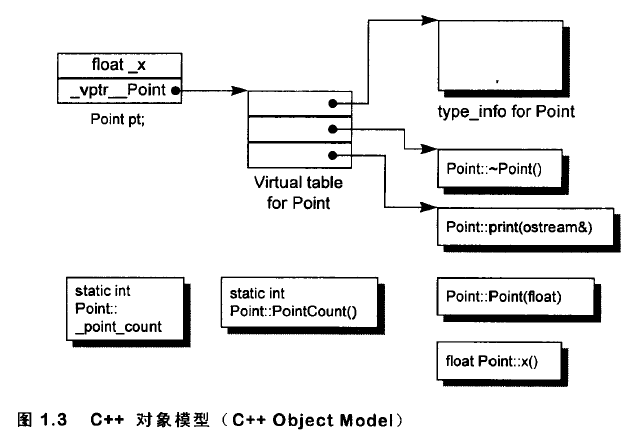
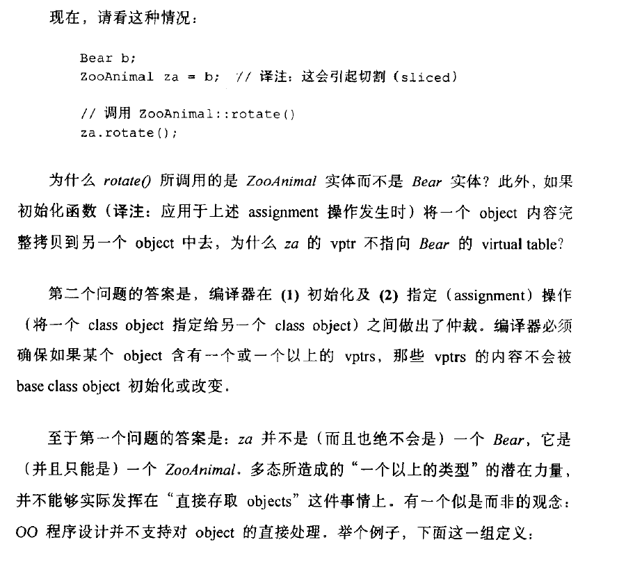
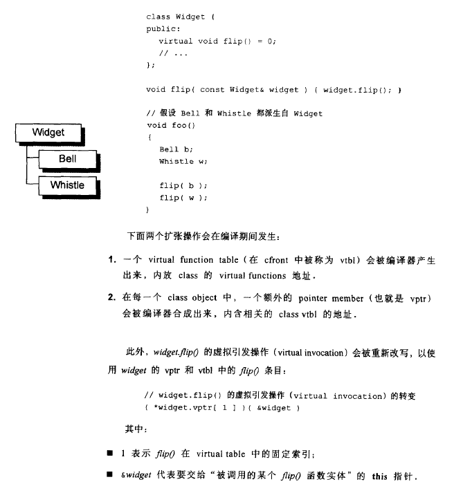

# C++对象模型

## Object

non-static data members: class object之内

static data members: class object之外

static和non-static data function members: class object之外

virtual function:

- 每个class产生一堆指向virtual functions的指针，放在一个表中。这个表被称为virtual table
- 每个class object被添加一个指针vptr，指向相关的virtual table。
  - vptr的setting和resetting都由constructore, destructore, copy assignment运算符自动完成
  - 每个class管理的type_info object也经由virtual table被指出来，通常是放在表格的第一个slot处。

虚拟继承：

- 无论base class被派生多少次，只会有一个实体(subobject)

优点：

- 空间和存取时间效率高

缺点：

- 如果程序代码不变，但是class object的non-static data members有修改，需要程序代码重新编译。

`int(*pq)();`当语言无法判断是声明还是调用时，规则把它判断为一个声明。

基类指针与派生类指针的区别：指针覆盖的地址空间不同，基类指针仅覆盖了基类对象的空间大小，而派生类的指针覆盖了派生类对象的空间大小。

- 多态的实现只是指针或引用指向的内存的“大小和内容解释方式”的改变

例子：

`rotate()`是虚函数：

注意到这里`za.rotate()`调用的是`ZooAnimal::rotate()`

## Constructor

- 编译器合成的构造函数：都用inline的范式完成，如果函数太复杂，就会合成出一个explicit non-inline static实体。

- 对于组合的情况：以member objects在class中的声明顺序来调用构造函数

- 派生类的构造函数默认情况下会先调用基类的构造函数
- 对于虚函数：

