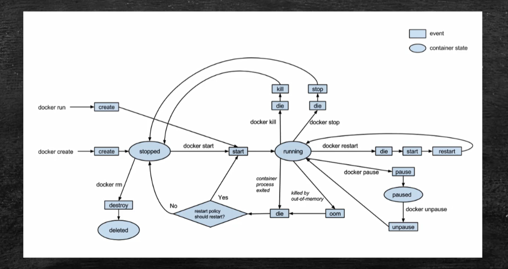

# docker

## 1 常用命令

### 1.1 docker常用命令


`docker run -it -d --name your_container_name image:tag /bin/bash`

-it: 交互式

-d: 后台运行

`docker run -d -p 8000:8080 tomcat`

-p: 端口映射。把本机的8000端口映射到容器的8080端口上

### 1.2 在容器中执行命令


## 2 了解容器

### 2.1 容器内部结构

Tomcat容器内部拥有一个极简的Linux系统


docker默认存放的目录：`/var/lib/docker`

### 2.2 容器生命周期



`docker create tomcat`: 创建容器但不启动

`docker ps`: 列出正在运行的容器

`docker ps -a`：列出所有容器

`docker start container_id`: 启动容器

`docker pause container_id`: 暂停容器

`docker unpause container_id`: 重启暂停的容器

`docker stop container_id`：将容器停止

`docker rm container_id`: 删除容器

## Dockerfile构建镜像

### Dockerfile


### Dockerfile自动部署


`# 注释`

FROM：设置基准镜像

MAINTAINER: 维护者

WORKDIR: 切换工作目录

ADD: 把指定目录复制到镜像的指定目录下。第一个`docker-web`是和Dockerfile同级的文件夹，第二个`./docker-web`是`/usr/local/tomcat/webapps/docker-web`。ADD命令会把第一个文件夹下的内容复制到第二个文件夹下。

构建镜像：

`docker build -t xxx.com/mywebapp:1.0 path/to/dockerfile `

## 容器间通信

#### 用link实现单向通信


docker中被创建的容器会有自己的虚拟ip。两个虚拟ip之间是可以互相通信的。但是局限性很大。

##### 用名字进行通信

例如：

1. 先创建一个tomcat容器

**注意：当前是无法用名字通信的**

`docker run -d --name web tomcat`

2. 再创建一个centos容器作为数据库(由于centos默认创建后会直接进入退出状态，所以如果想让容器一直保持运行，就要加`-it /bin/bash`)

`docker run -d --name database -it centos  /bin/bash`

3. 查看每个容器元数据

`docker inspect  container_id`

在"NetworkSettings"能看到docker给每个容器分配的虚拟ip地址。这个利用docker是可以ping通的。

4. 改成能用名字通信的

`docker run -d --name web --link database tomcat`

创建一个tomcat容器web，且tomcat容器能ping通database。但是database不能ping通web。

### 用bridge网桥实现双向通信


例如：

1. 先创建一个tomcat容器

**注意：当前是无法用名字通信的**

`docker run -d --name web tomcat`

2. 再创建一个centos容器作为数据库(由于centos默认创建后会直接进入退出状态，所以如果想让容器一直保持运行，就要加`-it /bin/bash`)

`docker run -d --name database -it centos  /bin/bash`

3. 列出docker网络服务的信息

`docker network ls`


4. 新建一个网桥 

`docker network create -d bridge my-bridge`

创建一个名为my-bridge的网桥


5. 将容器连接到网桥

`docker network connect my-bridge web`

`docker network connect my-bridge database`

6. 两个容器即可互相通信

#### 网桥实现原理


每次新建一个网桥，docker会创建一块虚拟网卡。

如果要和外部通信，还需要虚拟网卡到物理网卡的地址转换。

## Docker官方的Guides

```shell
docker run -d -p 80:80 docker/getting-started
```

- `-d`：在后台运行
- `-p`：端口映射，将本机的80端口（前）映射到容器的80端口（后）