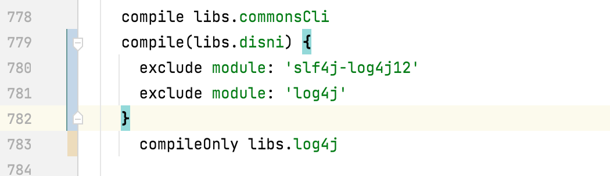
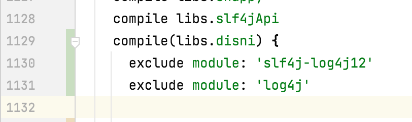
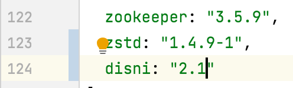
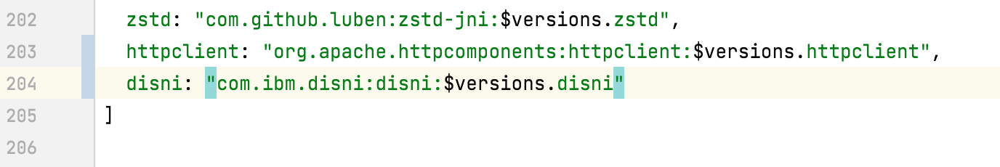
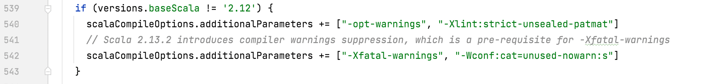

# kafka-性能测试

## 编译事项

### 引入dinsi

在`build.gradle`中：

- 



- 



在`gradle/dependencies.gradle`中：

- 



- 



### 禁用nowarn

在`build.gradle`中的542行加入` "-Wconf:cat=unused-nowarn:s"`



## 启动kafka server

更改配置文件

- `config/server.properties`
  - 注意添加listeners
- `config/zookeeper.properties`

启动zookeeper

```sh
nohup bin/zookeeper-server-start.sh config/zookeeper.properties &
```

启动kafka server

```sh
nohup bin/kafka-server-start.sh config/server.properties &
```

检查kafka service是否启动

```shell
jps -l
```

## 添加topic

```
./bin/kafka-topics.sh --create --topic p1 --partitions 1 --replication-factor 1 --zookeeper 10.0.12.24:2181
```

## producer-perf

在producer节点上运行

```shell
./bin/kafka-producer-perf-test.sh --topic p1 --num-records 1000000 --throughput -1 --record-size 1024 --producer-props bootstrap.servers=172.16.112.24:9092 acks=1
```

throughput设置为-1表示不限制吞吐

```shell
./bin/kafka-producer-perf-test.sh --topic p1 --num-records 1  --throughput -1 --record-size 1024 --producer-props bootstrap.servers=10.0.11.24:9092 acks=1
```


## kafka不使用zookeeper

https://adityasridhar.com/posts/how-to-easily-install-kafka-without-zookeeper

```shell

#只用做一次
./bin/kafka-storage.sh random-uuid

./bin/kafka-storage.sh format -t GUU9Hf1SROGmKKB_jXlh3Q -c ./config/kraft/server.properties


```


远程debug:

注意到kafka-run-class.sh里面有`KAFKA_DEBUG`变量，里面的默认端口是5005

参数说明：https://www.cnblogs.com/liaojie970/p/8677124.html

kafka默认的debug参数：` -agentlib:jdwp=transport=dt_socket,server=y,suspend=n,address=5005`

用IDEA远程调试https://blog.csdn.net/u011679955/article/details/83382234


思路：封装SocketChannel，封装nioSelector。两个都继承SomaChannel和SomaSelector的接口。

把所有用到socketchannel和nioSelector的地方都改成SoChannel和SoSelector


因为channel继承的原因，我在ServerSoChannel注册Selectionkey的时候，没有把channel绑定到Key上。


main文件改动:

`clients/src/main/java/org/apache/kafka/common/network/Selector.java`

- 涉及到连接和通信，以及selector。把里面都换成SomaChannel, SomaSelector, SomaSelectionKey

`clients/src/main/java/org/apache/kafka/common/utils/Utils.java`

- 增加`closeQuietly()`

`clients/src/main/java/org/apache/kafka/common/network/KafkaChannel.java`

- 里面主要是使用	`SocketAddress remoteAddress`的方法，将其改成了`INetAddress`

`clients/src/main/java/org/apache/kafka/common/network/TransportLayer.java`

- 是一个接口

- 把里面返回socketChannel的接口改成了返回SomaChannel

`clients/src/main/java/org/apache/kafka/common/network/PlaintextTransportLayer.java`

- 里面涉及到SelectionKey和SocketChannel的都改了

```java
//    private final SelectionKey key;
//    private final SocketChannel socketChannel;
    private final SomaSelectionKey key;
    private final SomaChannel somaChannel;
```

`clients/src/main/java/org/apache/kafka/common/network/SslTransportLayer.java`

- 里面涉及到SelectionKey和SocketChannel的都改了

`clients/src/main/java/org/apache/kafka/common/network/ChannelBuilder.java`

- 是一个接口
- 把SelecionKey改成了SomaSelectionKey


`clients/src/main/java/org/apache/kafka/common/network/PlaintextTransportLayer.java`

- 把SelecionKey改成了SomaSelectionKey

`clients/src/main/java/org/apache/kafka/common/network/SaslChannelBuilder.java`

- 把SelecionKey改成了SomaSelectionKey
- 这里面还是用到了SocketChannel，因为有ssl协议
- 感觉还是避免走到这个Builder里面吧，看看Kafka哪里有配置能不用ssl相关的
- 加了日志，看看能否走到这里

`clients/src/main/java/org/apache/kafka/common/network/SslChannelBuilder.java`

- 把SelecionKey改成了SomaSelectionKey
- 这里面还是用到了SocketChannel，因为有ssl协议
- 感觉还是避免走到这个Builder里面吧，看看Kafka哪里有配置能不用ssl相关的
- 加了日志，看看能否走到这里

`clients/src/main/java/org/apache/kafka/common/security/authenticator/SaslServerAuthenticator.java`

- 改了和transportlayer有关的socketchannel部分

SocketServer.scala

- 这个需要改很多

改完的文件可以把import注释了，看看是不是改全了

- test文件改动：

`clients/src/test/java/org/apache/kafka/common/network/SelectorTest.java`

SslSelectorTest


记得使用logger

```java
private static final Logger log = LoggerFactory.getLogger(Utils.class);
```


java的Selector的SelectedKey()方法中返回了一个`Set<SelectionKey>`。这里面的SelectionKey如果使用完了需要remove：

https://www.pdai.tech/md/java/io/java-io-nio-select-epoll.html

https://www.jianshu.com/p/199d9ab466f6

怎么会有这么离谱的事情？

可以给每个SomaSelectionKey添加一个set的引用，然后暴露一个removeFromSet接口。

让他把这个元素删了。


SoSelectionKey在


SoSelector

```java
@Override
public Set<SomaSelectionKey> keys() {
  Set<SelectionKey> nkeys = nioSelector.keys();
  Set<SomaSelectionKey> keys = new HashSet<>(nkeys.size());
  for(SelectionKey key:nkeys){
    keys.add(new SoSelectionKey(key));
  }
  return keys;
}
```

按照nioSelector的文档，这个方法返回的keys()是不被修改的。所以我返回了一个新的集合，并且每个SoSelectionKey没有绑定SelectedSet.

```java
@Override
public Set<SomaSelectionKey> selectedKeys() {
    Set<SelectionKey> nkeys = nioSelector.selectedKeys();
    Set<SomaSelectionKey> keys = new HashSet<>(nkeys.size());
    for(SelectionKey key:nkeys){
        keys.add(new SoSelectionKey(key, nkeys));
    }
    return keys;
}
```

因为selectedKeys()返回的集合，在读取其中的元素后要进行remove。所以这里每个key绑定了nioSelector的集合，然后可以调用key的removeItemFromSet方法进行remove。

**在源码中要找到remove的位置，手动加上这个函数**


可能的问题：

- no heap快满了
- GC


pipeline解决的问题是：发送端的发送速度过快，而接收端post receive的速度赶不上发送端，导致错误的出现。使用Pipeline可以流水地消费recvive request, 加速接收端的处理速度。

每个sender和receiver用一个RdmaChannel进行通信，其中channel里面包含发送缓冲区和接收缓冲区，他们是在channel建立开始就创建完成，并不断进行复用的。不会出现receiver每次都要分配存储空间的情况。而且在RDMA中，注册一片内存就要在硬件中记录相应的lkey, rkey和对应关系。如果注册多个小片内存容易造成硬件无法缓存这些数据，造成性能损失。因此RDMA普遍做法是注册较大片内存并复用内存。
