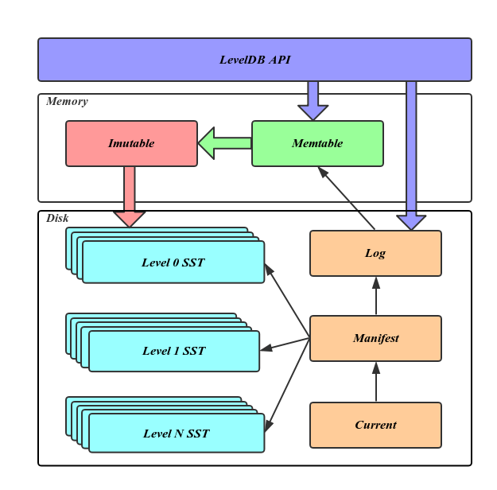
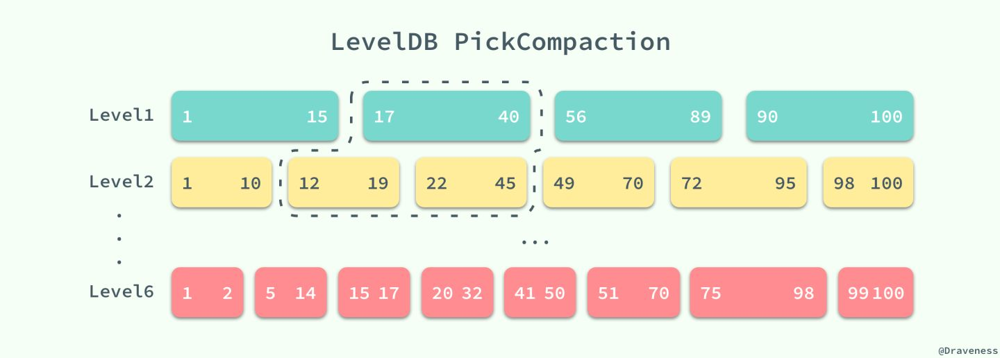
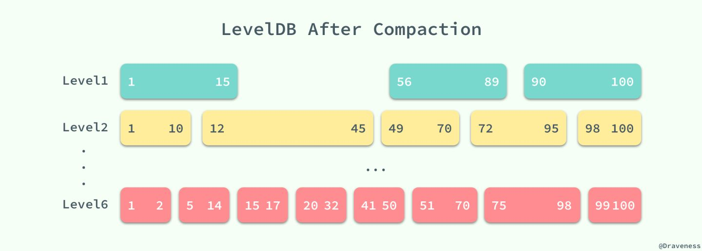

# leveldb

存储<K, V>对的数据库，且Key和Value都是字节数组。

先看一下官方的guide:

Guide to header files:

* **include/leveldb/db.h**: Main interface to the DB: Start here.

* **include/leveldb/options.h**: Control over the behavior of an entire database,
  and also control over the behavior of individual reads and writes.

* **include/leveldb/comparator.h**: Abstraction for user-specified comparison function.
  If you want just bytewise comparison of keys, you can use the default
  comparator, but clients can write their own comparator implementations if they
  want custom ordering (e.g. to handle different character encodings, etc.).

* **include/leveldb/iterator.h**: Interface for iterating over data. You can get
  an iterator from a DB object.

* **include/leveldb/write_batch.h**: Interface for atomically applying multiple
  updates to a database.

* **include/leveldb/slice.h**: A simple module for maintaining a pointer and a
  length into some other byte array.

* **include/leveldb/status.h**: Status is returned from many of the public interfaces
  and is used to report success and various kinds of errors.

* **include/leveldb/env.h**:
  Abstraction of the OS environment.  A posix implementation of this interface is
  in util/env_posix.cc.

* **include/leveldb/table.h, include/leveldb/table_builder.h**: Lower-level modules that most
  clients probably won't use directly.

## 主体结构

### 数据库

`include/leveldb/db.h`

```c++
// A DB is a persistent ordered map from keys to values.
// A DB is safe for concurrent access from multiple threads without
// any external synchronization.
class LEVELDB_EXPORT DB {
 public:
  // Open the database with the specified "name".
  // Stores a pointer to a heap-allocated database in *dbptr and returns
  // OK on success.
  // Stores nullptr in *dbptr and returns a non-OK status on error.
  // Caller should delete *dbptr when it is no longer needed.
  static Status Open(const Options& options, const std::string& name,
                     DB** dbptr);

  DB() = default;

  DB(const DB&) = delete;
  DB& operator=(const DB&) = delete;

  virtual ~DB();

  // Set the database entry for "key" to "value".  Returns OK on success,
  // and a non-OK status on error.
  // Note: consider setting options.sync = true.
  virtual Status Put(const WriteOptions& options, const Slice& key,
                     const Slice& value) = 0;

  // Remove the database entry (if any) for "key".  Returns OK on
  // success, and a non-OK status on error.  It is not an error if "key"
  // did not exist in the database.
  // Note: consider setting options.sync = true.
  virtual Status Delete(const WriteOptions& options, const Slice& key) = 0;

  // Apply the specified updates to the database.
  // Returns OK on success, non-OK on failure.
  // Note: consider setting options.sync = true.
  virtual Status Write(const WriteOptions& options, WriteBatch* updates) = 0;

  // If the database contains an entry for "key" store the
  // corresponding value in *value and return OK.
  //
  // If there is no entry for "key" leave *value unchanged and return
  // a status for which Status::IsNotFound() returns true.
  //
  // May return some other Status on an error.
  virtual Status Get(const ReadOptions& options, const Slice& key,
                     std::string* value) = 0;

  // Return a heap-allocated iterator over the contents of the database.
  // The result of NewIterator() is initially invalid (caller must
  // call one of the Seek methods on the iterator before using it).
  //
  // Caller should delete the iterator when it is no longer needed.
  // The returned iterator should be deleted before this db is deleted.
  virtual Iterator* NewIterator(const ReadOptions& options) = 0;

  // Return a handle to the current DB state.  Iterators created with
  // this handle will all observe a stable snapshot of the current DB
  // state.  The caller must call ReleaseSnapshot(result) when the
  // snapshot is no longer needed.
  virtual const Snapshot* GetSnapshot() = 0;

  // Release a previously acquired snapshot.  The caller must not
  // use "snapshot" after this call.
  virtual void ReleaseSnapshot(const Snapshot* snapshot) = 0;

  // DB implementations can export properties about their state
  // via this method.  If "property" is a valid property understood by this
  // DB implementation, fills "*value" with its current value and returns
  // true.  Otherwise returns false.
  //
  //
  // Valid property names include:
  //
  //  "leveldb.num-files-at-level<N>" - return the number of files at level <N>,
  //     where <N> is an ASCII representation of a level number (e.g. "0").
  //  "leveldb.stats" - returns a multi-line string that describes statistics
  //     about the internal operation of the DB.
  //  "leveldb.sstables" - returns a multi-line string that describes all
  //     of the sstables that make up the db contents.
  //  "leveldb.approximate-memory-usage" - returns the approximate number of
  //     bytes of memory in use by the DB.
  virtual bool GetProperty(const Slice& property, std::string* value) = 0;

  // For each i in [0,n-1], store in "sizes[i]", the approximate
  // file system space used by keys in "[range[i].start .. range[i].limit)".
  //
  // Note that the returned sizes measure file system space usage, so
  // if the user data compresses by a factor of ten, the returned
  // sizes will be one-tenth the size of the corresponding user data size.
  //
  // The results may not include the sizes of recently written data.
  virtual void GetApproximateSizes(const Range* range, int n,
                                   uint64_t* sizes) = 0;

  // Compact the underlying storage for the key range [*begin,*end].
  // In particular, deleted and overwritten versions are discarded,
  // and the data is rearranged to reduce the cost of operations
  // needed to access the data.  This operation should typically only
  // be invoked by users who understand the underlying implementation.
  //
  // begin==nullptr is treated as a key before all keys in the database.
  // end==nullptr is treated as a key after all keys in the database.
  // Therefore the following call will compact the entire database:
  //    db->CompactRange(nullptr, nullptr);
  virtual void CompactRange(const Slice* begin, const Slice* end) = 0;
};

// Destroy the contents of the specified database.
// Be very careful using this method.
//
// Note: For backwards compatibility, if DestroyDB is unable to list the
// database files, Status::OK() will still be returned masking this failure.
LEVELDB_EXPORT Status DestroyDB(const std::string& name,
                                const Options& options);

// If a DB cannot be opened, you may attempt to call this method to
// resurrect as much of the contents of the database as possible.
// Some data may be lost, so be careful when calling this function
// on a database that contains important information.
LEVELDB_EXPORT Status RepairDB(const std::string& dbname,
                               const Options& options);
}
```

简单来说，也就是四个接口。

1. Put
2. Delete
3. Write
4. Get

Write与Put的区别在于，Write是批处理写。比如有两个{key1: val1, key2: val2}一定要同时写入，要么同时写成功，要么同时写失败。而Put只是支持单项的写入。

### 读写流程

LSM存储引擎可参考https://juejin.cn/post/6844903809374765064



SST: sorted string table

写流程：

1. 先顺序写log文件，即WAL log。
2. 再把数据更新到内存中的Memtable中。Memtable是一个内存中的<K, V>表。
3. 当Memtable超过一定限制时，把Memtable变为Imutable，即内存中不可变的<K, V>表。

4. 把Imutable写入磁盘。然后释放相应的log文件空间。
5. 当level 0的SST文件过多时，会与高层(level值高）的SST合并。合并时保证有序性。同理触发下层的SST与更下层的合并。

读流程：

1. 查Memtable。
2. 查Imutable。
3. 查每层的SST（每层有多个SST)。从level 0开始不断往高层查。

Manifest文件：

所有涉及到SSTable的文件的操作都会在这里做上相应的记录。

1. MANIFEST 文件中记录了 LevelDB 中所有层级中的表、每一个 SSTable 的 Key 范围和其他重要的元数据，
2. 它以日志的格式存储
3. 是针对SST的WAL log。

Current文件：

这个文件的内容只有一个信息，就是记载当前的manifest文件名。

leveldb中有两种log文件：

- 平时写程序的输出log.println()，是放到LOG文件。
- WAL LOG文件(binlog)，用来支持事务完整性。

### SST中的合并

SST中存储很多<K, V>对，但是由于更新操作。在SST的下层的很多<K,V>对是已经失效的。如果不清理，会占用很大的磁盘空间。因此用SST合并来删除失效的<K,V>对。

图中每个块的数字代表Key的范围。合并前如下：



合并后如下：

如果用简单的代码描述如下：

```text
const SSTable files{Range1, Range2, Range3};
const CompationOperations compact(Range1, Range2, Range3);
SSTable newFiles = files + compact;
```

这个时候，compact可以看成是发起来的更改请求。为了保证数据的完整性，就需要把compact写WAL LOG。写入成功之后。再生成newFiles。

```text
1. 如果写WAL LOG失败。那么读WAL LOG的时候，也不会成功。那么文件的状态还是files。
2. 如果写入WAL LOG成功。但是生成newFiles时失败。那么系统恢复时:操作如下
   - files是没有更改过的，且一直存在的。生成之后，不会有修改动作。
   - compact是写入到WAL LOG的。写入成功之后，只需要读出这个compact，然后再操作一次。
     生成newFiles。
```

## 版本概念

leveldb中SST要定期进行合并。但是假设S1和S2要与下层的S3合并，合并过程中还有读请求来读这些文件，那么这些文件并不能被销毁。当S1, S2, S3生成新的合并文件后，旧有的文件(S1, S2, S3)还可能在处理读请求，就不能将其直接销毁。因此引入了版本的概念。

- 旧有的文件组成一个版本Version。

- 合并操作称之为VersionEdit。

- 旧的版本与新的版本可以共存。当新版本完成的之后。用户发起来的请求就到新的版本上。这个新的版本就叫current。

- 假设Version1在生成Version2的时候，Version1正在服务很多读请求。Version1自然不能丢。

- - 当Version2生成好了之后，Version2也开始服务很多读请求。
  - Version2到达某一时刻，也会开始进行合并，生成Version3。由于Version2还在服务读请求。自然不能丢弃。

- 当某个旧的Verions不再被读的时候。这些旧的Version就会被删除了。