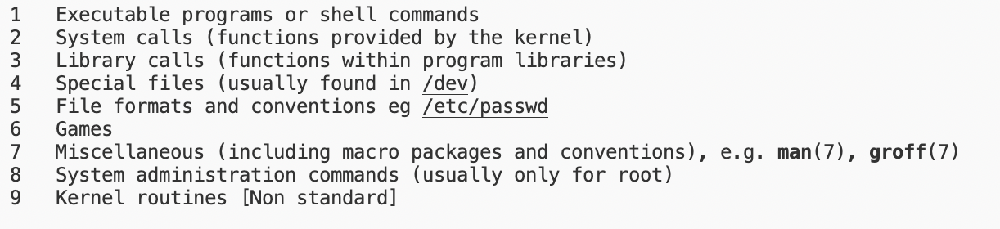

# 系统介绍

[TOC]

## 初识linux

### 用户与目录

提示符：

- `$` 普通用户

- `#` 超级用户

常见目录：

- `/`根目录
- `/root` root用户家目录
- `/home/username` 普通用户家目录
- `/etc` 配置文件目录
- `/bin` 命令目录
- `/sbin` 管理命令目录
- `/usr/bin/usr/sbin` 系统预装的其他指令

### 帮助命令

man命令

- 是manual的缩写

- man也是一条命令，分为9章
  - `man 7 man`
- `man -a passwd` 显示和这个命令有关的所有章节

help命令

- shell自带的命令称为内部命令，其他的是外部命令
  - 用type命令判断：`type cd`
- 内部命令使用help
  - `help cd`
- 外部命令使用help
  - `ls --help`

info命令

- 比help更详细
  - `info ls`

## 文件管理

### 文件查看

pwd命令

- 显示当前所在目录的名称

ls命令

- 显示当前目录下的文件信息
- 

### 目录文件的创建和删除

### 通配符

### 文件操作

### 文件内容查看
