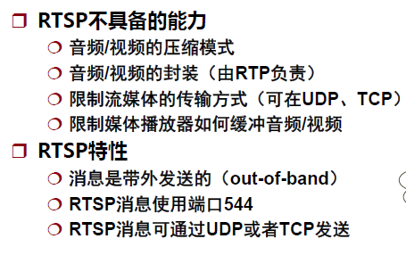
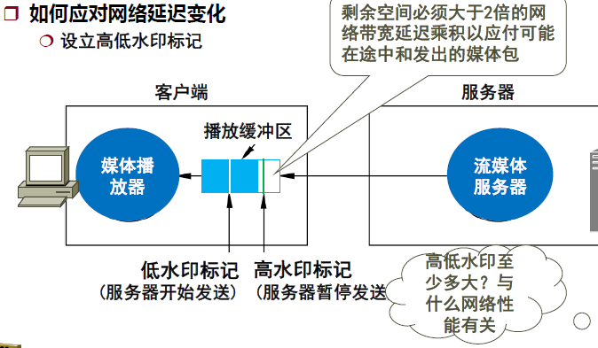
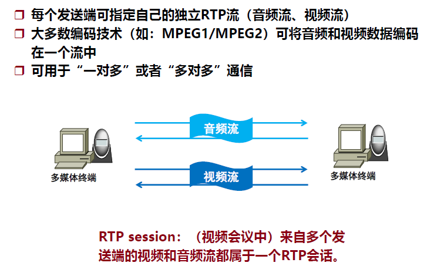
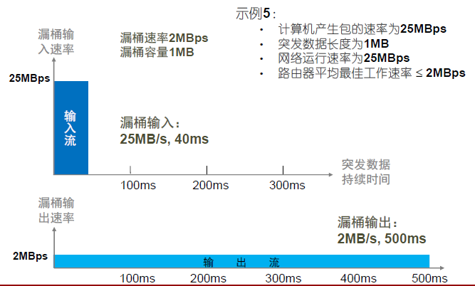
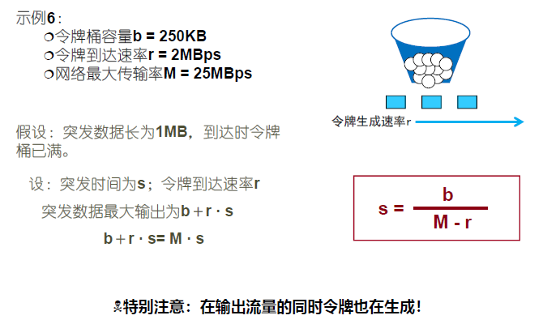
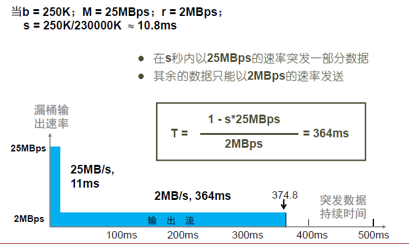
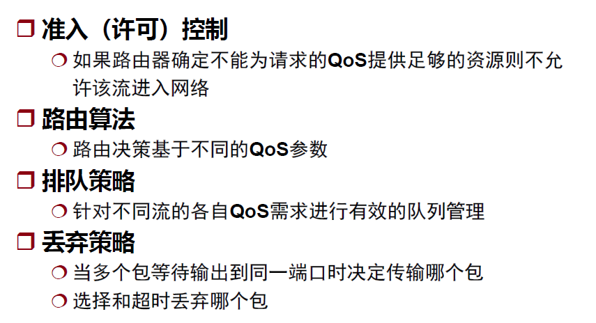

# 计算机网络——应用层

## 流媒体应用

### 音频压缩

压缩算法：

- 压缩算法可以很复杂，但是解压缩算法要简单。
- 分类：
  - 波形编码
  - 感知编码

### 数字视频压缩

空间冗余体现在图像中的许多空白部分可以压缩掉

时间冗余体现在连续两幅图片的重复部分

JPEG标准：用来压缩静止图像

MPEG：同时压缩音频和视频，两者独立工作。在接收端进行同步。

- 空间冗余：单独编码
- 时间冗余：差值编码
- 在 JPEG 压缩了空间冗余的基础上进行的时间冗余压缩。

I-帧，P-帧，B-帧

多媒体网络应用：

- 存储式的流式视频/音频
- 实况的流式音视频：最有效方式是IP组播
- 实时交互的音视频

### RTSP协议

RTSP协议：媒体播放器和媒体流服务器用来交换 playback 控制信息的协议。

使用RTSP协议来控制播放。

HTTP与RTSP相比，[HTTP请求](https://www.baidu.com/s?wd=HTTP请求&tn=SE_PcZhidaonwhc_ngpagmjz&rsv_dl=gh_pc_zhidao)由客户机发出，服务器作出响应;使用RTSP时，客户机和服务器都可以发出请求，即RTSP可以是双向的。RTSP是用来控制声音或影像的多媒体串流协议，并允许同时多个串流需求控制，传输时所用的网络通讯协定并不在其定义的范围内，[服务器端](https://www.baidu.com/s?wd=服务器端&tn=SE_PcZhidaonwhc_ngpagmjz&rsv_dl=gh_pc_zhidao)可以自行选择使用TCP或UDP来传送串流内容，它的语法和运作跟HTTP 1.1类似，但并不特别强调[时间同步](https://www.baidu.com/s?wd=时间同步&tn=SE_PcZhidaonwhc_ngpagmjz&rsv_dl=gh_pc_zhidao)，所以比较能容忍[网络延迟](https://www.baidu.com/s?wd=网络延迟&tn=SE_PcZhidaonwhc_ngpagmjz&rsv_dl=gh_pc_zhidao)。

### 媒体播放器

HTTP浏览器请求一个音视频，服务器用HTTP响应发送文件给浏览器。浏览器根据响应消息来调用响应的媒体播放器，并将文件传递给播放器。

引入流媒体服务器后，播放器能直接向流媒体服务器请求文件。

播放器的功能：

- 解压
- 错误处理
  - 前向纠错
  - 交叉编码
- 抖动消除

#### 前向纠错

- 服务器每4个包就生成一个奇偶包（校验包）。每发送4个包就再发一个校验包。
- 如果丢失了一个包，接收端可根据剩余的包和校验包复原出丢失的包。

#### 交叉编码

两个包交叉编码，一个包存奇数时间的采样值，另一个存偶数时间的采样值。

好处是如果丢了一个包，会使音质下降，但不至于在一段时间内没有声音。

#### 抖动消除

通过client端的缓冲区。

在高水印处，通知服务器暂停发送。在低水印处，通知服务器开始发送。从而防止缓冲区溢出而丢包。

### RTP协议

- 用来传输流媒体数据的协议
- 可支持 PCM 、 GSM 、 MP3 等公共语音标准
- 可支持 MPEG 、 H.263 等公共视频标准

RTP 不具备的功能

- 不提供确保数据传输时间的任何机制
- 不提供任何 QoS 保障
- 不保证数据报的传输
- 不保证数据报不乱序

### RTCP协议（实时传输控制协议）

- RTP的姊妹协议
- 不携带任何音频/视频数据
- 用来向同一个RTP会话的所有成员报告发送/接收的统计信息(通过IP组播)
- RTCP端口号= RTP端口号+ 1

接收端和控制端用RTCP协议老报告每个流的状况，从而控制编码和发送速率。

## 服务质量

弹性流量：指那些延迟和吞吐量变化很大仍然能满足应用需要需求的流量。

- 如FTP,SMTP等
- 通常关心延迟、吞吐量和可靠性
- 用户更关心总时间，热不是最高能获得多大带宽。

非弹性流量：不能适应延迟和吞吐量发生变化的流量。

- 如流媒体服务

抖动：单个会话期延迟的最大变化

QoS机制：用较低的成本来满足应用的需求, 例如因特网。

需要某种手段给予需求更多的优先待遇：

- 应用程序必须能在服务开始之前或之中通过IP包头陈述自己的需求
- 在需求的表述上有更大的灵活性
- 网络预先订下应用所需的资源并在所需资源不满足时拒绝新请求

### 流的隔离

- 链路级的包调度：为每个应用流分配固定的链路带宽
  - 缺点：可扩展性差
- 监管机制：在端系统或边缘路由器，将不遵守某种要求的应用数据包打上标记，为将来的处理提供依据。

### 调度机制

- FIFO
- 优先级队列
- 公平队列

#### FIFO

包的链路发送次序与到达队列的次序相同
如果没有足够的空间存放新近到达的包，则丢包策略决定是否丢弃刚到达的包，还是删除已排入队列等待传送的包（牛奶？葡萄酒？）

#### 优先级队列

到达输出链路的包被分类排入不同优先级队列

- 优先级的确定可考虑多种因素
- 包头的标记（ToS）、包的源/目的IP地址
- 包的目的端口号等

#### 公平队列

- 给每个队列赋予不同的权重
- 保证给予类i一定比例服务

### 监管机制

- 漏桶
- 令牌桶

#### 漏桶

#### 令牌桶

### 综合服务

IntServ: 由IETF开发的一种服务框架，用来为个别应用会话提供个别的服务质量保证。

能提供多个服务类别：

- 尽力而为
- 可控负载
- 确保型

#### 资源预留协议RSVP

RSVP (ReSerVation Protocol)协议

- 应用程序为数据流预留带宽
- 主机请求一定的带宽
- 路由器转发带宽预留请求