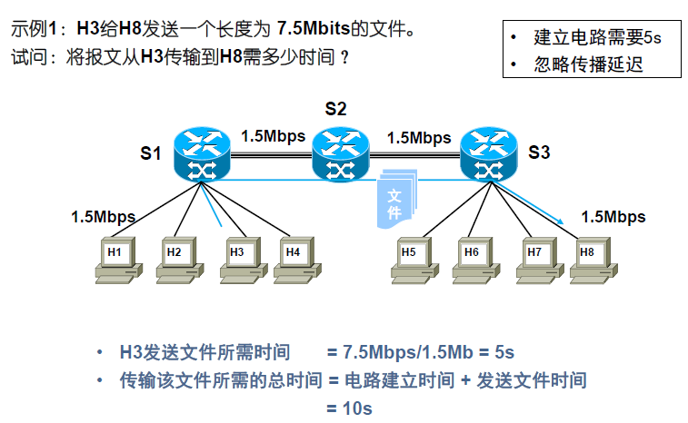
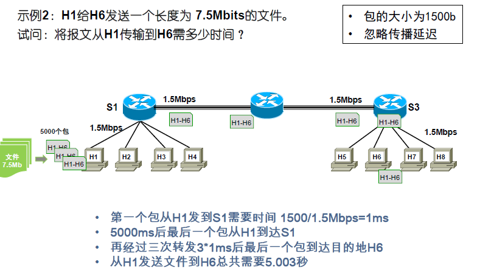
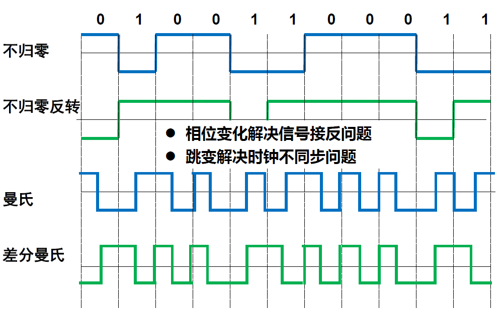
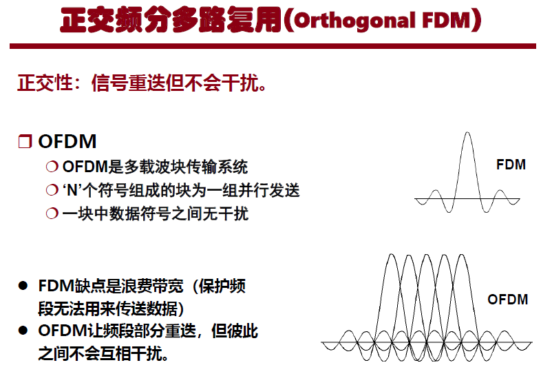

# 计算机网络——简介与物理层

[TOC]

## 简介

### 三网融合

大众熟悉的三大类网络有：

- 电信网络：提供电话、电报及传真等服务；
- 有线电视网络：向用户传送各种电视节目；
- **计算机网络：使用户能在计算机之间传送数据文件**；

随着技术的发展，网络技术相互融合：

- **电信网络和有线电视网络都逐渐融入了现代计算机网络技术，扩大了原有的服务范围；**
- **计算机网络也能够向用户提供电话通信、视频通信以及传送视频节目的服务。**

电信网络、有线电视网络、计算机网络三类网络互相**融合为一个网络**就被称之为三网融合

### 通信子网 vs 资源子网

通信子网：通信线路把分散在不同地点的通信控制处理器连接起来构成的。

资源子网：由主机系统的软硬件、数据库等各种资源组成。

### 因特网一瞥

- 网络边缘：用于连接计算设备，如主机和端系统
  - 通信链路使用有线介质或无线介质，带宽受限
- 接入网络：将端系统连接到边缘路由器
  - 居家网络：
    - 使用电话线，数据通过DSL接入网络
    - 有线电视网络，使用公共电缆接入网络
  - 公共网络（校园网、企业网、ISP)
  - 移动接入网
  - 无线接入网络：使用蜂窝基站/AP(接入点)
- 核心网络：是少量众所周知的大型网络
  - tier1商业 ISPs ( 例如 Sprint, AT&T, NTT) 、国家或国际网
  - 内容提供者网络 例如 Google)

### 网络分类

按覆盖范围：个域网、局域网、城域网、广域网

按传输技术：广播网络、点-点网络

- 小型、地理位置集中的网络多采用广播形式
- 大型、地理位置分散的网络多采用点-点形式

### 数据传输

#### 基于电路交换的数据传输

优点：

- 实时性好（仅有信号传播时延）
- 稳定的数据传输速率
- 不存在信道访问延迟

缺点：

- 不能充分发挥传输介质潜力
- 长距离连接的建立过程长
- 扩展性较差

#### 存储-转发技术

存储-转发：交换节点接收并存储包，然后根据包的目标地址转发该包到通往目的地的出境线路上。

- 报文：用户发送的原始数据（文件）

- 数据报/包：数据块大小固定

存储-转发时延 = 处理时延 + 排队时延

当第一个包抵达目的地、最后一个包尚未发出时，沿途每个交换机都在并发地传输经过的每个包

优点：

- 将数据分流到不同路径使得带宽资源利用更加有效。
- 若链路出现故障同一个报文的剩余包可通过其它路径传送

缺点：

- 存储－转发延迟、排队延迟
- 包丢失->报文丢失概率增大

### 延迟

发送时延/传输时延：使数据块从节点进入传输介质所需要的时间。

传播延迟：信号在信道中传播一定距离而花费的时间

处理延迟：交换节点为存储转发而进行必要处理所花费的时间(包处理、路径选择、排队)

## 物理层基本概念

信道通信方式

- 单工通信：在任何时候只允许按照一个方向发送信息。

- 半双工通信：通信双方可以交替向对方传输信息，但是任何时候只允许在一个方向上传输。

- 全双工通信：允许两个方向上同时传输信息。

模拟数据：在某个时间间隔内有连续值的数据。

数字数据：具有离散值的数据。

周期信号的三个特征：

- 振幅
- 周期/频率
- 相位

模拟数据用编码解码器能转换成数字数据。

放大器：会把已经失真信号中的噪声一同放大

中继器：还原真实数据后再生成信号

分贝：$D=10log_{10}(p_{1}/p_{2})$

传输减损：

- 信号衰减
- 延迟失真

信噪比：$R_{S/N}=10log_{10}(S/N)$，$S$为平均信号功率，$N$为噪声功率。

比特率：表示数据的传输速率，定义为单位时间内传送的比特数，单位为比特/秒或简写为 bps

符号率/波特率：表示信号速率，称为调制速率。定义为单位时间内所传输的波形个数。单位为波特(baud)。$D_{baud}=1/T$

## 信道容量

信道容量（capacity ）：指给定条件下信道传输数据的能力。

- 数据速率(data rate)：指数据通信的速率，以每秒多少个二进制位表示(bps)
- 带宽( bandwidth)：被传信号所占频带的宽度，以每秒多少个周期表示或赫兹 Hz 。

### Nyquist准则

准则：离散无噪声的数字信道信道容量为$C=2Wlog_{2}L$。$W$为带宽，$L$为编码的进制数。

### 香侬定律

定律：在信号平均功率有限的白噪声指通信系统内部本身产生的噪声信道中，信道的极限数据传输率即信道容量为：$C=Wlog_{2}(1+S/N)$。$W$是信道带宽，$S$是信号功率，$N$是噪声功率。$C$的单位是bps。

## 数字信号的编码

为什么要编码：因为实际的信道带宽受限、有噪声、干扰和失真。之间传输数字数据可能会失真很大，无法识别。

### 不归零

- 不归零(NRZ-L)
  - 用正、负电压表示两个二进制位。
  - 0：高电压；1：低电压。
- 不归零反转(NRZL)
  - 在一位时间内维持一常量电压脉冲
  - 0 = 在 一位时间的开始处没有变换；1 = 在一位时间的开始处变换低到高或高到低

### 双向编码

- 曼彻斯特(Manchester)：在每一位中间有一个跳变
  - 1：从低变高；0：从高变低
  - 跳变既可用作时钟同步，又可定义成数据。

- 差分曼彻斯特：数据定义成每一位起始处是否存在跳变
  - 0:1位时间开始时存在跳变；1:1位时间开始时不存在跳变

## 数字数据 -> 模拟信号

使用调制解调器。例如将计算机的数字数据转换成模拟信号，然后通过电话线传输。

数字调制：把低频数字信号变换成适合于信道传输的处理过程

数字解调: 把信道中已调信号恢复成低频数字信号的处理过程

调制解调：把低频信号变换成高频信号以便于数字信号的传输，即将待传信号的频谱进行搬移和还原。

正交振幅调制(QAM)：利用振幅和相位的不同组合来进行调制。

## 模拟数据 -> 数字信号

数字化：将模拟数据转换成数字信号的过程 。

编码解码器：将模拟数据转换成数字形式，随后又从数字形式恢复成原始模拟数据的设备。

采样定理：如果 在规定时间间隔内，以高于两倍最高有效信号频率的速率对信号 f(t) 进行采样的话，那么这些采样值包含了原始信号的全部信息。

因此利用采样定理，用低通滤波器可从这些采样值中构造出函数 f(t) 。

模拟信号采样：从时间上连续的信号中取出“样品”，使连续信号成为一串时间上离散的“样值”序列。

量化：把样值信号的无限多个可能的取值，近似地用有限个数的数值来表示。

量化级：把样值信号的瞬时幅度分成许多度量单位，一个度量单位称为一个量化级，用量化级的大小来表示瞬时样值。

编码：使离散的量化样值成为合适的二进制数字码组 。

解码：把数字信号码组变换成相应的电压或电流量，恢复成原量化的样值信号。

增量调制：用差值编码进行通信的方法 。即模拟输入信号用一个楼梯函数近似表示该函数在每个采样间隔$T_{s}$内上或下一个量化级$\delta$

差分调制PCM ：数字化后输出的不是数字化的幅度本身，而是当前值和前一个值的差。

## 传输介质

引导性介质：电磁波沿着一个固态介质传播。

非引导性介质；提供了传输电磁信号的手段，但不加以引导。

有线：（引导性介质）

- 双绞线
- 同轴电缆
- 光纤
- 电力线

无线：（非引导性介质）

- 无线电
- 微波
- 红外线
- 可见光

## 多路复用

### 频分多路复用

频分多路复用：每个数据信号被调制到具有不同频率的载波上，所有的信号在一个信道上同时传送。

波分复用：光的频分复用。

如何实现频分多路复用：调制解调技术

- 数字调制：当只有模拟传输设施可用时
- 模拟调制：FDM需要把相同频谱的输入搬移到不同频谱

### 时分多路复用

时分多路复用：以时间作为分割信号的依据。它利用每个信号在时间上交叉，可在一个传输通路上传输多个数字信号 或运载数字数据的模拟信号

### 码分多路复用

CDMA重要特征：允许所有用户在同一频带上同一时间片内同时发送信息，但需要使用不同的码字。