# 计算机网络——数据链路层

[TOC]

- 数据链路层完成整条路径上相邻两点之间的"点-点"传输。即完成通信两端之间的一条路径上每一跳数据的传输

- 帧：数据链路层上交换数据的单位
- 数据链路层是“存储-转发”交换技术的基础
- 基本功能
  - 介质访问控制
  - 链路管理
  - 差错控制
  - 流量控制
  - 成帧、拆帧产生校验码
- 链路层包括软硬件两部分（网卡硬件+驱动程序），衔接了物理层和网络层

## 成帧

方法：

- 字符计数法：用头部的一个字段（第一个字节）标识帧的**总长度**。
  - 缺点：计数值的传输出错将导致收发双方不同步
  - 一般很少采用

- 字符填充的首位定界法：用特殊的字节（标志字节 / flag byte）作为帧的起始和结束的分界。如果帧的内容中有flag byte，就用转义字符转义掉。如果转义字符也在数据中，就再用转义字符来转义。
  - 副作用：一个帧的长度要取决于他所携带的数据内容。
  - 缺点：只能使用8bit的字节。

- 比特填充的首位定界法：每个帧的起始和结束用特殊的比特模式来表示（01111110）。在帧的数据中使用比特填充技术。即发送端每发送5个“1”后插入一个"0"。接收端在接收时删除填充的“0”。
  - 和上种方法的区别：字符填充的缺点是只能使用8bit的字节。帧的划分可以在比特级完成，因而帧可以包含由任意大小单元组成的二进制比特数。
  - 副作用：一个帧的长度要取决于他所携带的数据内容。

- 物理层编码违禁法：比特编码成信号通道时常常包含一些冗余比特。我们可以利用这些保留的信号来标识帧的开始和结束。例如4B/5B线性编码模式下，4个数据位被映射成5个信号比特。这意味着32个信号中有16个不能使用。

通常采用综合法：

- 用计数值确定帧尾
- 检查帧定界符是否出现在应该出现的地方
- 计算校验和来验证是否传输的数据出错

## 流量控制

流量控制：限制发送方发送速度的一种机制，使发送速率不能超过接收方能处理的速率

特点：

- 动态的
  - 与发送方的速度有关
  - 与当前网络的拥挤程度有关
- 反馈的
  - 使发送方了解接收方当前的处理能力
- 网络层实体控制从数据链路层接收数据速率。数据链路层控制从对等实体接收帧的速率。

## 差错控制

- 检错和纠错
- 顺序到达
  - 丢失重传会乱序，确认帧也可能出错
  - 确认方式：ACK, NAK
  - 计时器：要保证一帧到达对方并做处理后，相应的确认帧返回。

## 介质访问控制(MAC)

- 在广播信道中，当信道的使用产生竞争时如何确定信道使用权。

- 广域网：采用点-点连接，不存在信道竞争问题。
- 局域网：多路复用信道，即多个站点共享同一个传输介质。需要介质访问控制。

## 停等协议

- 优点：控制简单；适用于包被分成数量不多的较大帧发送时
- 缺点：效率低；当一个包用多个帧发送，链路的比特长度大于帧长时，浪费时间。
- 链路比特长度：信号从链路一端传播到另一端的时间，以发送比特数计量。

### 性能

发送数据包的总时间$T=nT_{f}$，其中$T_{f}=t_{frame}+t_{prop}+t_{proc}+t_{ack}+t_{prop} \approx 2t_{prop}+t_{frame}$。

$t_{frame}$：发送端传输（发送）一个帧的时间

$t_{prop}$: 帧传播的时间

$t_{proc}$：接收端处理帧的时间

$t_{ack}$：接收端发送ack的时间

线路利用率：$U=\frac{t_{frame}}{t_{frame} + 2t_{prop}}=\frac{1}{2\alpha +1}$

### 拆分数据包

- 接收缓冲区的大小限制
- 减少出错可能性，降低重传概率
- 一个站不能占用信道时间过长，避免其他站的长时延

## 无错信道上的滑动窗口

- 滑动窗口控制：利用发送和接收窗口来控制连续发送的数据量
- 序号空间：帧序号的取值范围，$0$~$2^{n}-1$
- 发送站维护发送窗口，接收站维护接收窗口。
  - 两者可以不一样大。
  - 窗口不是数据缓冲区，窗口只存放帧序号
  - 实际上每一端既是发送站，又是接收站。所以每一端维护两个窗口。

流程：

- 接收端每收到一个帧，校验正确后就可将接收窗口向前推进，并发出确认帧。
- 发送端只发送帧号落在发送窗口内的帧。收到确认帧后，根据确认的序列号将发送窗口向前推进。

确认帧：

- 捎带确认：既有数据又有确认时，将两者合在一个帧中发送，即数据帧捎带上确认信息。

- 累计确认：接收方对收到的K个帧发送一个ACK，如果确认号为K，表示收到了序号至K-1的帧，并期待序号为K的帧。

### 性能

性能与窗口大小和$\alpha$有关。假设传输时间为1，则传播时间为$\alpha$。

- $N> 2 \alpha + 1$

$U=1$

- $N < 2 \alpha + 1$

$U=\frac{N}{2 \alpha + 1}$

管道化技术：发送端为达到信道最大效率，必须连续不断发送数据

带宽延迟积：带宽和传播实延的乘积。用来衡量两个进程之间信道容量。

## 差错控制

差错控制

- 正确接收：帧按照发出的次序到达，且每个帧有不定长的传输延迟
- 检错能力
- 纠错能力
- 功能：
  - 差错检测
  - 肯定确认
  - 超时重发
  - 否定确认与重发

自动重发检错（ARQ)

- 发送方根据被传输的数据信息，按照一定规律加入校验码。一同发给接收方
- 接收方根据数据与校验码之间的规律进行校验，来判断数据是否出错。并将结果反馈给发送方

## 有错信道上的停-等协议

- 数据帧用0, 1表示
- 确认帧用ACK0, ACK1表示

## 有错信道上的滑动窗口

### 回退N控制策略

书上：

- 发送方连续发出N个帧，接收方以流水线方式接收各帧，并进行差错检测。
- 接收方一旦发现某一个帧$i$有错，则丢弃该帧和它之后收到的所有帧。并且针对这些丢弃的帧不返回确认。
- 发送方直到帧$i$的计时器超时后，回退到$i$号帧，并重新发送它和后续的帧。

课件上：

- 发送方传出的帧$i$被损坏，接收方接收到$i$后，发送REJi表明拒绝帧$i$。发送方收到后，重传帧$i$及其后续的帧。
- 发送方传出的帧$i$丢失，接收方接收到了帧$i+1$后，发现顺序不对。接收方给发送方发送REJi。发送方收到后，重传帧$i$及其后续的帧。
- 发送方传出的帧$i$丢失，发送方并没继续发送帧。接收方收不到任何消息，发回一个RR。当发送方的计时器超时后，发一个RR帧。
- 如果确认帧丢失，会收到随后帧的确认（意味着当前帧被收到了），或者计时器超时。

回退N控制的发送窗口：假设序号空间为$0...2^{n}-1$，**最大窗口大小**为$2^{n}-1$

注意：接收端的窗口，在收到正确的帧后就能推进。

- 特点：
  - 要求每一帧的确认在其后第N个帧尚未结束发送前到达
  - 发送方必须有存放N帧信息的缓存以便出错时重发
  - 接收方只需要一个大小为1的缓冲区
  - 要求全双工链路

- 优点：消除停等协议的等待应答时间

- 缺点：正确帧的重发浪费信道

### 选择性重传

- 发送方连续发送N个帧，接收方发现有错误的帧就把帧的序号反馈给发送方，让其重新发送。其余的正确帧储存起来。

选择性重传的发送窗口：假设序号空间为$0...2^{n}-1$，**最大窗口大小**为$2^{n-1}$

注意：接收端的窗口，在收到正确的帧后就能推进。

- 特点：
  - 接收方必须有足够的存储空间
  - 接收方的接收顺序可能会打乱原发送顺序
  - 全双工链路
- 优点：信道利用率高
- 缺点：实现复杂，需要接收方有足够的存储空间

## 纠错码

码距：只两个码对应码位码元不同的个数

汉明距离：一个码组集合中任意两个码组间的最小码距

- 为了检出e个错码，要求汉明距离$d \geq e+1$
- 为了纠正t个错码，要求汉明距离$d \geq 2t+1$
- 为了检出e个错码，同时纠正t个错码，要求汉明距离$d \geq e + t +1$

编码效率：指一个码组中信息所占的比重。$R=\frac{k}{n}=\frac{k}{k+r}$，$k$是信息位长度，$r$是校验位长度。

### 奇偶检验码

在数据位后面加1位的检验为，使得总的码字中：

1. “1”的个数是偶数：偶校验
2. "1"的个数是奇数：奇校验

- 垂直奇偶检验码：
  - 发送端在k位表示字符的信息位上附加一个第k+1位的校验位
  - 接收端根据收到的k位重新产生校验位，并与第k+1位作比较。相同则无错，否则存在错误。
  - 可以检测出奇数个错误
  - $R=\frac{k}{k+1}$, $k$是码元的位数

- 水平奇偶检验码
  - 在传送数据时将若干个字符组成一组信息
  - 对一组内的各字符的同一位进行奇偶校验
  - 可检测出组内各字符同一位上的奇数个错；可检测出突发长度≤字符长度的所有突发错误
  - $R=\frac{m}{m+1}$，$m$是参与校验的字符数
- 垂直水平奇偶校验码
  - 把垂直和水平两个方向的奇偶校验结合起来使用
  - 可检出3位或3位以下的全部错误
  - 可检出所有的奇数个错
  - 可检出大部分偶数个错
  - 可检出长度＜k+1的突发错误
  - $R=\frac{mk}{(m+1)(k+1)}$

### 循环冗余校验码(CRC)

基本思想

- 发送方将要传送的信息分成码组M，然后按某一种约定的规律对每一个信息码组附加一些校验码R，形成新的码C，使得C中的码元之间具有一定的相关性(即码组中“1”和“0”的出现彼此相关)，再传输到接收方
- 接收方根据这种相关性或规律性来校验码C是否正确，还可对出错码组的错定位加以相应的纠正，最后将码C还原成信息码M。

循环冗余校验：利用除法及余数来根据数据产生固定长度的校验码的方法

- 根据码来生成码多项式：假设码$C=C_{n-1}C_{n-2}...C_{0}$，$C$的码多项式为$C_{n-1}x^{n-1}+C_{n-2}x^{n-2}+...+C_{0}$

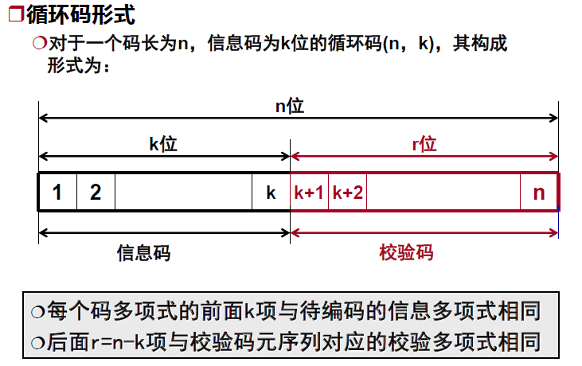

定理：在一个$(n，k)$循环码中，存在一个且只有一个$(n-k)$次的码多项式
$g(x) = x^{n-k}+ g_{n-k-1}x^{n-k-1}+ ….g_2x^2+g_1x +1$
满足下列两个条件：

- 此循环码中任一码多项式都是$g(x)$的倍式
- 任意一个$(n-1)$次或$(n-1)$次以下又是$g(x)$倍式的多项式必定是此循环码的一个码多项式

校验码的生成：

- 设生成多项式$G(x)$的最高幂次为$r=n-k$
- 将待编码码元序列表示为$m(x)$，乘以$x^r$，结果左移$r$位$x^r·m(x)$
- 用$G(x)$去除$x^rm(x)$，求得商式$Q(x)$和余式$R(x)$。即$x^r·m(x) = Q(x)·G(x) + R(x)$

- $G(x)$是接收双方事先约定的

循环校验工作：

- 假设待发送的数据位$m(x)$，按照上述过程计算。并发送$m(x)*x^r + R(x)$
- 接收端接收到$m'(x)$，计算余式。看是否和$R(x)$相等。

### 汉明码

- 对(n, k)分组码，监督位数r =n-k；
- 若用r个监督位构造出r个监督关系式用来指示一位错误的n种可能位置，则：$2^r-1 \geq n$, $2^r\geq k+r +1$
- 汉明码：码长为$n = 2^r–1$的线性分组码$(n,k)$即$(2^r–1, 2^r–1–r)$码

## 局域网（LAN）通信

- 特点：
  - 用带地址的帧传输数据
  - 不存在中间交换
- 将数据链路层分成两个子层：
  - 逻辑链路控制层（LLC)
  - 介质访问控制（MAC)
- LLC子层与所用介质、介质访问方法无关；MAC子层和介质相关
- 自底向上：PHY, MAC, LLC
- PHY:
  - 主要处理在物理链路上传递非结构化的比特流
    - 数据比特转换成信号的编码和解码
    - （用于帧同步)前导码的产生和删除
    - 单个比特传送和接收
- MAC:
  - 传送时将数据封装成带地址和差错检测的帧
  - 接收时拆帧并执行地址识别和差错检测
  - 控制对传输介质的访问
- LLC:
  - 给高层提供接口并执行流量控制和差错控制

### 介质访问控制概述

介质访问控制是将传输介质带宽有效分配给网上各站点用户的方法

访问控制技术：

- 同步：为每个站点分配专用规定的容量。类似TDMA和FDMA
  - 固定信道分配方法（FDM/TDM)
- 异步：动态分配每个站点的传输量，响应用户的即时需要
  - 分布式：
    - 优点：单点故障不会影响全网；不易形成瓶颈
    - 缺点：每个站的逻辑复杂；要进行协调
  - 集中式
    - 优点：每个站的逻辑简单；避免协调问题
    - 缺点：单点故障容易影响全网；易产生瓶颈

竞争系统三大问题

- 访问时机
- 冲突检测
- 重试策略

动态信道分配的假设：

- 流量独立
- 单信道
- 冲突可观察
- 时间连续或分槽
- 载波监听或不监听

### 纯ALOHA协议

- 连续时间发送，不按时间槽
- 不监听。但是发送站可以侦听到集线器的广播，来确定帧是否成功发送。
- 如果冲突，发送方随机等待一个时间后重发
- 期待的信道利用率最多18.4%

### 分槽ALOHA协议

- 分时间槽发送
- 不监听
- 如果冲突，随机等待一个时间槽后重发
- 关键：时间槽隐含着需要时钟同步
- 期待的信道利用率最多36%

### 载波侦听多路访问协议(CSMA)

LAN的特性：站间传播时延 < 帧的传输时延

载波侦听协议：网络站点监听载波是否存在(即有无传输)并随之采取相应的行动。

CSMA协议的三种形式

- 1-坚持CSMA
  - 发送数据前先侦听信道
  - 如果介质空闲，则传输
  - 如果介质繁忙，一直监听直到空闲后，立即传输
  - 如果发生冲突，等待一个随机时间后，再开始上述过程
  - 缺点：冲突可能性大

- 非坚持CSMA
  - 发送数据前先侦听信道
  - 如果介质空闲，则传输
  - 如果介质繁忙，随机等待一个时间后再重复上述过程
  - 如果发生冲突，等待一个随机时间后，再开始上述过程
  - 缺点：容量可被浪费，无法有效利用
- P-坚持CSMA
  - 适用于分时间槽的信道
  - 发送数据前先侦听信道
  - 如果介质空闲，则以$p$的概率发送数据，以$1-p$的概率将发送推迟一个时间槽。在下个时间槽，还是以$p$的概率发送数据，以$1-p$的概率将发送推迟一个时间槽......
  - 如果介质繁忙，等待一个时间槽，重复上述过程
  - 如果发生冲突，等待一个随机时间后，再重复上述过程
  - 缺点：浪费容量，一旦两个帧发生冲突，两个帧都要重发。帧越长，冲突后浪费的容量越大。

- 带冲突检测的CSMA(CSMA/CD)

  - 前面协议的缺点是：如果两个站侦听到信道为空，并且同时开始传输时，它们产生的信号仍然会冲突。
  - 因此，一个改进是：每个站快速检测到发生冲突后，立即停止传输帧。
  - CSMA/CD模型
    - 竞争期：发送站检测到正发送帧冲突的最短时间
    - 传输期：发送站传输帧
    - 空闲期：所有站都处于静止状态(无帧发送)
- 在竞争期，所有需要发送帧的站竞争信道的使用权
  - 在传输期，竞争胜出的站使用信道且其他站不会干扰
  - 假设两点间传播时延为$\tau$，最坏情况下当一个站点监听了$2 \tau$时间还没监听到冲突，就可确保自己竞争成功。由于LAN中站间传播时延 < 帧的传输时延，因此CSMA/CD的信道利用率高于CSMA
  

## IEEE 802.3协议

- 经典以太网采用了1-坚持的CSMA/CD协议
  - 如果介质空闲，则传输；否则
  -  如果介质忙，继续监听;直到介质空闲马上传输
  -  如果在传输期间检测到冲突发送一简短的JAM(冲突加强)信号
  -  发出短冲突加强信号后，进行冲突处理。等待一段时间后，重复上述过程

  冲突窗口：开始发送帧后侦听到是否发生冲突的那段时间：$2 \tau +t_{CD}+t_{JAM}$。其中$t_{CD}$是冲突检测所需的时间，$t_{JAM}$是阻塞信号JAM的传送时间。

  - 冲突处理：
    - 立即停止发送帧的其余内容，并发阻塞信号JAM
    - 按后退算法计算重发时间延迟：每冲突一次，等待窗口的大小加倍。从窗口中随机选择一个等待时间。
    - 若重发16次仍不成功，则放弃
  - 后退算法：
    - 二进制指数后退算法BEB：
      - 平均等待延迟为：$M_{BEN}= (2^i-1)*2\tau$
      - $i$为帧的冲突次数，$2 \tau$为冲突窗口
    - 截断二进制指数后退算法
      - 平均重发延迟为：$M_{BEN}= (2^i-1)*2\tau$
      - $i=min(10,$ 冲突次数$)$，$2 \tau$为冲突窗口

举个例子：

- (1) 准备发送。但在发送之前，必须先检测信道。

- (2) 检测信道。若检测到信道忙，则应不停地检测，一直等待信道转为空闲。若检测到信道空闲，并在 96 比特时间内信道保持空闲（保证了帧间最小间隔），就发送这个帧。

- (3) 检查碰撞。在发送过程中仍不停地检测信道，即网络适配器要边发送边监听。这里只有两种可能性：

- - ①发送成功：在争用期内一直未检测到碰撞。这个帧肯定能够发送成功。发送完毕后，其他什么也不做。然后回到 (1)。
  - ②发送失败：在争用期内检测到碰撞。这时立即停止发送数据，并按规定发送人为干扰信号。适配器接着就执行指数退避算法，等待 r 倍 512 比特时间后，返回到步骤 (2)，继续检测信道。但若重传达 16 次仍不能成功，则停止重传而向上报错。

#### IEEE802.3——MAC帧结构

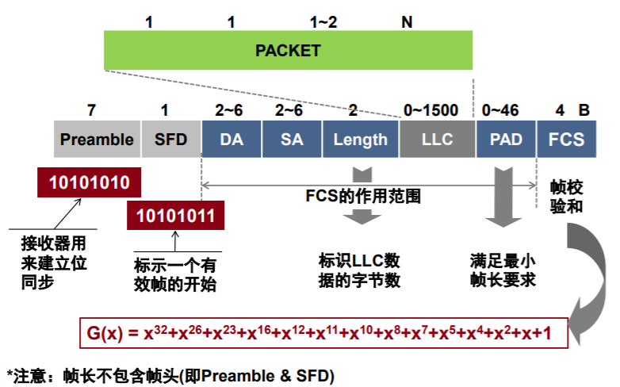

- DA：目的地址。最高位为0表示单地址，为1表示组地址。
- SA：源地址
- LLC：存数据。最多1500B
- PAD：802.3协议规定有效帧的帧长至少64B。为了区分垃圾和有效帧；为了冲突检测，规定最小帧长为$2 \tau *$传输速率

### 交换机与集线器

冲突域：两个或以上站点同时发送将产生冲突的区域。

集线器：只是在电器上连接所有的连接线，它逻辑上等于单根电缆的经典以太网。

- 所有站位于同一个冲突域，需要使用CSMA/CD算法来调度各自传输。
- 使用集线器的以太网在**逻辑上仍是一个总线网**，各工作站使用的还是 **CSMA/CD 协议，并共享逻辑上的总线**。

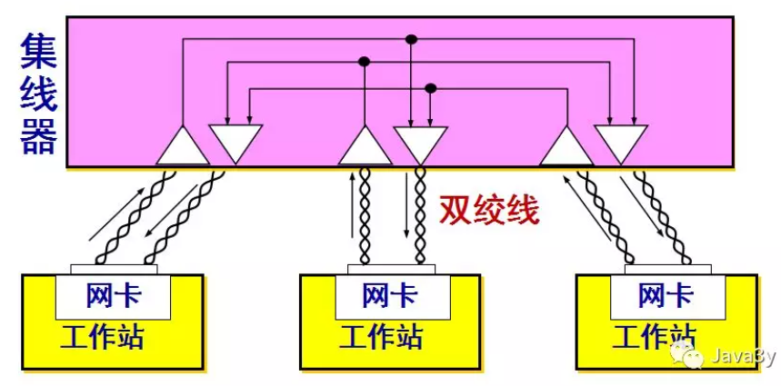

交换机：有一块高速背板，背板上有若干个插板。插板上有若干个连接站的连接器。

- 插板是一个冲突域。任何时候每个插板上只能有一个站发送。
- 每个端口有自己独立的冲突域。通常情况下，电缆是全双工的，站和端口同时往电缆上发送帧，无需担心其他站和端口。输入帧会被缓存在RAM上。 
- 全双工电缆不需要CSMA/CD，半双工需要。全双工是因为交换机上有RAM缓存。实际上物理信道还是广播信道。

### 快速以太网(802.3u)

- 快速以太网设计理念
  -  基于802.3标准的扩充
  -  需要向后兼容现有的以太网
  -  新协议可能存在不可预测问题
  -  必须尽快完成此项工作
-  快速以太网基本思想
  - 保留原来的帧格式
  -  保留原来的接口和过程规范
    - CSMA/CD
  - 采用10Base-T连线方式
  - 传输介质：3/5类非屏蔽双绞线、光纤
- 自动协商机制：快速以太网交换机可处理10Bbps和100Mbps混合配置，允许两个站自动协商最佳速度（10/100）和双工模式（半/全）。

### 千兆以太网(802.3ab/802.3z)

- 802.3z 的设计目标
  - 与 802.3u 本质相同
    速度快 10 倍
  - 标准保持向后兼容提供单播和组播下的无确认数据报服务
  - 同样的帧格式
  - 满足最小帧长和最大
    帧长的要求
  - 传输介质
    - 单/多模光纤
    - 屏蔽双绞线
    - 非屏蔽双绞线
- 全双工（连入交换机）
  - 两个方向同时进行通信
  - 所有线路具有缓存能力
    - 发送前不必载波侦听
    - 不再需要 CSMA/CD
  - 电缆最大长度由信号强度决定而不是由来回传播 延迟（ 2 𝝉）确定。因为在全双工模式下，所有线路都具有缓存能力了，每台计算机和交换机在任何时候都能自由发送帧，没有竞争的产生。即使交换机正在给计算机发送数据，计算机的传输也会成功（因为全双工）。由于不存在竞争，所以不需要CSMA/CD协议。因此线缆的最大长度由信号长度决定。
- 半双工（连入集线器）
  - 采用标准的 CSMA/CD

### 万兆以太网(802.3ae)

- 研究目标
  - 将千兆以太网带宽扩大 10 倍
  - 使以太技术进入城域网和广域网
- 特点
  - 传输介质
    - 光纤
    - 屏蔽双绞线
    - 屏蔽同轴电缆
  - 数据传输采用全双工
    - 不再需要 CSMA/CD
  - 采用新物理编码技术
  - 支持 10Gbps 速率

### 虚拟局域网

- 虚拟局域网络
  - 由一些局域网网段构成的与物理位置无关的逻辑组，这些网段反
    映了用户的组织结构
  - 每个 VLAN 帧有一个明确的标识符，指明此帧的发送者属于哪个
    VLAN
  - 虚拟局域网限制了广播信息的范围
- 实现途径
  - 以太交换机
  - 交换机不会向虚拟局域网之外的站点传送广播信息
- 为了使VLAN正常运行，网桥必须建立配置表。这些配置表指明了通过哪些端口可以访问到哪些VLAN。一个端口可以标记多个VLAN颜色。
- VLAN基于VLAN感知交换机。因为存在一些计算机和交换机无法感知到VLAN，因此第一个VLAN感知的网桥在帧上添加了一个VLAN字段，路径上的最后一个网桥把这个VLAN字段删除。

### 虚拟专用网(VPN)

虚拟专用网：把局域网直接联至Internet，两个局域网之间通过虚拟链路相互连接。

优点：扩展性好

缺点：虚拟链路容量不能保证

## 无线局域网传输问题

### 无线传输的范围

传输范围：主机在发送模式下，发送一个帧。在这个范围内的其他主机都能成功接收到帧的通信范围。取决于发送能量和无线电波传输特性。

侦听范围：主机在发送模式下，能检测到传输的范围。取决于接收器灵敏度和无线电波传输特性。

干扰范围：主机在接收模式下，在这个范围内的其他主机发送帧，会干扰接收方的接收并导致丢帧。

#### 隐藏节点问题

由于距离太远导致一个站点无法检测到介质竞争对手的存在。

没有侦听到载波$\neq$可以传输

#### 暴露节点问题

由于侦听到其它结点的发送误以为介质忙而导致不能发送。

侦听到载波存在$\neq$不能传输

### IEEE 802.11体系结构

802.11满足与其他有线802.x系列的无缝融合

应用程序感觉不到任何不同（除了带宽低、接入时间长）

无线节点的高层协议（应用协议、TCP、IP）与有线节点的高层协议一样

#### 拓扑结构

BSS: (Basic Service Set) 一组能相互通信的站点。

独立BSS: 各站点只能直接通信，网络没有中继功能

有架构BSS: AP（接入点）提供到有线网络连接的中继功能，站点之间不能直接通信。所有通信都要经过AP进行。

## IEEE 802.11 MAC标准

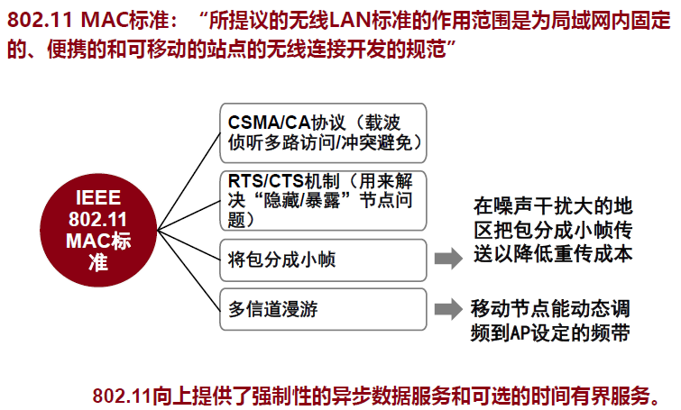

### CSMA/CA（载波监听与冲突避免）

载波监听：

- 如果介质为空，则节点传输帧
- 如果介质为忙，等待直到当前传输结束

冲突避免：

- 随机后退算法
- 优先级确认协议

不同类型的帧有不同的优先级。不同优先级对应于不同的等待时间。低优先级的帧不会和高优先级的帧竞争。

帧间的间隔时间：是每个帧都要等的，只是不同帧等待时间不同。

- DIFS：是数据帧的帧间间隔时间。时间最长，优先级最低。
- PIFS：中等优先级。用于使用PCF实现服务。
- SIFS：最高优先级。用于ACK、CTS、轮询响应。

流程：

- 监听介质是否为空，如果为空：
  - 就先等一个帧间间隔。然后看是否介质为空。
    - 如果为空就传输帧。
    - 如果不为空，就等待直到传输完毕。
- 如果监听时不为空，就等待直到传输完毕。
- 当等待直到传输完毕后。先等待一个帧间间隔，然后监听信道。如果这时候忙，就重复这一步，接着等。
  - 如果信道为空，就执行随机后退算法。然后再看信道是否为空。
- 可见，需要发送帧的站必须以随机后退开始，除非他最近没使用过信道，且信道处于空闲的状态。
  - 随机后退只适用于优先级为DIFS的帧。

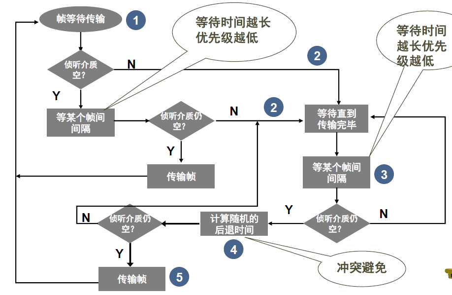

随机后退的竞争窗口：从31到1023。每次成功后窗口减半，每次不成功窗口加倍。

CSMA/CA是否公平？

- 每次失败后，随机窗口增大。容易导致一次失败以后，接下来更容易失败。因此不公平。
- 引入了改进的随机后退过程。相当于上一次等待的时间在下次接着用，而不是在下次等待时候清零。（类似于掉课的选课点，明年能接着用）
  - 选择一个随机数 
  - 使用侦听确定每个时间槽是否有活动
  - 如果没有活动则减少backoff时间
  - backoff 计时器将本次竞争的随即等候时间计量到下一次竞争中

单播数据的可靠传输：

- 接收方在校验CRC正确时立即返回ACK
- 没有收到ACK则随机后退后重传该数据帧
- 返回ACK只需要等待SIFS，不需要随机后退

### 带有RTS/CTS的扩展DCF

通过预留信道来解决“隐藏节点”问题。

RTS/CTS机制

- 机制的使用是可选的
- 每个802.11节点必须实现该功能

明确预留信道

- 发送方发送 RTS( 请求发送 )”报文
- 接收方用“ CTS ”回应发送请求
- CTS为发送方预留带宽的同时通告所有节点（包括隐藏的）
- RTS和CTS长度很短，冲突的概率减少

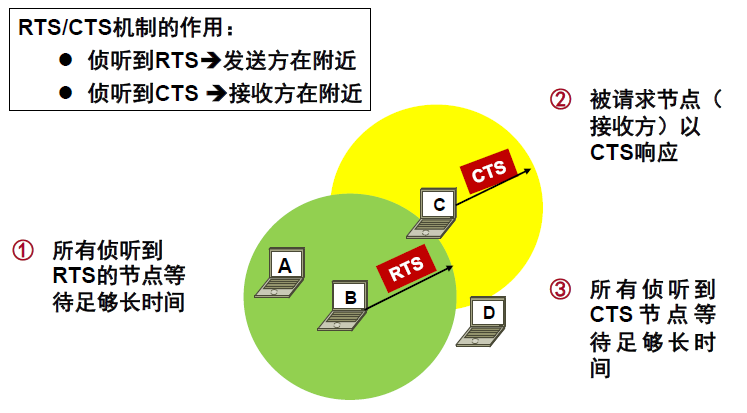

- 发送方先等待DIFS后再发送RTS
- 接收方收到RTS后，只需要等待SIFS后就发出CTS
- 发送方收到CTS后，只需要等待SIFS就可以发数据
- 接收方收到数据后，只需要等待SIFS就可以发ACK

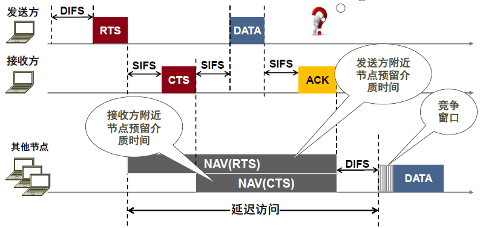

如何应付无线链路高比特出错率？

- 将长帧划分为较小的帧，逐个传输，逐个确认。

802.11的MAC帧结构中有四个地址字段，为了区分物理的和逻辑的。

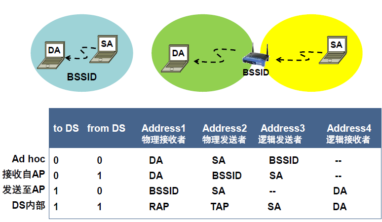

## 网桥的基本功能

过滤和转发

透明网桥功能：

- 将一个LAN上的MAC帧中继到另一个LAN上
- 如果两个LAN使用了不同的MAC协议，那么网桥必须将入境帧的内容映射到符合出境LAN的帧格式中
- 路由机制是一种称为生成树的技术

### 网桥的转发与学习

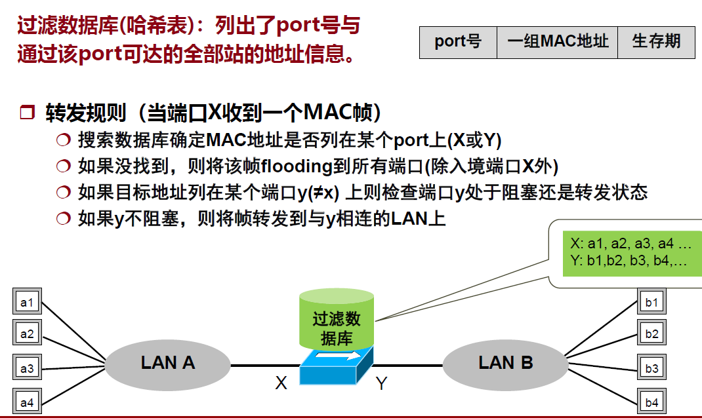

后向学习过程

- 到达某个端口的帧其源地址域说明它来自那个入境端口所连的LAN方向。因此通过源MAC地址和其入境端口进行学习。

老化计时器（生存期）

- 当往数据库增加一新条目时设置该计时器(缺省300秒)
-  当某个条目的计时器超时从库中删去该条目
-  每当接收一个帧时将其源地址与DB作比较

### 生成树协议

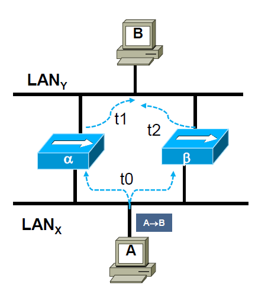

在$t_{0}$时刻，A向B发送一个帧。由于广播信道的特性，网桥$\alpha$在$t_1$时刻收到并泛洪该帧。网桥$\beta$在$t_2$时刻收到并泛洪该帧。

结果是网桥$\beta$收到两个A->B的帧。并且认为A是在上面那个端口连接的LAN中的。这样当B给A发帧时，网桥$\beta$会认为两者在同一LAN下，不会进行转发。

地址学习机制的基础：互连网络的拓扑结构是一棵树。

生成树算法：

- 去掉一个图中的一些边，形成一棵树

- 将去掉边对应的网桥有关端口设置为“阻塞”状态
- 处于“阻塞”状态的端口可以接收帧，但不能转发帧
- 需要时打开被“阻塞”端口，以便故障恢复

## 接入网络技术

### 有线电视接入技术

- 公用天线系统
  - 天线
  - 头端
  - 有线电视电缆

混合光纤结构(HFC)系统：中长距离使用光纤，连接到家庭使用同轴电缆。

利用有线电视系统接入Internet

- 专用调制解调器
- 线缆服务接口规范（DOCSIS）
- 头端（简单的放大器→智能CMTS）

头端(CMTS)控制下行信道的使用：利用时分多路复用(TDM)的方式。采用固定204字节数据包

### 数字订户线路(DSL)

xDSL(Digital Subscriber Line)的设计目标

- 服务必须能在已有的三类双绞线本地回路上工作
- 不能影响用户已有的电话和传真功能
- 必须比56kbps快（传统的拨号上网）

#### 非对称DSL(ADSL)

运行在已有普通电话线上的一种新的高速宽带技术。

非对称：下行速率比上行快

面向非对称服务

- 视频点播
- 居家购物
- Internet访问
- 多媒体应用等

ADL典型配置：

- 一个高速下行通道
- 一个中速双工通道
- 一个POTS通道（用于分离语音）

特性：

- 用户独占交换机的本地回路带宽
- 用户上网的速率受制于交换机之间的距离

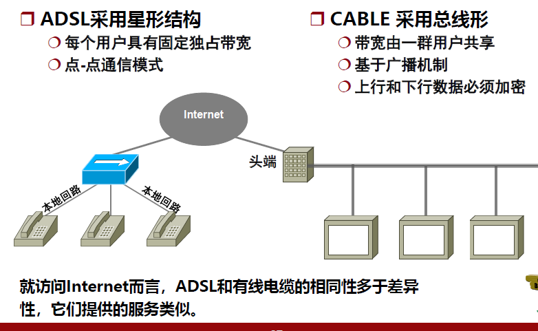

## PPP协议

PPP是一个可用于调制解调器、比特串行线路、SONET和其他物理层的多协议成帧机制。

例如：用户使用拨号电话线接入互联网时， 用户计算机和 ISP 进行通信时所使用的数据链路层协议就是 PPP 协议。

**PPP 是面向字节的，所有的 PPP 帧的长度都是整数字节。**

设计目标：

- 封装成帧
- 数据透明性
- 支持多种网络层协议
- 支持多种链路
- 错误检测
- 连接状态
- 网络层地址协商
- 简单性

PPP不必满足：

- 差错纠正
- 流量控制（是高层协议控制将包传给 PPP 发送的速率）
- 顺序性：PPP不必以帧交给链路发送者相同的顺序递交给链路的接收者。
- 多点链路

### PPP的组成

- 明确的成帧方法

- 一个链路控制协议(LCP)

  - LCP帧：用来协商最大帧长、认证协议等。
  - LCP功能：
    - 协商数据链路的选项
    - 关闭链路
    - 拒绝请求
    - 测试线路质量
    - 调试

- 一组网络控制协议(NCP)

  - NCP帧：协商报头是否压缩；协商 IP 地址

  ### PPP工作流程

  1. 当用户拨号接入 ISP 时，路由器的调制解调器对拨号做出确认，并建立一条物理连接。
  2. PC 机向路由器发送一系列的 LCP 分组（封装成多个 PPP 帧）。
  3. 这些分组及其响应选择一些 PPP 参数，并进行网络层配置，NCP 给新接入的 PC 机分配一个临时的 IP 地址，使 PC 机成为因特网上的一个主机。
  4. 通信完毕时，NCP 释放网络层连接，收回原来分配出去的 IP 地址。接着，LCP 释放数据链路层连接。最后释放的是物理层的连接。

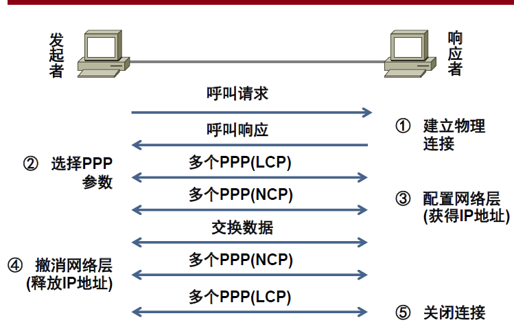

### PPP不提供使用序号和确认的可靠传输

- 在数据链路层出现差错的概率不大时，使用比较简单的 PPP 协议较为合理。
- 在因特网环境下，**PPP 的信息字段放入的数据是 IP  数据报。数据链路层的可靠传输并不能够保证网络层的传输也是可靠的**。
- **帧检验序列 FCS 字段可保证无差错接受。**

## PPPoE

1. PPPoE (PPP over Ethernet) 的意思是“在以太网上运行 PPP”，它把 PPP 协议与以太网协议结合起来 —— 将 PPP 帧再封装到以太网中来传输。
2. 现在的光纤宽带接入 FTTx 都要使用 PPPoE 的方式进行接入。在 PPPoE 弹出的窗口中键入在网络运营商购买的用户名和密码，就可以进行宽带上网了。
3. 利用 ADSL 进行宽带上网时，从用户个人电脑到家中的 ADSL 调制解调器之间，也是使用 RJ-45 和 5 类线（即以太网使用的网线）进行连接的，并且也是使用 PPPoE 弹出的窗口进行拨号连接的

## 适配器（网卡）的作用

网络接口板又称为通信适配器 (adapter) 或网络接口卡 NIC (Network Interface Card)，或“网卡”。

适配器的重要功能：

- 进行串行/并行转换。
- 对数据进行缓存。
- 在计算机的操作系统安装设备驱动程序。
- 实现以太网协议。