# 计算机网络——网络层

网络核心完成路径选择，由链路层协议实现每一跳的数据传输。

端-端通信：两个计算机系统传输实体之间的通信。

网络层是端-端通信的最底层。

网络层功能：

- 主要功能：存储-转发
  - 转发/交换（数据平面）：当一个包到达路由器时，路由器必须将它放到适当的输出链路。
  - 路由选择（控制平面）：路由器必须确定包从发送主机流向接收主机所走的路由或路径。
- 其他功能：
  - 呼叫建立（面向连接）：某些网络层需要所选路径沿途上的路由器，在真正数据交换之前握手协商状态信息（序列号、初始窗口大小）
  - 拥塞控制：路由器要调节数据包通过网络的流动

服务种类服务：

- 面向连接的服务
  - 就是通信双方在通信时,要事先建立一条通信线路,其过程有建立连接、使用连接和释放连接三个过程
  - 具有流控和流量控制功能
- 无连接的服务：
  - 在通信前无需建立会话

## 包交换技术

包交换技术（Packet switching technology）也称为分组交换技术，是将用户传送的数据划分成一定的长度，每个部分叫做一个分组。每个分组的前面有一个分组头，用以指明该分组发往何地址，然后由交换机根据每个分组的地址标志，将他们转发至目的地，这一过程称为分组交换。

### 数据报子网

特点：同一对端系统之间的数据报可能走不同的路径

数据报子网的实现

- 每个包必须包含目标端的完整地址：如IP地址
- 路由器用一张表路由表指出通向目标端的出境线路
- 当一个包入境时，路由器查找路由表并将包沿出境线路发出，无须修改包中的任何内容。

### 虚电路子网

- 同一对端系统之间的数据报遵循同一条路径
- 路由器依据包头的虚电路号转发

虚电路(VC)转换表：

- 建立虚电路时选择一个当前未使用的最低虚电路号。虚电路号包括<入境, 自己>和<自己，出境>。
- 数据报报头包含一个虚电路号
- 转发数据报时要修改报头中的虚电路号

VC转换表的维护：

- 每当建立一条新VC时在表中添加一项
- 每当终止一条VC时在表中删去相应条目

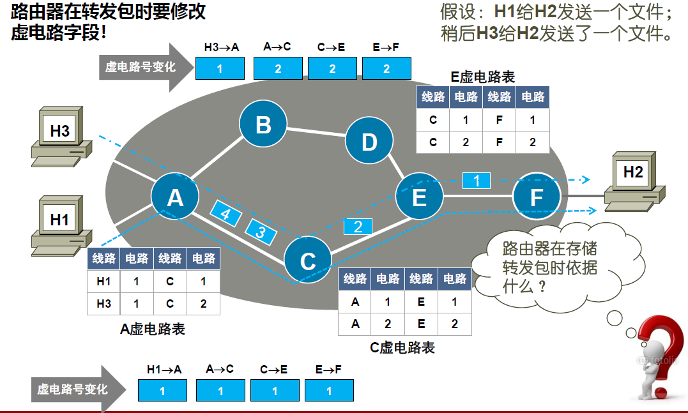

如图：A的虚电路表中，第一行表示有一条H1到A的虚电路，虚电路号为1;有一条A到C的虚电路，虚电路号为1。

数据报和虚电路的比较：
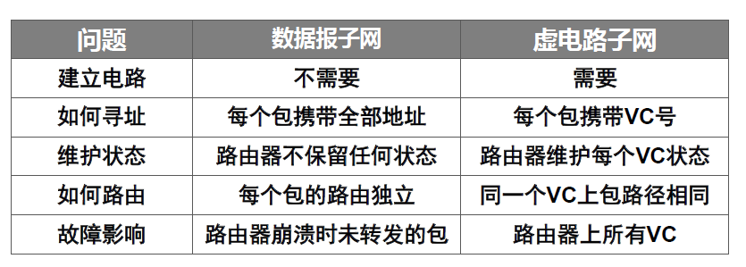

有连接的服务+虚电路结构：ATM上的AAL1

有连接的服务+数据报结构：TCP

- 网络单独处理每个包。同一条外部连接上的不同报文可能走不同路由

无连接服务+虚电路结构：ATM之上的IP

- 网络为传递报文在两站点间建立一条虚电路，并将该电路保留一段时间以满足预期的未来需要。

无连接服务+数据报结构：UDP

- 用户传输报文不需要建立连接，网络传递包也不需要建立虚电路

## 网络互连设备

### 中继器

- 放大电子信号的低级设备。它将来自一个接口的比特简单广播到所有的其他接口。

- 用于连接以太制式的总线式网络，起到扩展网络连接距离的作用。
- 工作在物理层

类别：

- 放大器：单纯地把接收信号放大后再输出
- 信号再生器：先过滤掉噪声再放大输出

缺点：

- 不具备检错和纠错功能
- 连接的以太网不能形成环

中继器的多级配置：

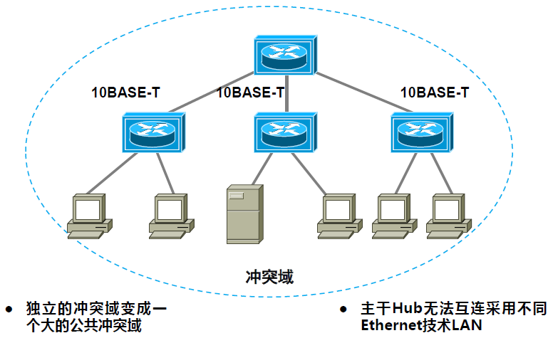

### 网桥

- 接收整个帧传递到数据链路层做校验和检查
- 向下传到物理层转发到不同的网络
- 工作在数据链路层
- 按照MAC地址转发帧
- 通常有两类网桥：透明网桥，源路由网桥

网桥的多级配置：
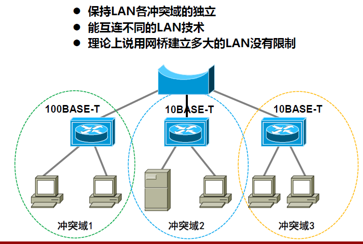

### 路由器

- 一种用于连接两个运行相同不同协议的中间系统
- 针对网络层地址协议（如 IP 地址）进行选择与判断
- 需要有二层地址与三层地址的映射能力（地址解析）
- 对相同高层协议提供多个网络介质之间网络互连能力

### 桥路器

- 可同时作为网桥使用的一种路由器
- 桥路器不识别逻辑地址（Ip地址）时改用物理地址发送

### 网关

- 用于连接两个异构的相互独立的网络
- 类型：协议网关、应用网关、安全网关

协议网关：用于使用不同协议的网络间进行协议转换，由三种工作方式，分别对应于在链路层、网络层、或二、三层之间进行转换。

应用网关：在不同格式间翻译数据的系统，以连接应用不相容的源系统和目标系统的中间点，例如Email网关。

安全网关：防火墙。将外部网络与内部网络隔开。

## 分段与重组

包的长度受限制：

- 硬件
- OS
- 协议
- 减少由错误引起的重传
- 防止某个包占用信道时间过长

分段技术：将大的包分成网络能容纳的一系列段，将每一段作为一个独立的包发送。

### 透明分段

分段策略：

- 包遇到通不过的子网时，在进入之前由路由器按照子网MTU大小进行分段
- 在离开子网时重组还原原始的包，因此前面的分段对后面的网络透明

特点：

- 出口网关必须确定何时收到全部小包
- 所有小包必须经过同一网关出口
- 不断地分段与重组会增大开销

### 不透明分段

分段策略：

- 任一中间网关都不重组，必要时只进行分段
- 仅在目标主机进行一次重组

特点：

- 要求每个主机都能重组
- 总的开销增大

### 重组

将分成的若干个小包还原成原始的大包

重组方法：一般采用树形结构编号

### 隧道技术

隧道：在两个端点建立传输数据报的虚拟管道，使所传输的数据报不为途径的节点所知。通常采用封装技术

## 路由算法

### 静态路由算法

不根据实测或估计的网络当前通信量和拓扑结构做路由选择。

测量路径长度的方法：

- 最小跳计数
- 信道带宽
- 传输延迟
- 平均通信量

#### 扩散法（flooding)

在所有出境线路上发送包

优点：

- 尝试所有可能的路由
- 至少有一个包通过最小跳路由到达
- 所有与源节点连接的结点都被访问

缺点：包的拷贝数量呈指数增长

### 链路状态路由算法

每个节点在获得全网的全部网络拓扑信息的基础上独立计算到全部目的地的路由。

特性：

- 每个节点都有完整的网络拓扑
- 每个节点维护到邻居的连通性与链路成本
- 每个节点向网络中所有其他节点广播自己和邻居的连接信息
- 每当收到来自其他节点信息就用Dijkstra算法重新计算路由

LS算法执行过程：

- 发现邻居节点
  - 在一跳的范围内广播一个HELLO报文，邻居做出响应。并把它的地址带过来。
- 测量链路成本
  - 给邻居发送ECHO报文，邻居收到后立即响应。用来测量链路的往返时间。
- 封装链路状态包
  - 把本地与邻居相连的链路成本以及邻居的ID封装到一个报文中
- 广播链路状态信息
  - 发送链路状态的时机：
    - 定期发送
    - 出现重大事件：
      - 发现新的邻居
      - 到某个邻居的链路连接中断
      - 链路成本发送很大变化
- 计算新路由

缺点：出现路由震荡。路由来回切换，造成路由不稳定。

### 距离矢量算法

距离矢量(Distance Vector)：通过和邻居交换路由信息，独立计算本地抵达所有目的地的每条路经距离，选择最短的那条路径作为目标路由。

特点：

- 分布的
  - 每个节点接收来自邻居节点的路由信息，并执行路由计算
  - 将计算结果回传给直接邻接的节点
- 迭代的
  - 计算过程循环进行
  - 直到相邻节点没有可交换的路由信息为止
- 异步的

$D^{X}(Y,Z)$: 从X经邻居Z到达Y的距离。

特点：好消息传得快；坏消息传的慢。

毒性逆转方法：

- 它的基本思想是：如果Z到X最短路径要通过邻居Y，那么它将告诉Y, 自己到X的距离是无穷。
- 用来解决“坏消息传的慢”的问题。
- 但是，当涉及3个或更多节点的环路，就不能用上述方法解决。例如下图中的CD断开。

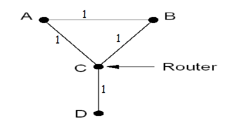

LS与DV路由算法比较

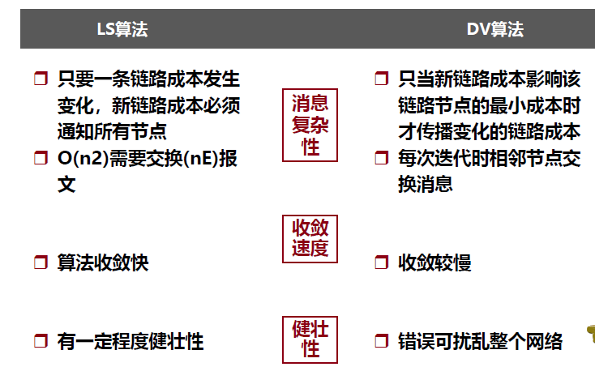

## Internet基本体系结构

路由器系统组成了Internet的基本体系结构。

主机用部分信息即可完成数据包的传输：

- 主机可把所有本地的数据报送给本地路由器，而把所有非本地数据报通过省缺路由发送。
- 即使只有部分的路由信息，主机也能成功地传输数据报。

需要一种体系，允许某个组管理当地的路由器，当添加新的网络互连和路由信息时不必更改远程路由器的路由表。

### 核心路由体系

原始的Internet体系结构

核心路由器：由Internet网络运营中心（INOC)控制

核心系统：

- 提供到所有可能的目的地的可靠的、一致的且可信的路由

核心路由体系问题：

- 多一跳问题：无论怎么选择核心路由器总存在多一跳的传输情况

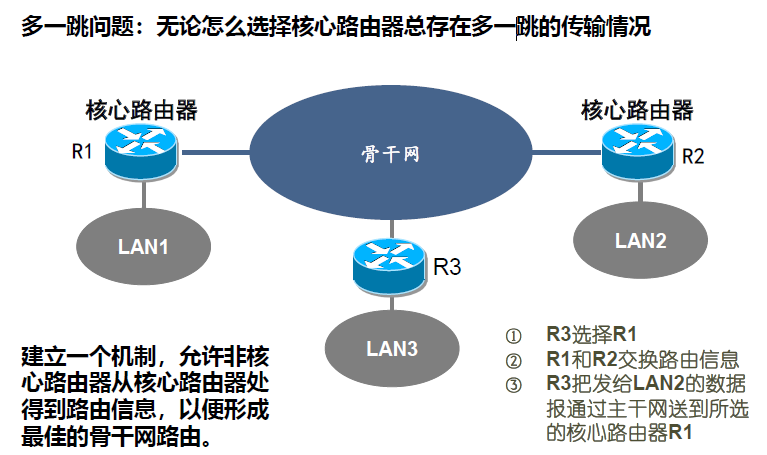

- 如何报告LAN4的存在？如何保证LAN4的网络可达性？

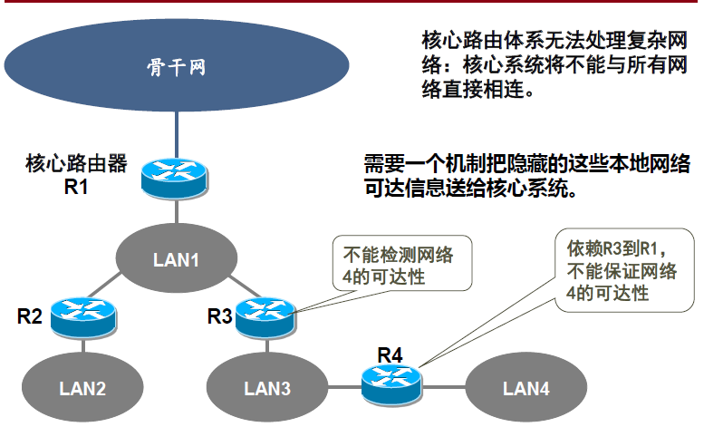

### 自治系统

不把互联网络看作多个独立的网络，而是当作一个独立的组织，所有该网点的网络处于这个组织的控制之下。

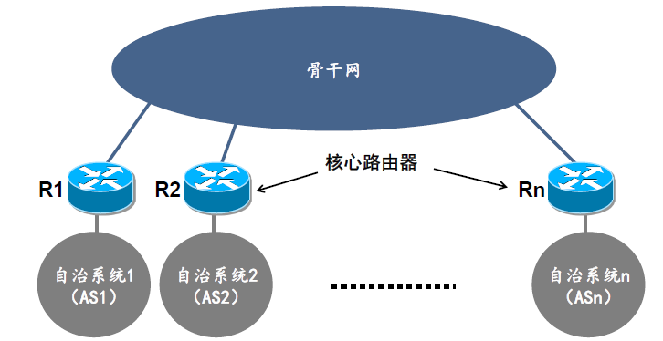

自治系统特性

- 可自由地选择其内部的路由体系结构
- 收集内部所有网络信息，并责成若干路由器把这些可达信息送给其他自治系统

Internet 路由体系

- 使用核心体系结构，每个与之相连的自治系统都要把可达信息送到 Internet 核心路由器

自治系统内部可以选择任何路由协议，

各个自治系统要是相连，需要指定边界路由器。边界路由器要运行同样的路由协议。

#### 内部网关协议（IGP)

是一个抽象的说法，目前Internet大多用的是OSPF协议。OSPF使用了链路状态算法。

内部路由器：用来交换网络可达信息及路由信息算法的统称。

两个自治系统(AS)在内部使用可使用不同的IGP。

在书中对OSPF介绍的很多。

#### 边界网关协议(BGP)

外部网关协议现在常用的是边界网关协议（BGP）。

使用了距离矢量算法。

BGP 为每个自治系统提供提供了

- eBGP 从邻居 AS 获取子网可达信息
- iBGP 将可达信息传播至所有 AS 内部路由器
- 根据可达信息和路由策略确定到其他网络的 good 路由

允许子网向 Internet 广播自己的存在

BGP不仅会通报自己到邻居的距离，还会通报路径信息，用来防止无穷计算问题。

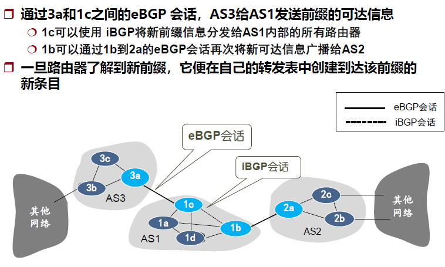

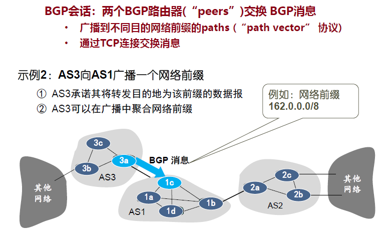

## ICMP协议

Internet控制报文协议

- ICMP报文封装在有效载荷部分
- ICMP报文的最终目的地是处理它的Internet协议软件模块

特点：

- 不是高层协议
- 不具备可靠性和优先级
- 携带ICMP的报文的IP数据报传递出错时不再报告
- 携带ICMP的报文的IP数据报与携带用户数据的IP数据报具有完全相同的路由选择

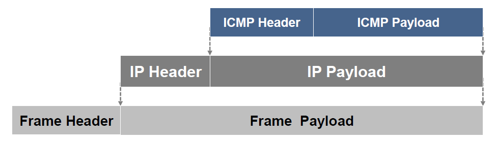

工作过程：

- 当数据报产生差错时，ICMP向数据报的源端汇报差错情况
- 源端必须把差错交给一个应用程序或采取其他措施来纠正

### 功能

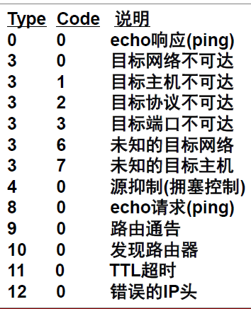

#### 检测可达性和状态

- 主机或路由器向指定目标发送 ICMP的ECHO请求报文(Type=8)，请求报文包含一个可选的数据区
- 收到 ECHO 请求报文的机器应立即回应一个应答报文(Type=0)，应答报文包含了请求报文中数据的拷贝
- 例如：ping

目标端不可达时的报告：

- 当路由器无法投递包时：向源端返回目标端不可达报文，并丢弃该数据报
- 目标端不可达还细分为多种，包括网络不可达、主机不可达、协议不可达、端口不可达等等。

#### 拥塞控制

- 发生拥塞的路由器丢弃数据报，并返回源抑制报文

#### 重定向路由

当路由器检测到主机使用了一条非优化路由时就向主机发送一个重定向的ICMP报文，请求主机改变路由，同时转发初始数据报。

#### 检测循环路由

当路由器因TTL计数器为0或主机等待包重组超时而丢弃数据报时，向源端返回ICMP超时报文。

#### 报告其他问题

当路由器或主机发现一个数据报有问题时（如不正确的数据报头）便向源端发送一个参数问题的 ICMP 报文。

#### 传输时间估计

计算一个请求报文从发出到达目的地、被转换成应答报文及返回所需时间。

#### 请求子网掩码

为了解本地网络使用的子网掩码，主机可向路由器发出一个地址掩码请求报文，并接收一个地址掩码应答报文。

#### 其他：trace route

利用ICMP超时报文发现到目的地一条路径上的路由器列表。

- 向目标端发送TTL=1、TTL=2、TTL=3......的TTL递增的ICMP报文，途径的路由器会丢弃包，并向源端返回包含IP地址的ICMP报文。

可能存在问题：

- 重复响应或重发丢失包
- 路由可动态变化

#### 其他：发现路径MTU

- 源端发送报文长度递减的ICMP报文，并设置数据报头的“不能分(DF)”标志位。
- 路由器会丢弃超长又不允许分段的数据报，并向源端返回ICMP。

## ARP协议

Internet地址解析协议

地址解析：将IP地址解析成相应的硬件地址的过程

动态消息交换法：需要解析地址是通过网络进行消息通信获得IP地址对应的物理地址。

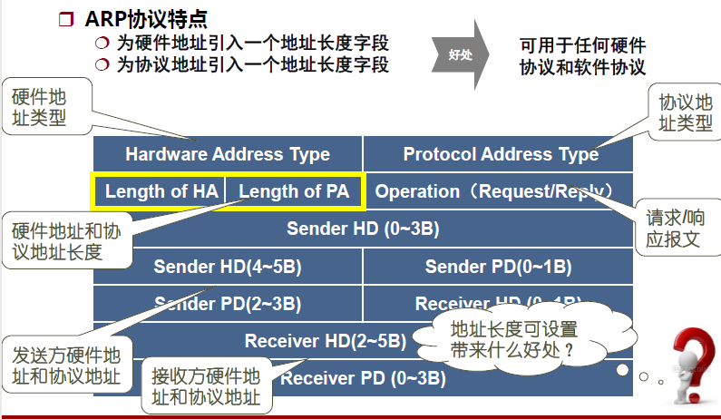

- 主机会通过**广播发送 ARP 请求**，这个包中包含了想要知道的 MAC 地址的主机 IP 地址。
- 当同个链路中的所有设备收到 ARP 请求时，会去拆开 ARP 请求包里的内容，如果 ARP 请求包中的目标 IP 地址与自己的 IP 地址一致，那么这个设备就将自己的 MAC 地址塞入 **ARP 响应包**返回给主机。

ARP 消息的处理

- 从接收到的消息中取出发送方的地址绑定信息
- 检查消息中的操作字段确定收到的是请求应答消息
- ARP的高速缓存 (ARP表)
- ARP有一个高速缓存，用来存放最近获得的IP地址与硬件地址绑定信息

ARP的优化策略：在回答ARP请求后将**请求消息中的发送方地址**绑定信息加入自己的高速缓存