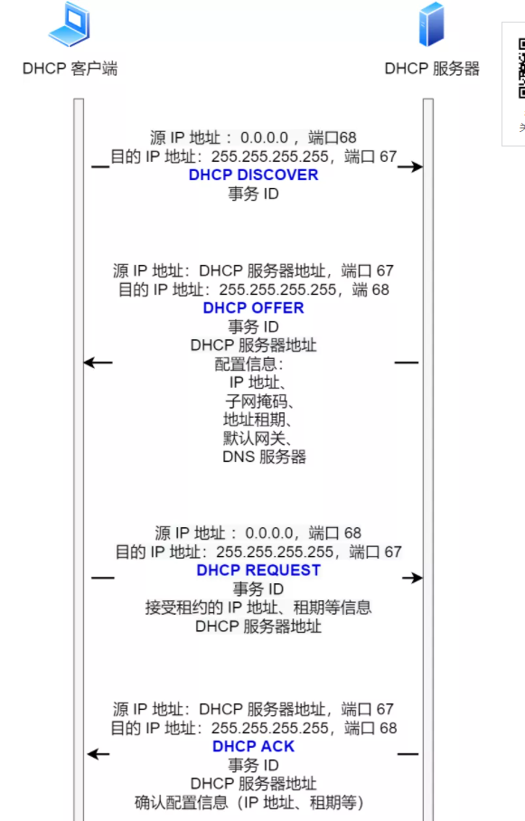
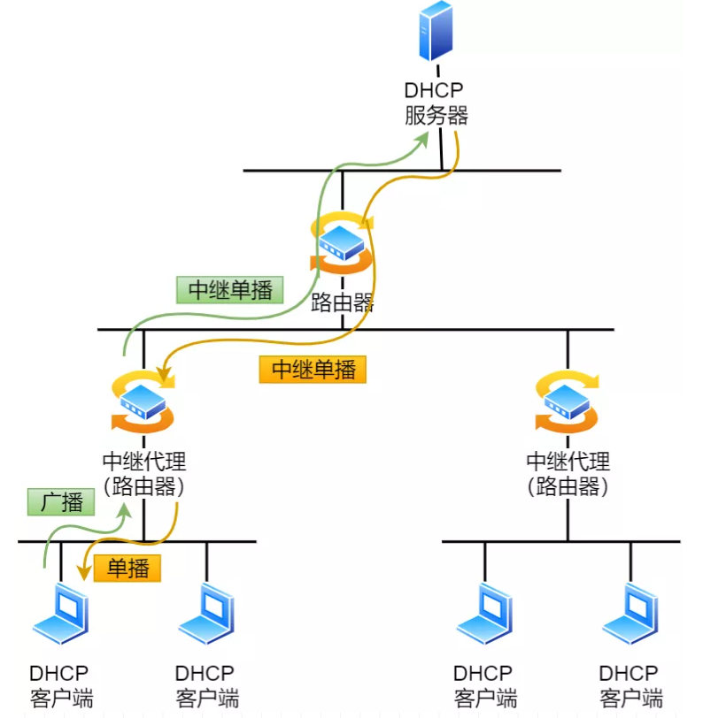
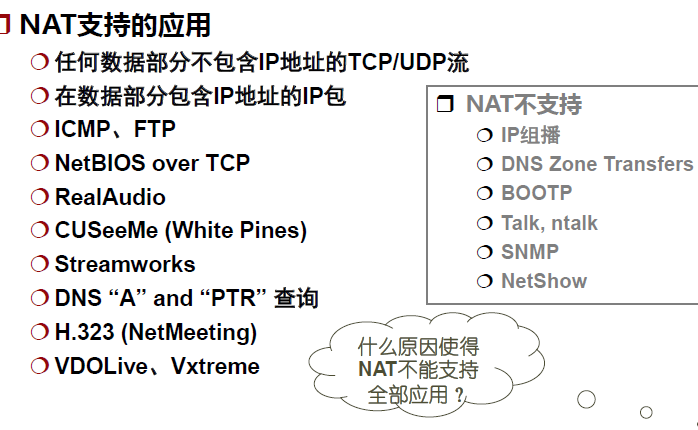
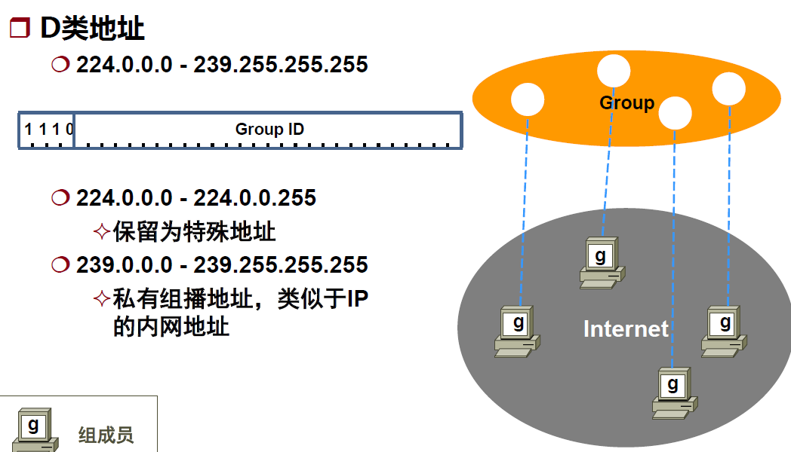
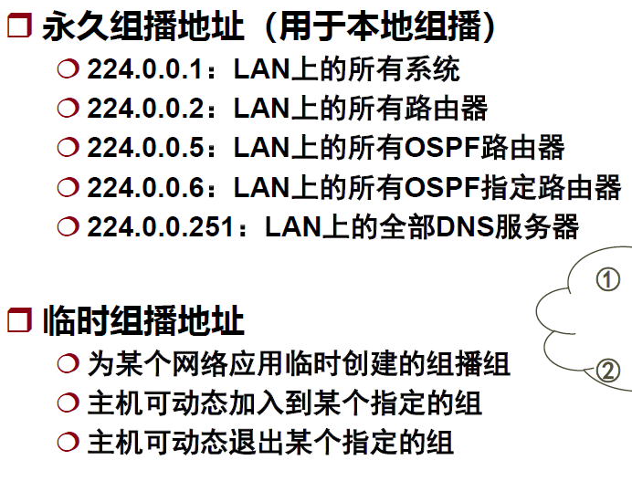
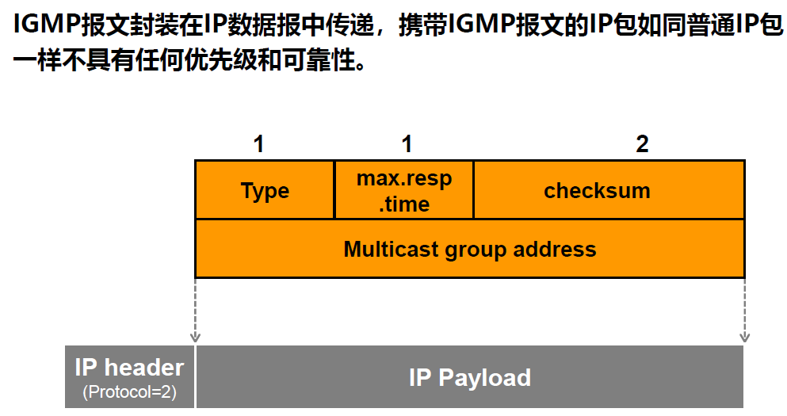
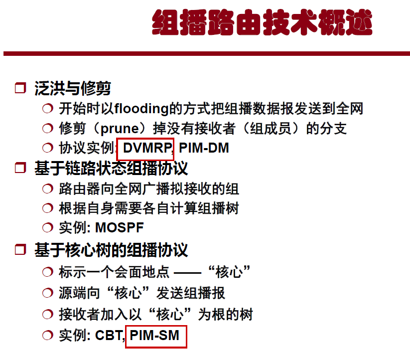
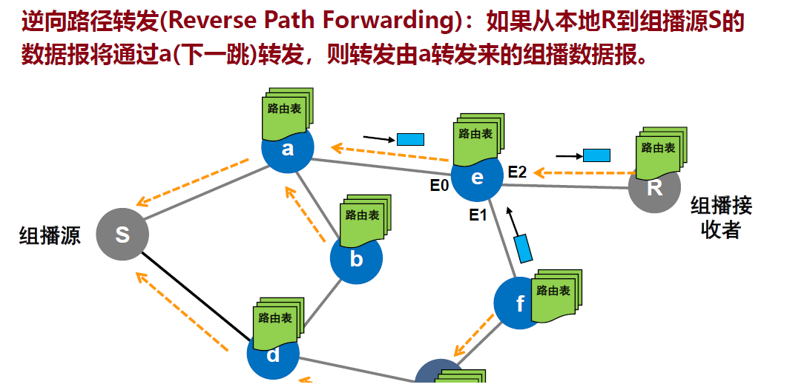
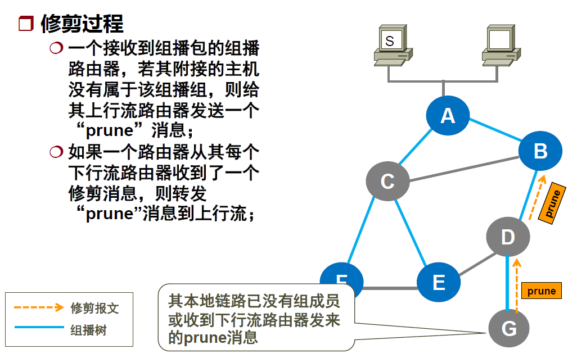
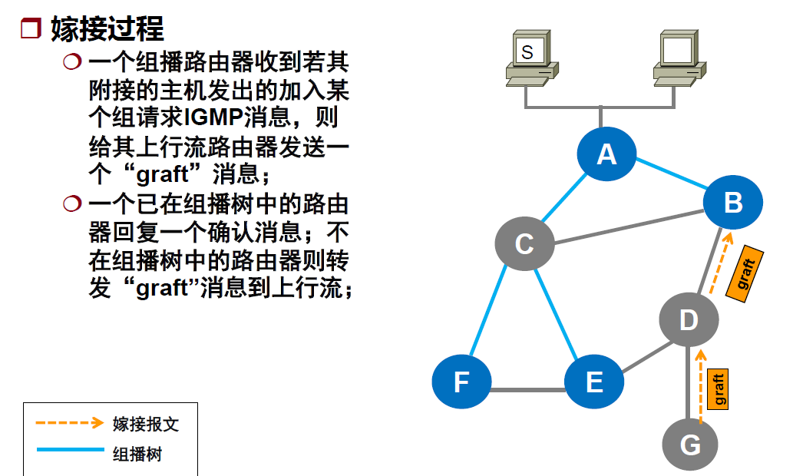

# 计算机网络——网络层

[TOC]

网络核心完成路径选择，由链路层协议实现每一跳的数据传输。

端-端通信：两个计算机系统传输实体之间的通信。

网络层是端-端通信的最底层。

网络层功能：

- 主要功能：存储-转发
  - 转发/交换（数据平面）：当一个包到达路由器时，路由器必须将它放到适当的输出链路。
  - 路由选择（控制平面）：路由器必须确定包从发送主机流向接收主机所走的路由或路径。
- 其他功能：
  - 呼叫建立（面向连接）：某些网络层需要所选路径沿途上的路由器，在真正数据交换之前握手协商状态信息（序列号、初始窗口大小）
  - 拥塞控制：路由器要调节数据包通过网络的流动

服务种类服务：

- 面向连接的服务
  - 就是通信双方在通信时,要事先建立一条通信线路,其过程有建立连接、使用连接和释放连接三个过程
  - 具有流控和流量控制功能
- 无连接的服务：
  - 在通信前无需建立会话

## 包交换技术

包交换技术（Packet switching technology）也称为分组交换技术，是将用户传送的数据划分成一定的长度，每个部分叫做一个分组。每个分组的前面有一个分组头，用以指明该分组发往何地址，然后由交换机根据每个分组的地址标志，将他们转发至目的地，这一过程称为分组交换。

### 数据报子网

特点：同一对端系统之间的数据报可能走不同的路径

数据报子网的实现

- 每个包必须包含目标端的完整地址：如IP地址
- 路由器用一张表路由表指出通向目标端的出境线路
- 当一个包入境时，路由器查找路由表并将包沿出境线路发出，无须修改包中的任何内容。

### 虚电路子网

- 同一对端系统之间的数据报遵循同一条路径
- 路由器依据包头的虚电路号转发

虚电路(VC)转换表：

- 建立虚电路时选择一个当前未使用的最低虚电路号。虚电路号包括<入境, 自己>和<自己，出境>。
- 数据报报头包含一个虚电路号
- 转发数据报时要修改报头中的虚电路号

VC转换表的维护：

- 每当建立一条新VC时在表中添加一项
- 每当终止一条VC时在表中删去相应条目

如图：A的虚电路表中，第一行表示有一条H1到A的虚电路，虚电路号为1;有一条A到C的虚电路，虚电路号为1。

数据报和虚电路的比较：

有连接的服务+虚电路结构：ATM上的AAL1

有连接的服务+数据报结构：TCP

- 网络单独处理每个包。同一条外部连接上的不同报文可能走不同路由

无连接服务+虚电路结构：ATM之上的IP

- 网络为传递报文在两站点间建立一条虚电路，并将该电路保留一段时间以满足预期的未来需要。

无连接服务+数据报结构：UDP

- 用户传输报文不需要建立连接，网络传递包也不需要建立虚电路

## 网络互连设备

### 中继器

- 放大电子信号的低级设备。它将来自一个接口的比特简单广播到所有的其他接口。

- 用于连接以太制式的总线式网络，起到扩展网络连接距离的作用。
- 工作在物理层

类别：

- 放大器：单纯地把接收信号放大后再输出
- 信号再生器：先过滤掉噪声再放大输出

缺点：

- 不具备检错和纠错功能
- 连接的以太网不能形成环

中继器的多级配置：

### 网桥

- 接收整个帧传递到数据链路层做校验和检查
- 向下传到物理层转发到不同的网络
- 工作在数据链路层
- 按照MAC地址转发帧
- 通常有两类网桥：透明网桥，源路由网桥

网桥的多级配置：

### 路由器

- 一种用于连接两个运行相同不同协议的中间系统
- 针对网络层地址协议（如 IP 地址）进行选择与判断
- 需要有二层地址与三层地址的映射能力（地址解析）
- 对相同高层协议提供多个网络介质之间网络互连能力

### 桥路器

- 可同时作为网桥使用的一种路由器
- 桥路器不识别逻辑地址（Ip地址）时改用物理地址发送

### 网关

- 用于连接两个异构的相互独立的网络
- 类型：协议网关、应用网关、安全网关

协议网关：用于使用不同协议的网络间进行协议转换，由三种工作方式，分别对应于在链路层、网络层、或二、三层之间进行转换。

应用网关：在不同格式间翻译数据的系统，以连接应用不相容的源系统和目标系统的中间点，例如Email网关。

安全网关：防火墙。将外部网络与内部网络隔开。

## 分段与重组

包的长度受限制：

- 硬件
- OS
- 协议
- 减少由错误引起的重传
- 防止某个包占用信道时间过长

分段技术：将大的包分成网络能容纳的一系列段，将每一段作为一个独立的包发送。

### 透明分段

分段策略：

- 包遇到通不过的子网时，在进入之前由路由器按照子网MTU大小进行分段
- 在离开子网时重组还原原始的包，因此前面的分段对后面的网络透明

特点：

- 出口网关必须确定何时收到全部小包
- 所有小包必须经过同一网关出口
- 不断地分段与重组会增大开销

### 不透明分段

分段策略：

- 任一中间网关都不重组，必要时只进行分段
- 仅在目标主机进行一次重组

特点：

- 要求每个主机都能重组
- 总的开销增大

### 重组

将分成的若干个小包还原成原始的大包

重组方法：一般采用树形结构编号

### 隧道技术

隧道：在两个端点建立传输数据报的虚拟管道，使所传输的数据报不为途径的节点所知。通常采用封装技术

## 路由算法

### 静态路由算法

不根据实测或估计的网络当前通信量和拓扑结构做路由选择。

测量路径长度的方法：

- 最小跳计数
- 信道带宽
- 传输延迟
- 平均通信量

#### 扩散法（flooding)

在所有出境线路上发送包

优点：

- 尝试所有可能的路由
- 至少有一个包通过最小跳路由到达
- 所有与源节点连接的结点都被访问

缺点：包的拷贝数量呈指数增长

### 链路状态路由算法

每个节点在获得全网的全部网络拓扑信息的基础上独立计算到全部目的地的路由。

特性：

- 每个节点都有完整的网络拓扑
- 每个节点维护到邻居的连通性与链路成本
- 每个节点向网络中所有其他节点广播自己和邻居的连接信息
- 每当收到来自其他节点信息就用Dijkstra算法重新计算路由

LS算法执行过程：

- 发现邻居节点
  - 在一跳的范围内广播一个HELLO报文，邻居做出响应。并把它的地址带过来。
- 测量链路成本
  - 给邻居发送ECHO报文，邻居收到后立即响应。用来测量链路的往返时间。
- 封装链路状态包
  - 把本地与邻居相连的链路成本以及邻居的ID封装到一个报文中
- 广播链路状态信息
  - 发送链路状态的时机：
    - 定期发送
    - 出现重大事件：
      - 发现新的邻居
      - 到某个邻居的链路连接中断
      - 链路成本发送很大变化
- 计算新路由

缺点：出现路由震荡。路由来回切换，造成路由不稳定。

### 距离矢量算法

距离矢量(Distance Vector)：通过和邻居交换路由信息，独立计算本地抵达所有目的地的每条路经距离，选择最短的那条路径作为目标路由。

特点：

- 分布的
  - 每个节点接收来自邻居节点的路由信息，并执行路由计算
  - 将计算结果回传给直接邻接的节点
- 迭代的
  - 计算过程循环进行
  - 直到相邻节点没有可交换的路由信息为止
- 异步的

$D^{X}(Y,Z)$: 从X经邻居Z到达Y的距离。

特点：好消息传得快；坏消息传的慢。

毒性逆转方法：

- 它的基本思想是：如果Z到X最短路径要通过邻居Y，那么它将告诉Y, 自己到X的距离是无穷。
- 用来解决“坏消息传的慢”的问题。
- 但是，当涉及3个或更多节点的环路，就不能用上述方法解决。例如下图中的CD断开。

LS与DV路由算法比较

## Internet基本体系结构

路由器系统组成了Internet的基本体系结构。

主机用部分信息即可完成数据包的传输：

- 主机可把所有本地的数据报送给本地路由器，而把所有非本地数据报通过省缺路由发送。
- 即使只有部分的路由信息，主机也能成功地传输数据报。

需要一种体系，允许某个组管理当地的路由器，当添加新的网络互连和路由信息时不必更改远程路由器的路由表。

### 核心路由体系

原始的Internet体系结构

核心路由器：由Internet网络运营中心（INOC)控制

核心系统：

- 提供到所有可能的目的地的可靠的、一致的且可信的路由

核心路由体系问题：

- 多一跳问题：无论怎么选择核心路由器总存在多一跳的传输情况

- 如何报告LAN4的存在？如何保证LAN4的网络可达性？

### 自治系统

不把互联网络看作多个独立的网络，而是当作一个独立的组织，所有该网点的网络处于这个组织的控制之下。

自治系统特性

- 可自由地选择其内部的路由体系结构
- 收集内部所有网络信息，并责成若干路由器把这些可达信息送给其他自治系统

Internet 路由体系

- 使用核心体系结构，每个与之相连的自治系统都要把可达信息送到 Internet 核心路由器

自治系统内部可以选择任何路由协议，

各个自治系统要是相连，需要指定边界路由器。边界路由器要运行同样的路由协议。

#### 内部网关协议（IGP)

是一个抽象的说法，目前Internet大多用的是OSPF协议。OSPF使用了链路状态算法。

内部路由器：用来交换网络可达信息及路由信息算法的统称。

两个自治系统(AS)在内部使用可使用不同的IGP。

在书中对OSPF介绍的很多。

#### 边界网关协议(BGP)

外部网关协议现在常用的是边界网关协议（BGP）。

使用了距离矢量算法。

BGP 为每个自治系统提供提供了

- eBGP 从邻居 AS 获取子网可达信息
- iBGP 将可达信息传播至所有 AS 内部路由器
- 根据可达信息和路由策略确定到其他网络的 good 路由

允许子网向 Internet 广播自己的存在

BGP不仅会通报自己到邻居的距离，还会通报路径信息，用来防止无穷计算问题。

## ICMP协议

Internet控制报文协议

- ICMP报文封装在有效载荷部分
- ICMP报文的最终目的地是处理它的Internet协议软件模块

特点：

- 不是高层协议
- 不具备可靠性和优先级
- 携带ICMP的报文的IP数据报传递出错时不再报告
- 携带ICMP的报文的IP数据报与携带用户数据的IP数据报具有完全相同的路由选择

工作过程：

- 当数据报产生差错时，ICMP向数据报的源端汇报差错情况
- 源端必须把差错交给一个应用程序或采取其他措施来纠正

### 功能

#### 检测可达性和状态

- 主机或路由器向指定目标发送 ICMP的ECHO请求报文(Type=8)，请求报文包含一个可选的数据区
- 收到 ECHO 请求报文的机器应立即回应一个应答报文(Type=0)，应答报文包含了请求报文中数据的拷贝
- 例如：ping

目标端不可达时的报告：

- 当路由器无法投递包时：向源端返回目标端不可达报文，并丢弃该数据报
- 目标端不可达还细分为多种，包括网络不可达、主机不可达、协议不可达、端口不可达等等。

#### 拥塞控制

- 发生拥塞的路由器丢弃数据报，并返回源抑制报文

#### 重定向路由

当路由器检测到主机使用了一条非优化路由时就向主机发送一个重定向的ICMP报文，请求主机改变路由，同时转发初始数据报。

#### 检测循环路由

当路由器因TTL计数器为0或主机等待包重组超时而丢弃数据报时，向源端返回ICMP超时报文。

#### 报告其他问题

当路由器或主机发现一个数据报有问题时（如不正确的数据报头）便向源端发送一个参数问题的 ICMP 报文。

#### 传输时间估计

计算一个请求报文从发出到达目的地、被转换成应答报文及返回所需时间。

#### 请求子网掩码

为了解本地网络使用的子网掩码，主机可向路由器发出一个地址掩码请求报文，并接收一个地址掩码应答报文。

#### 其他：trace route

利用ICMP超时报文发现到目的地一条路径上的路由器列表。

- 向目标端发送TTL=1、TTL=2、TTL=3......的TTL递增的ICMP报文，途径的路由器会丢弃包，并向源端返回包含IP地址的ICMP报文。

可能存在问题：

- 重复响应或重发丢失包
- 路由可动态变化

#### 其他：发现路径MTU

- 源端发送报文长度递减的ICMP报文，并设置数据报头的“不能分(DF)”标志位。
- 路由器会丢弃超长又不允许分段的数据报，并向源端返回ICMP。

## ARP协议

Internet地址解析协议

地址解析：将IP地址解析成相应的硬件地址的过程

动态消息交换法：需要解析地址是通过网络进行消息通信获得IP地址对应的物理地址。

ARP报文直接封装到帧中。

- 主机会通过**广播发送 ARP 请求**，这个包中包含了想要知道的 MAC 地址的主机 IP 地址。
- 当同个链路中的所有设备收到 ARP 请求时，会去拆开 ARP 请求包里的内容，如果 ARP 请求包中的目标 IP 地址与自己的 IP 地址一致，那么这个设备就将自己的 MAC 地址塞入 **ARP 响应包**返回给主机。

ARP 消息的处理

- 从接收到的消息中取出发送方的地址绑定信息
- 检查消息中的操作字段确定收到的是请求应答消息
- ARP的高速缓存 (ARP表)
- ARP有一个高速缓存，用来存放最近获得的IP地址与硬件地址绑定信息

ARP的优化策略：在回答ARP请求后将**请求消息中的发送方地址**绑定信息加入自己的高速缓存

## DHCP协议

动态主机配置协议

- 允许计算机快速、动态获取IP地址
- 只要有新计算机连到网络，新计算机就与服务器联系并申请一个地址
- DHCP服务器从管理员指定的地址中选一个未分配的地址给新计算机
- 动态地址是临时的：有租用期

DHCP是用UDP传的，报文封装到UDP中。

### 过程

- 客户端首先发起 **DHCP 发现报文（DHCP DISCOVER）** 的 IP 数据报，由于客户端没有 IP 地址，也不知道 DHCP 服务器的地址，所以使用的是 UDP **广播**通信，其使用的广播目的地址是 255.255.255.255（端口 67） 并且使用 0.0.0.0（端口 68） 作为源 IP 地址。DHCP 客户端将该 IP 数据报传递给链路层，链路层然后将帧广播到所有的网络中设备。
- DHCP 服务器收到 DHCP 发现报文时，用 **DHCP 提供报文（DHCP OFFER）** 向客户端做出响应。该报文仍然使用 IP 广播地址 255.255.255.255，该报文信息携带服务器提供可租约的 IP 地址、子网掩码、默认网关、DNS 服务器以及 **IP 地址租用期**。
- 客户端收到一个或多个服务器的 DHCP 提供报文后，从中选择一个服务器，并广播 **DHCP 请求报文（DHCP REQUEST**)进行响应，回显配置的参数。
- 最后，服务端收到请求报文后，广播 **DHCP ACK 报文**对 DHCP 请求报文进行响应，应答所要求的参数。

如果租约的 DHCP IP 地址快期后，客户端会向服务器发送 DHCP 请求报文：

- 服务器如果同意继续租用，则用 DHCP ACK 报文进行应答，客户端就会延长租期。
- 服务器如果不同意继续租用，则用 DHCP NACK 报文，客户端就要停止使用租约的 IP 地址。

注意：DHCP 交互中，**全程都是使用 UDP 广播通信**。

那如果 DHCP 服务器和客户端不是在同一个局域网内，路由器又不会转发广播包，那不是每个网络都要配一个 DHCP 服务器？

- 使用DHCP中继代理。有了 DHCP 中继代理以后，对不同网段的 IP 地址分配也可以由一个 DHCP 服务器统一进行管理。
- DHCP 客户端会向 DHCP 中继代理发送 DHCP 请求包，而 DHCP 中继代理在收到这个广播包以后，再以**单播**的形式发给 DHCP 服务器。
- 服务器端收到该包以后再向 DHCP 中继代理返回应答，并由 DHCP 中继代理将此包转发给 DHCP 客户端 。

## NAT协议

网络地址转换协议

NAT协议：在私有地址和全局地址之间进行转换。

引入 NAT 协议的动机：

- 增加内部网络的安全性
- 内联网用户需要访问 Internet
- DHCP 只能部分缓解 IP 地址资源的不足
- 小型企业和家庭用户需要全程在线连接 Internet

### 内联网

内联网：不与Internet相连的企业内部网络。

私有地址：不能用在Internet上的内部地址（路由器将丢弃）

- 好处
  - 无需申请全球合法的IP地址
  - 网络规模完全自主选择

利用隧道技术将内联网包封装成Internet上的IP包

- 前提：每个内联网必须拥有至少一个合法IP地址的路由器

### NAT工作过程

NAT路由器：

- 负责源IP地址和目的IP地址转换
- 地址转换可以静态或者动态设置

将出境包的<源IP地址，端口号>映射成<NAT路由器IP地址，NAT路由器分配的端口号>

将入境包做相反的映射。

NAT路由器的地址转换表中记录每个映射条目。

NAT缺点：

- 外部无法主动与 NAT 内部服务器建立连接，因为 NAPT 转换表没有转换记录。
- 转换表的生产与转换操作都会产生性能开销。
- 通信过程中，如果 NAT 路由器重启了，所有的 TCP 连接都将被重置。

### UPnP（即插即用）

- 是一种允许主机发现并配置邻近NAT的技术。
- NAT内的主机通过UPnP对外发布某个服务,外部主机可以使用TCP/UDP向该服务发起连接请求。

## IP组播

### 应用层组播

特点：

- 网络层没有组播功能
- 发送者对每个接收者都采用单播传输

### 网络层组播

特点：

- 发送主机仅发送一个包
- 一旦这个包需要转发到多条出境链路上，路由器就负责拷贝该包
- 路由器必须建立和维护组播连接的状态信息

组播的地址标识：

- 每一组接收者有一个“标识符”
- 将包传送到与该“标识符”相连的所有接收者

#### IP组播地址

#### 组播路由器

- 组播路由器能了解所有本地链路上是否存在组成员，并根据组成员来标识链路。
- 检录路由组播包的状态
  - 必要时在网络接口复制组播包
  - 构建组播路由表中的相应条目

#### IP组播的体系结构

基本思想：

- 组播发送者向组播地址发送数据包
- 组成员告知本网段的路由器它们需要接收哪些数据包
  - 通过组管理协议进行
  - 组管理协议工作在网络边缘的路由器及附接主机之间
- 发送者和接收者之间的路由器构造组播树
  - 组播包沿该树到达接收者网络
  - 组播树由组播路由协议构造
  - 组播路由协议工作在组播路由器，确保有关路由器能收到组播包

#### Internet组管理协议(IGMP)

组管理协议：用户进程通过该协议提出加入/退出某个组的请求

**IGMP 是因特网组管理协议，工作在主机（组播成员）和最后一跳路由之间**

##### 加入一个组

假设主机H1要加入组224.2.0.1

- H1发送“Membership-Report"消息申请想加入组224.2.0.1,
- 路由器收到程序的report消息后，就会记录 IGMP 路由器表。
- 路由器后续就会转发该组播地址的数据包了
- 路由器会周期性地询问其管辖的网络边缘中是否还存在组成员

##### 常规查询与响应

1. 路由器会周期性发送目的地址为 `224.0.0.1`（表示同一网段内所有主机和路由器） **IGMP 常规查询报文；**
2. 主机1 和 主机 3 收到这个查询，随后会启动「报告延迟计时器」，计时器的时间是随机的，通常是 0~10 秒，计时器超时后主机就会发送 **IGMP 成员关系报告报文**（源 IP 地址为自己主机的 IP 地址，目的 IP 地址为组播地址）。如果在定时器超时之前，收到同一个组内的其他主机发送的成员关系报告报文，则自己不再发送，这样可以减少网络中多余的 IGMP 报文数量；
3. 路由器收到主机的成员关系报告报文后，就会在 IGMP 路由表中加入该组播组，后续网络中一旦该组播地址的数据到达路由器，它会把数据包转发出去

##### 退出组

1. 主机 1 要离开组 224.2.0.1，发送 IGMPv2 离组报文，报文的目的地址是 224.0.0.2（表示发向网段内的所有路由器）；
2. 路由器收到该报文后，以 1 秒为间隔连续发送 IGMP 特定组查询报文（共计发送 2 个），以便确认该网络是否还有 224.2.0.1 组的其他成员；
3. 如果主机 3 仍然是组 224.2.0.1 的成员，那么它会立即响应这个特定组查询。路由器知道该网络中仍然存在该组播组的成员，于是继续向该网络转发 224.2.0.1 的组播数据包；
4. 如果在该网段内，组 224.2.0.1 已经没有其他成员了，那么没有主机响应这个查询。一定时间后，路由器认为该网段中已经没有组播的组成员了，将不会再向这个网段转发该组播地址的数据包

#### 组播路由算法

组播路由思想：

- 构造一棵组播树，组播树连接所有附接主机属于组播组的**路由器**。根据这棵树将组播包发送到属于组播树的所有主机上。

- 组播树可能包含没有附接主机属于组播组的**路由器**。

两种组播转发树：

- 共享树

  - 是以某一个路由器为根，到所有接收者的树。用二元组$<*,G>$表示。$*$表示所有的源。

  - 一棵树能被多个发送者共享，维护较少的状态信息。转发路径未必最优。

  - 树根的位置很重要

  - 为了把数据包发送给这个组，发送者会先把数据包发送给核心；当数据包到达核心后，再沿着树往下转发。一种优化是数据包到达树后，沿着树向上转发给根，同时也转发给其它分支。

  - 路由器存储的信息少。适用于多数共享树与源树相同的环境，以及有许多低带宽的发送者（例如共享的白板）。

  - 共享组播树的构造：

    - 在共享组播路由树中定义一个中心点 或称为核心
    - 具有组播组成员的路由器向中心节点单播“ join”控制报文
    - 用单播路由转发“ join”控制报文

    

- 基于源的树

  - 也称最短路径树，用二元组$<s,G>$表示，$s$为组播发送者。
  - 以发送者为树根到每一个接收者的最短路径构成一棵转发树
  - 从发送者到接收者的路径最优，但需要维护较多的状态信息
  - 在具有N个发送者主机的组播组中，要构造N个不同的树。适用于发送者数量少而接收者大量的应用（无线电广播）。
  - 利用Dijkstra算法计算最小成本路径树

组播路由技术概述：

与组播路由相关的三个操作：

- 逆向路径转发（RPF）
- 修剪
- 嫁接

##### 逆向路径转发

背景：没有正向路由信息（组播源到组播接收者），只有逆向路由信息（组播接收者到组播源）。

当一个想发给组播地址R的数据包到达路由器时，路由器查询它到来的那条链路是否为从本地R发往组播源S的下一跳。如果是，就**转发这个数据包到除了入境链路外的所有出境链路**。否则，就丢弃这个数据包。

如图，黄色虚线是已知的到组播源S的路由信息。

现在S想发送一个组播包，对于路由器e来说，它分别从E0和E1接收到了组播包。因为E0链路是通往S的最好路径(下一跳是a)，因此转发从E0链路来的组播包，丢弃从E1链路来的组播包。

RPF用于构造组播树：

- 路由器接收到一个数据包，对它执行 RPF 检查
- 路由器可以确保自己在组播树中“入境”的路径只有一条，并且是到发送者最优的那一条                                                                                                                                                                                                                                                                                                                                                                                                                                                                                                                                                                                                                                                                                                                                                                                                                                                                                                                                                                                                                                                                                                                                                                                                                                                                                                                                                                                                                                                                                                                                                                                                                                                                                                                                                                                                                                                                                                                                                                                                                                                                                                                                                                                                                                                                                                                                                                  

##### 修剪

##### 嫁接

域内组播(intra-domain)协议：自治系统内部用来转发组播报的树

域间组播(inter-domain)协议：自治系统之间用来传输组播数据报的树。

Internet组播协议举例：

- DVMRP
- PIM-SM

##### DVMRP

工作过程（ 数据驱动方式）

- 发送者的第一跳路由器开始向所有下行端口发送组播数据报
- 中间的路由器对接收到的数据报进行 RPF 检查
- 最后一跳路由器根据 IGMP 信息返回修剪/嫁接一个分支

流程：

- 广播：
  - 发送者S开始广播组播包
  - 每个收到组播包的路由器采用广播方式转发该包，同时进行逆向路径转发检查。
- 裁剪
  - 修剪掉没有组成员的分支
  - 所连主机没有属于组播组的路由器向组播数据流的上行邻居发送“修剪”报文，将自己从组播树中修剪掉。
- 将所有无需接收组播包的路由器修剪后，暂时达到稳定状态的组播树
- 当有新成员加入时，发送“嫁接”控制报文

利用隧道技术可在混合单播路由器和组播路由器的物理网络上构造一个虚拟的组播路由器网络。

##### PIM-SM

- 组播报文采用 pull 方式（接收方驱动方式）
- 组播树共享，每个路由器只能加入所在组的一棵共享树G
- 初始化时共享树就是汇聚点 
- 离接收者（组成员）最近的边缘路由器向RP发送“注册”控制 消息，以此加入共享树
- 发送者（组播源）向RP注册，并通过共享树发送组播数据包
- 如果距离组播源的距离小于距离RP的距离，边缘路由器可通过发送（ S,G ）控制消息给组播源强制转换成一棵基于源的树

