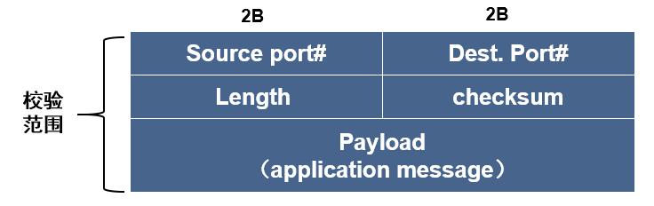
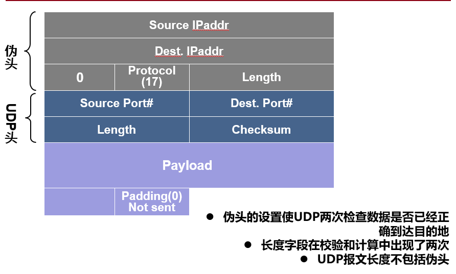
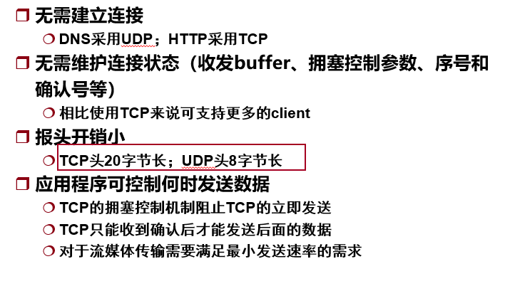
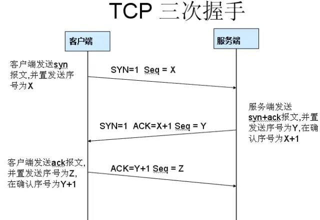
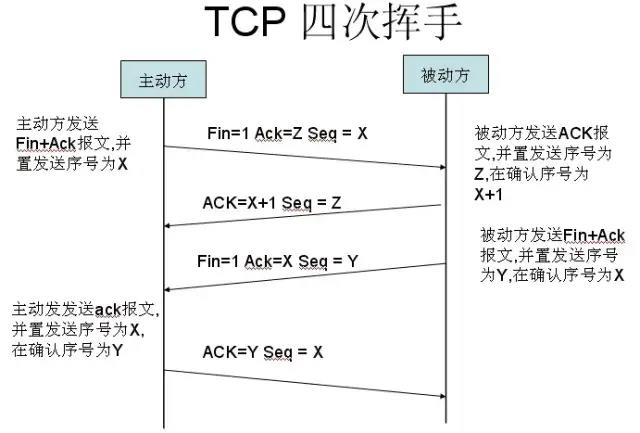
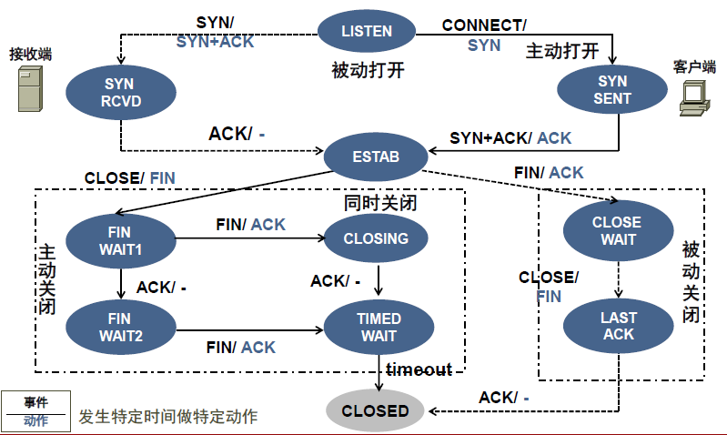
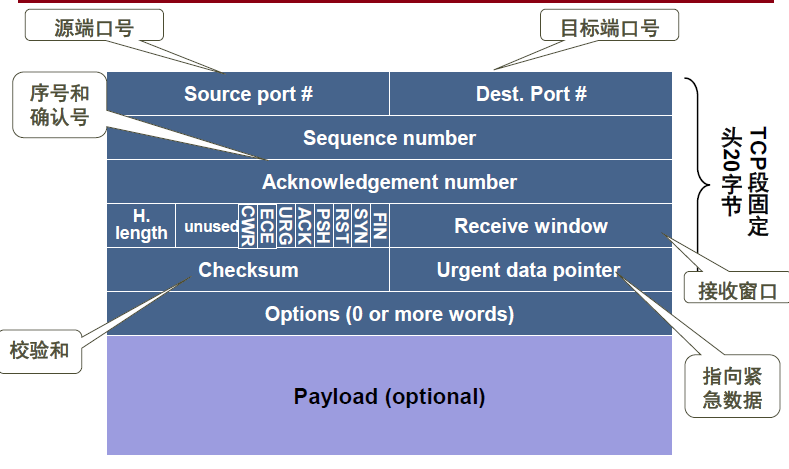
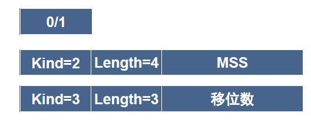
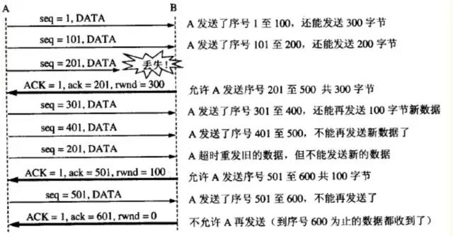

# 计算机网络——传输层

传输层能提供应用的多路复用/分用服务、可靠数据传输、带宽保证及延迟保证等。

传输层提供了应用进程之间的端-端连接；网络层提供了主机之间的端-端连接接。

为什么需要传输层？

- 网络不可靠。需要传输层来检测包丢失、损坏、乱序等。

面向连接服务

- 大多数都提供了可靠的通信

无连接服务

- 大多数通信是不可靠的
- 适用：
  - 内部数据收集
  - 外部数据发布
  - 请求-响应
  - 实时流媒体应用

分用：当传输层从网络层接收数据后，必须将数据正确递交给某个特定的应用进程。

复用：当传输层从不同应用进程接收报文后，要封装在传输层的报文中再交给网络层发送。

传输层通过socket和port实现多路复用：

- socket具有唯一的标识，每个发出去的报文必须有字段描述递交数据的soket
- 端口用来标识一个特定的应用进程：
  - 应用层通过端口将数据交给传输层发送
  - 传输层通过端口将收到的数据交给应用层
  - 端口仅本地有效

通信的最终目的地不是进程号而是协议端口

- 进程的生成/消失都是动态的
- 接收进程的变化对发送端透明
- 由接收端功能来识别目的地

## UDP

UDP的socket：$<DestIpAddr, DestPort>$

当应用程序创建一个UDPsocket，传输层会自动为其分配一个port号（1024~65535），该号是目前没被使用的。如果两个UDP segment具有不同的源IP地址以及/或者不同的port号，但是却有同样的目的IP地址和目的PORT号，则这两个段将通过同样的目的socket到达相同的目的进程。

### UDP的功能

- 进程-进程间的数据传递
- 差错检测

UDP提供了不可靠的无连接传输服务

- 没有确认机制
- 不对报文排序
- 没有超时机制
- 没有反馈机制控制流量

### UDP的报文格式

UDP计算校验和时要加上伪头：

UDP的伪头：

接收端在验证正确性时必须**把伪头字段的信息从IP报文的头中抽取出来**，以伪头的格式进行装配，然后再重新计算校验和。

最大UDP数据报长度：

- IP数据报的最大长度是65535字节。包括20字节的IP头。
- UDP头占8字节，因此UDP数据报中用户数据的最大长度为65507字节。

制约UDP数据报长度的因素：

- 大部分系统缺省提供读写8192个字节的UDP数据报
- 受TCP/IP内核实现的限制

知名端口：0~1023

### UDP协议特性

### DNS

域名系统：将主机名、电子邮件地址、Web服务器名映射成IP地址的分布式数据库系统。

DNS特点：

- 层次的
- 分布式的
- 基于域（AS）的

每个区域对应一个负责该层次主机的管理授权中心

- 区域是“管理空间”
- 区域管理员负责域名的名字空间
- 授权来自于父并可传给子

功能：

- 提供名字和地址的映射关系
- 主机别名
- 邮件服务器别名
  - 别名一般比规范名更易于记忆
  - DNS返回对应的规范名和IP地址
- 负载均衡

查询方式：

- 递归查询：当主机/名字服务器A向B查询，B将代表A执行查询请求并将响应结果返回给A。
  - 名字解析负担到所有关联的域名服务器上
  - 上次服务器负担越重
- 迭代查询：当主机/名字服务器A向B查询，B将返回下一个DNS名字服务器的IP地址。

缓存与更新：

- 一旦服务器了解到某个名字地址便将这种映射关系缓存
  - 一定时间（TTL）后缓存的表项超时
  - 通常本地域名服务器缓存顶级域名服务器
    - 减轻顶级域名服务器的负担

- 被缓存的映射关系可能过时
  - 提供的是best effort“名字-地址”解析服务
  - 如果某个主机修改了其IP地址，直到TTL后才能扩散到Internet

## TCP

TCP的socket: $<SrcIpAddr, SrcPort, DestIpAddr, DestPort>$

在不可靠的信道上建立可靠数据传输。不可靠数据通道的特性决定了可靠数据传输协议的复杂性。

不可靠信道：

- 报文传输过程中可能出错
- 报文可能丢失
- ACK可能丢失

传输层的连接仅由两个主机上的传输实体维护：

- 每一端确保另一端的存在
- 允许两端协商传输参数
- 触发传输实体资源的分配

连接建立可能发生的错误：

- 连接发起方的 SYN 丢失
- 连接接受方的应答 SYN 丢失

出现重复 SYN 的情况：

- 发起方发起的 SYN 被延迟
- 接受方的响应丢失
- 接受方的响应被延迟

解决途径：维护状态信息

连接开始时序列号固定的影响：接受已过期的序列号/因重复而丢弃合法的序列号

### 特性

- 面向连接

- 只在两个端系统上保持连接状态
  - 不同于TDM/FDM
  - 不同于虚电路
- 连接是全双工的
  - 可同时双向发送数据
- 连接是点-点
  - 只能一对一通信，不支持一对多通信
- 有缓冲的发送
- 无结构的数据流

- 字节流传输：
  - 端-端之间不保留报文边界
  - 应用通过socket发出的数据被缓存在缓冲区，何时发出取决于具体TCP实现

### 三次握手

**第一次握手**：建立连接。客户端发送连接请求报文段，将SYN位置为1，ACK位设置为0。Sequence Number为x；然后，客户端进入SYN_SEND状态，等待服务器的确认；

**第二次握手**：服务器收到SYN报文段。服务器收到客户端的SYN报文段，需要对这个SYN报文段进行确认，设置Acknowledgment Number为x+1(Sequence Number+1)；同时，自己自己还要发送SYN请求信息，将SYN位置为1，Sequence Number为y；服务器端将上述所有信息放到一个报文段（即SYN+ACK报文段）中，一并发送给客户端，此时服务器进入SYN_RECV状态； 

**第三次握手**：客户端收到服务器的SYN+ACK报文段。然后将Acknowledgment Number设置为y+1，向服务器发送ACK报文段，这个报文段发送完毕以后，客户端和服务器端都进入ESTABLISHED状态，完成TCP三次握手。

- ACK = X表示到序列号X-1为止的数据都已经收到了。
- Seq是按照字节数增加。
- 仅有ACK的报文的长度为0，不会导致Seq增加。如图情况下，下次客户端给服务端发送的报文的Seq = Z。
- SYN用于初始化连接时，segment只包含一个字节的数据。
- 实际上在TCP传输中，除了三次握手的第一次设置ACK位为0外，其余情况下ACK位均为1。这是因为反正一个数据报文能捎带ACK就捎带着。
- 一旦连接建好两个传输实体便可用任何滑动窗口协议实施流量控制

#### 为什么要三次握手？

为了防止已失效的连接请求报文段突然又传送到了服务端，因而产生错误。

具体例子：“已失效的连接请求报文段”的产生在这样一种情况下：client发出的第一个连接请求报文段并没有丢失，而是在某个网络结点长时间的滞留了，以致延误到连接释放以后的某个时间才到达server。本来这是一个早已失效的报文段。但server收到此失效的连接请求报文段后，就误认为是client再次发出的一个新的连接请求。

于是就向client发出确认报文段，同意建立连接。假设不采用“三次握手”，那么只要server发出确认，新的连接就建立了。由于现在client并没有发出建立连接的请求，因此不会理睬server的确认，也不会向server发送数据。但server却以为新的运输连接已经建立，并一直等待client发来数据。这样，server的很多资源就白白浪费掉了。采用“三次握手”的办法可以防止上述现象发生。例如刚才那种情况，client不会向server的确认发出确认。server由于收不到确认，就知道client并没有要求建立连接。”

#### 初始序号的选择

要解决的问题：主机崩溃时所有保持的有关连接状态信息会全部失去，因此重新建立的连接必须采用不受之前报文影响的序号。
解决方法：

- 确保两个序号相同的报文永远不会同时有效
- 主机恢复后等待T秒。T是报文生存期的倍数，用来确保报文发出去 T时间后不再存在。
- 限制对序号的使用

基于时钟方法：

- 每台机器的时钟采用二进制计数器的形式
- 连接建立时用时钟的低 k 位作为初始序号
- TCP采用基于时钟的序号产生方案(每4$\mu s$)。双方协商本次连接的初始序号

### 四次挥手

**第一次分手**：主机1（可以使客户端，也可以是服务器端），设置Sequence Number，向主机2发送一个FIN报文段；此时，主机1进入FIN_WAIT_1状态；这表示主机1没有数据要发送给主机2了；

**第二次分手**：主机2收到了主机1发送的FIN报文段，向主机1回一个ACK报文段，Acknowledgment Number为Sequence Number加1；主机1进入FIN_WAIT_2状态；主机2告诉主机1，我“同意”你的关闭请求；
**第三次分手**：主机2向主机1发送FIN报文段，请求关闭连接，同时主机2进入LAST_ACK状态；

**第四次分手**：主机1收到主机2发送的FIN报文段，向主机2发送ACK报文段，然后主机1进入TIME_WAIT状态；主机2收到主机1的ACK报文段以后，就关闭连接；此时，主机1等待2倍的MSL后依然没有收到回复，则证明Server端已正常关闭，那好，主机1也可以关闭连接了。

MSL：报文段最大生存时间，它是任何报文段被丢弃前在网络内的最长时间。

#### 为什么要四次分手？

TCP协议是一种面向连接的、可靠的、基于字节流的运输层通信协议。TCP是全双工模式，这就意味着，当主机1发出FIN报文段时，只是表示主机1已经没有数据要发送了，主机1告诉主机2，它的数据已经全部发送完毕了；但是，这个时候主机1还是可以接受来自主机2的数据；当主机2返回ACK报文段时，表示它已经知道主机1没有数据发送了，但是主机2还是可以发送数据到主机1的；当主机2也发送了FIN报文段时，这个时候就表示主机2也没有数据要发送了，就会告诉主机1，我也没有数据要发送了，之后彼此就会愉快的中断这次TCP连接。

- 每个方向连接单独释放,超时值设定为2倍的MSL

#### 为什么要等待2MSL？

MSL：报文段最大生存时间，它是任何报文段被丢弃前在网络内的最长时间。原因有二：

- 保证TCP协议的全双工连接能够可靠关闭
- 保证这次连接的重复数据段从网络中消失

第一点：如果主机1直接CLOSED了，那么由于IP协议的不可靠性或者是其它网络原因，导致主机2没有收到主机1最后回复的ACK。那么主机2就会在超时之后继续发送FIN，此时由于主机1已经CLOSED了，就找不到与重发的FIN对应的连接。所以，主机1不是直接进入CLOSED，而是要保持TIME_WAIT，当再次收到FIN的时候，能够保证对方收到ACK，最后正确的关闭连接。

第二点：如果主机1直接CLOSED，然后又再向主机2发起一个新连接，我们不能保证这个新连接与刚关闭的连接的端口号是不同的。也就是说有可能新连接和老连接的端口号是相同的。一般来说不会发生什么问题，但是还是有特殊情况出现：假设新连接和已经关闭的老连接端口号是一样的，如果前一次连接的某些数据仍然滞留在网络中，这些延迟数据在建立新连接之后才到达主机2，由于新连接和老连接的端口号是一样的，TCP协议就认为那个延迟的数据是属于新连接的，这样就和真正的新连接的数据包发生混淆了。所以TCP连接还要在TIME_WAIT状态等待2倍MSL，这样可以保证本次连接的所有数据都从网络中消失。

### 报文格式

- Header length: TCP头以32位计算的长度。TCP头的长度是可变的、
- Receive window: 用于流量控制，指出接收端愿意接收的字节数
- Urgent data pointer: 指向urgent数据的最后一个字节。

- Options: 收发双方用来协商MSS、窗口扩展因子、时间戳
- Payload: 应用层数据受最大段长MSS限制

MSS：最大段长

- tcp segment是交换数据的单元
- MSS过小会降低网络利用率，过大会降低网络性能
- MSS的选择：
  - 连接两端位于同一物理网络
    - 选择的MSS应使IP数据报的大小与网络的MTU（最大传输单元）相同
  - 连接两端位于不同物理网络
    - 最好设置为途径网络的最小MTU或缺省值
  - 连接两端必须协商MSS

urgent数据的发送

- URG强迫TCP发送当前数据流中的字节
- URG指针指出Urgent数据的位置
- TCP将PSH位置成1使接收端执行urgent操作

带外数据(out of band)

- 传输层协议使用带外数据（out-of-band，OOB）来发送一些重要的数据。带外数据比普通数据（也称带内数据）有更高的优先级，它应该总是立即发送，而不论发送缓冲区是否有排队等待发送的普通数据

- 允许发送方将数据标位urgent
- 接收方收到urgent数据后通知相应应用数据进入urgent

TCP的窗口扩大因子：

- tcp报文的options有不同格式，和其kind的值有关：
  - kind=0: 选项表结束
  - kind=1: 无操作
  - kind=2: 最大段长
  - kind=3: 窗口扩大因子

- 当网络具备高带宽、高延迟特点时，一次发送64KB 字节可能带来发送的低效率。 TCP 用窗口扩大选项来加大每次发送的数据量。
- TCP窗口扩大因子选项：
  - 移位数表示窗口大小扩大的位数（至多14）。允许窗口从$2^{16}$B扩大到$2^{30}$B。
  - 该选项必须在连接建立时协商，且每个方向上的扩大因子可能不同

### 流量控制

TCP使用可变大小的滑动窗口机制实现流量控制: 

- tcp的发送端维护一个变量RcvWin来记录接收端能接收的字节数
  - $LastByteSent - LastByteAckd \leq RcvWin$
- tcp接收端通过window size字段反馈当前可接收的字节数
  - $RcvWindow = RcvBuffer - (LastByteRcvd - LastByteRead) $。
  - ack=x, rwnd=y。表示从发送端的序列号x开始，还能接收y个字节。

如图：设A向B发送数据。在连接建立时，B告诉了A：“我的接收窗口是 rwnd = 400 ”(这里的 rwnd 表示 receiver window) 。

从图中可以看出，B进行了三次流量控制。第一次把窗口减少到 rwnd = 300 ，第二次又减到了 rwnd = 100 ，最后减到 rwnd = 0 ，即不允许发送方再发送数据了。这种使发送方暂停发送的状态将持续到主机B重新发出一个新的窗口值为止。B向A发送的三个报文段都设置了 ACK = 1 ，只有在ACK=1时确认号字段才有意义。

TCP为每一个连接设有一个持续计时器(persistence timer)，为了防止出现死锁的情况。只要TCP连接的一方收到对方的零窗口通知，就启动持续计时器。若持续计时器设置的时间到期，就发送一个零窗口控测报文段（携1字节的数据），接收端收到后会把窗口大小发给发送端。如果仍为0，就重置持续计时器。如果非0，就可以发数据了。

### 拥塞控制

RTT: TCP段开始发送到ACK返回的时间

流量控制和拥塞控制的区别：

- 流量控制只和发送者与接收者的端-端通信有关
- 拥塞控制是全局问题，涉及所有主机、路由器及路由器的存储-转发能力

如果包到达和排队的速率大于包被转发的速率，队列的长度就会无限制的增长

- 如果网络发生拥塞：
  - 队列延迟增大
  - 路由器的缓冲区溢出

最大-最小公平性：如果分配给1个流的带宽在不减少分配给另一个流的带宽的前提下不能得到进一步增长，就不给这个流分配更多带宽。

拥塞窗口：体现网络的承受能力的窗口。

- 丢包事件：被丢弃的包后面没有后续包/后续包被丢; 被 丢弃的包的后续包到达目的地。
  - 段的计时器超时
  - 收到三个重复的ACK

#### 慢启动（slow start)

- TCP连接建立时，CongWin初始为一个MSS。初始的发送速率=CongWin/RTT。
- 对于每个重传计时器超时前确认的端，发送窗口增加一个段的字节量。此外，随着该段获得确认，现在网络中又少了一个段。结果是每个RTT后CongWin的大小加倍。
- 发生“丢包事件”后，将CongWin大小减半，并重新开始慢启动过程。

为了防止拥塞窗口增长过大引起网络拥塞，还需要设置一个慢启动阈值ssthresh状态变量。慢启动阈值ssthresh的用法如下：

- 当 cwnd < ssthresh 时，使用上述的慢启动算法。
- 当 cwnd > ssthresh 时，停止使用慢启动算法而改用拥塞避免算法。
- 当 cwnd = ssthresh 时，既可使用慢启动算法，也可使用拥塞控制避免算法。拥塞避免

#### AIMD算法（逐步递增，加倍递减）

拥塞避免（congestion avoidance）：TCP拥塞控制协议的线性增加阶段。

逐步递增：每当经过一个RTT就将CongWin窗口增大一个MSS。

加倍递减：

- 一旦发现丢失段立即将 CongWin 窗口减半(最后减到1)
- 对于保留在发送窗口中的段将重传计时器的值加倍

#### 对“丢包事件”的响应

- 某个段超时
  - 发送端进入“慢速启动”阶段 ，拥塞发送窗口置为1个MSS
  - 拥塞窗口按指数增长直到 CongWin=发生超时时的一半
  - 然后CongWin按线性增长(进入拥塞避免阶段)
- 三个重复 ACK(快速重传)
  - 拥塞窗口减半
  - 按线性增长
- 慢速启动阈值
  - 用来统一管理拥塞窗口
  - 标志慢速启动的结束和线性增长的开始
  - 阈值（ Threshold ）的初始值较大

#### 快速重传

发送端检测到三个重复ACK立即重传该ACK所指的段，而不是等待该段超时后再重传。

#### 快速恢复

- 当发送方连续收到三个重复确认后，阈值设置为当前CongWin的一半，并重传丢失的报文。同时设置当前的**cwnd = ssthress**
- 由于还有多个报文还在网络中传递，所以接收端还会继续的发送ack报文，发送端每收到一个ack，就将cwnd加1，并且发送一个新的分组，（前提是通告窗口允许发送）
- 当接收端收到重传的数据包时，将会回复一个ack，这个ack不仅仅是对重传包的确认，而是对这一段时间内收到的所有报文进行确认。

- 然后进入拥塞避免阶段。

#### TCP 拥塞控制算法（基于 Reno 版本）

- 当拥塞窗口低于 threshold 时，发送端进入慢速启动阶段，窗口按指数快速增大
- 当拥塞窗口大于 threshold 时，发送端进入拥塞避免阶段，窗口按线性速度增大
- 收到 3 个 重复 ACK时， threshold值置为当前拥塞窗口大小的一半，并把拥塞窗口设置成threshold值，进入拥塞避免阶段
- 发生“超时”丢包事件时， threshold 值设为当前拥塞窗口大小的一半，并把拥塞窗口设置成 1 个 MSS ，开始慢速启动过程

### 传输性能问题

#### 问题一

telnet应用实例：本地击键一次就会向远端发送一个包。远端主机确认。远端主机反馈“接收窗口”。本地回显字符。这导致每输入一个字符，需要发送4个段共162字节。

优化方法：将“确认”和“窗口更新”延迟以便搭载在后续其他数据传输中。

Nagle算法：发送端

- 如果已传数据未确认之前发送端应用程序又生成了额外的数据，则照常将数据放入输出缓冲区，但并不发送
- 直到缓冲区中的数据足够填满一个 MSS
- 如确认到达后发送端仍处于等待状态，则发送缓冲区中累积的所有数据

只有第一段是小报文，从而提高了发送端的数据传输效率。

#### 问题二

低能窗口综合症：

- 当接收端的应用程序每次仅读一个字节时，接收端通告一个小的可用窗口值将导致发送端产生很短的段
- 发送端的段仅含少量数据

会浪费网络带宽，增加计算开销

优化方法：

- TCP 对收到的段进行确认，但要等到接收窗口可用空间达到启发式策略所指定的限度之后才发出“窗口增大”通告。
- 在接收窗口大小不够所指定的限度时推迟发送确认。

Clark算法：接收端

- 通告大小为“ 0 ”的 Receive Windows 后，要等到接收缓冲区可用空间达到总空间的一半或 MSS 之后才发送“窗口更新”通告。

TCP规范中指出：

- 发送端使用启发技术（Nagle)避免传输少量数据
- 接收端使用启发技术（Clark)防止反馈微笑增量值的窗口通告

### TCP中的计时器

重传计时器

持续计时器

保活计时器：有的tcp实现的。当一个连接空闲很长时间后，保活计时器超时，从而促使某一端查看另一端是否仍在。如果另一端没响应，就终止连接。

### 网络协助拥塞控制

端-端的拥塞控制：

- 网络层不提供对传输层拥塞控制的显示支持
- 端系统必须由网络行为推断拥塞控制的发生
- e.g   TCP

网络协助拥塞控制：

- 路由器在检测到拥塞时为发送端提供反馈信息
  - 抑制包、显式拥塞控制、逐跳后压

路由器通过监测出境线路和其他资源的使用情况来进行拥塞检测。

显式拥塞通知（ECN)

- 当检测到发生拥塞时，路由器在包头设置一个特殊的比特。
- 这个包被接收端收到后，接收端会拷贝并“捎带”在ACK中发给发送端
- 发送端监测带有警告比特的ACK数量并据此调整传输速率

抑制包

- 路由器监测到拥塞后，在拥塞结点处产生抑制包并发给源端
- 源端收到抑制包后，以一定的比例降低发送速率。如果一段时间后还有来自同一目的地的抑制包，应该再次降低发送速率；否则加大通信量。
- 例如：ICMP的Source Quench
- 缺点：在长距离或高速率环境下，抑制包对源端的作用太慢

HOP-HOP抑制包

- 每一跳都会降低传输速率
- 转发抑制包的路由器及时作出速率调整，对缓解拥塞有很好的作用

卸载：

- 当路由器被包所淹没时，只能将包丢弃
- 丢弃哪个包取决于应用以及数据链路层的差错控制策略
- 应用程序打上丢包优先级标记，在发生拥塞的节点作为是否被丢弃
  的依据
- 葡萄酒策略：不能丢弃老的包。例如：文件传输
- 牛奶策略：丢弃老的包，保留新的包。例如：实时语音
- 要考虑的其他因素：
  - 丢弃全部的包？
  - 按优先级丢弃？
  - 基于生存期丢弃？

早期丢弃(RED)：

- 预防策略
  - 路由器在缓冲区溢出之前就丢弃一个或者多个包
- 每当到达一个包,RED算法就计算平均队列长度avg
- 如果avg低于某些低阈值，就假定发生拥塞的概率很小或者说不存在
  拥塞，将该包排入队列
- 如果avg大于某些高阈值，则认为拥塞很严重，丢弃该包
- 如果avg介于两个阈值之间，可认为拥塞正在形成，计算拥塞发生的
  概率

