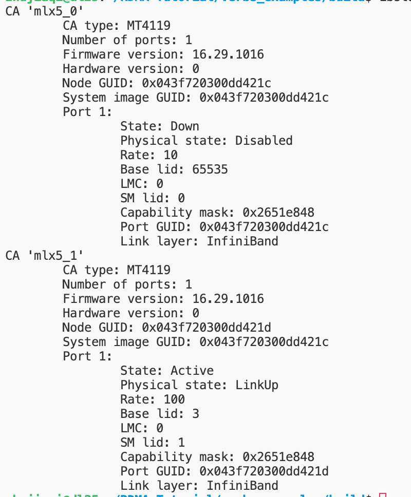

# RDMA 操作与踩坑

## 踩坑

- 每个post_recv要传入一个buffer_len。远端的如果post_send的话，指定的len要比recv端端len大，不然会报错。

- Server端的每次收到一个新连接，都会新产生一个RdmaCmId。 然后用这个新的CmId进行匹配RdmaEventChannel， 创建pd等操作。
- ackCmEvent后，cmEvent中的内容会变掉。所以一定要在这之前复制一份cmEvent
- 在创建的时候要注意创建顺序：

client端

```
event_channel
cm_id
cm_id.resolve_addr
cm_id.resolve_route
pd
cq
qp
mr
cm_id.connect
```

server端

```
l_event_channel
l_cm_id
l_cm_id.bind_addr
l_cm_id.listen
RDMA_CM_EVENT_CONNECT_REQUEST
event_channel
cm_id
migrate_id
pd
cq
qp
mr
cm_id.accept 
```

- 创建时候要遵守上面端顺序，不然销毁时就会出错。在销毁的时候顺序就是：

```
IbvMr drop
IbvQp drop
IbvCq drop
IbvPd drop
RdmaCmId drop
RdmaEventChannel drop
```


查看IB设备: `ibstat`



注意1：**双端口的IB网卡被视为两个设备**

注意 2：在RDMA编程的语境下，`ib_port` 与网卡（HCA）的端口不是一个概念。正如上文所说，HCA的一个物理端口对应一个IB设备，`ib_port`是IB设备的子概念，如上图所示，每个CA都有一个port，其id为1。

