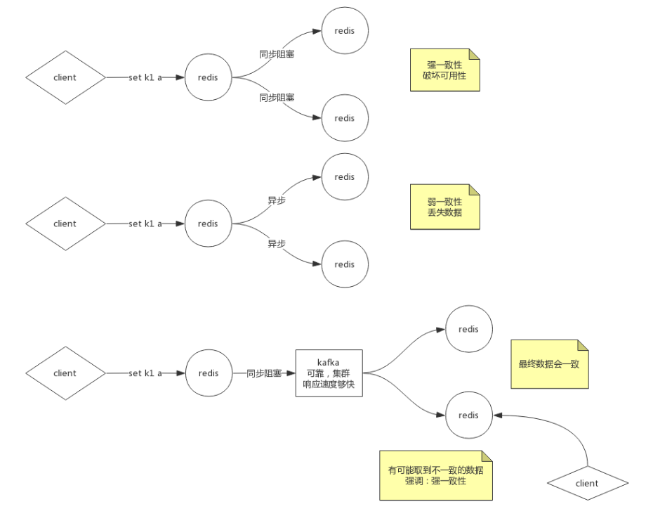

# Redis

单机、单进程的NoSQL：可以做缓存、数据库

## Redis数据结构

## Redis持久化

两种方式：

- RDB
- AOF

存储层：

- 快照/副本
- 日志

Linux管道：

- 衔接：前一个命令的输出作为后一个命令的输入
- 管道会触发创建进程  

```shell
echo $$ | more
echo $BASHPID | more
#$$的优先级高于管道
```

- 父进程可以让子进程看到数据：export
- export的环境变量，子进程的修改不会破坏父进程；父进程的修改不会破坏子进程。
- 创建子进程的速度是什么程度？
  - fork()
  - 速度：快
  - 内存空间：小
  - 相当于两个进程的虚拟地址指向同一片物理空间，并没有实际拷贝数据。并使用copy on write。

### RDB

- 时点性 
  - 可能实现方式：
    - 阻塞：redis不对外提供服务。（通常不用）
    - 非阻塞：redis继续对外提供服务。
      - 如果直接写磁盘。假设从$a$时刻写磁盘到$b$时刻，就无法得到准确的始点。
      - 如何解决：在$a$时刻，redis创建一个子进程。redis在子进程中进行写磁盘。这样始点就是$a$时刻。
- redis实现方式：
  - 命令：
    - save：前台阻塞
    - bgsave: 后台
  - 配置文件中编写bgsave的规则：使用的是save的标识，但是触发的是bgsave。
  - 一般关机维护时候用save
- 弊端：
  - 不支持时间拉链，只有一个dump.rdb。需要运维每天重命名
  - 丢失数据相对多一些。两个时点之间的窗口数据容易丢失。
- 优点：
  - 恢复的速度相对快。相当于序列化

### AOF

- 把redis的写操作记录到文件中
- 优点：
  - 丢失数据相对少
  - redis中RDB和AOF可以同时开启。但是如果开启了AOF，只会用AOF恢复
    - AOF中包含RDB全量和增加记录新的写操作。
- 弊端：
  - 体量无限变大
  - 恢复慢
- 结果：要设计一个方案让日志足够小
  - hdfs的做法：让日志只记录增量合并的过程。
  - redis的做法：
    - 4.0之前：重写。删除抵消的命令，合并重复的命令。最终也是纯指令的文件。
    - 4.0以后：重写时候将老的数据写成ROF格式。将增量的部分以指令方式append到AOF中。AOF是一个RDB和日志的混合体。

持久化会触发IO:

- 三种级别：
  - no
  - always
  - every second

AOF文件中的格式：

```shell
*3
$3
set
$2
k1
$5
hello
```

*$a$指这个命令由$a$段组成。\$$a$指接下来有$a$个字符。

## Redis集群

redis是单机、单节点、单实例的：

- 单点故障
- 容量有限
- 压力

解决方法：

- 做副本
  - 一个用于读写，其他的作为它的副本：解决单点故障。
  - 一个用于读写，其他的用于副本+读：解决单点故障和读压力。
- 多个redis按数据不同类别（业务功能）分别存储不同的数据。
- 按照优先级、逻辑再拆分

### 数据一致性

强一致性：客户端发送写请求到redis，所有节点阻塞，直到数据全部一致后再返回。

- 容易破坏可用性

容忍数据丢失一部分：

弱一致性：通过异步方式。主redis写成功后立刻对客户端响应；并通知其他redis同步数据。

最终一致性：在主redis和从redis之间放一个kafka集群。保证kafka集群是可靠的，且响应速度足够快。

- 客户端有可能无法从redis中读取到最终一致性后的数据。



### 主从复制

主从：客户端可以访问主和从。

主备：客户端只会访问主机，不会访问备用机。除非主机坏了。

实际上常用主从复制。主机又是一个单点，一般都对主做高可用。

- 用程序实现监控主机，如果主机挂了就选一个新的主。
- 监控程序也可能会出现单点故障。因此监控程序需要做成集群。
  - 可能问题：网络分区、脑裂

