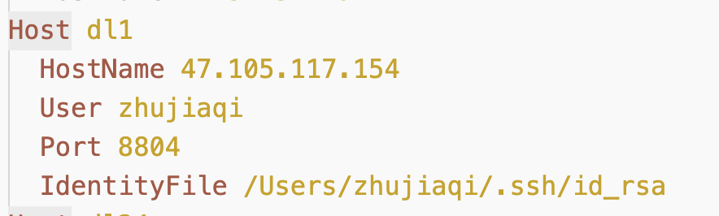
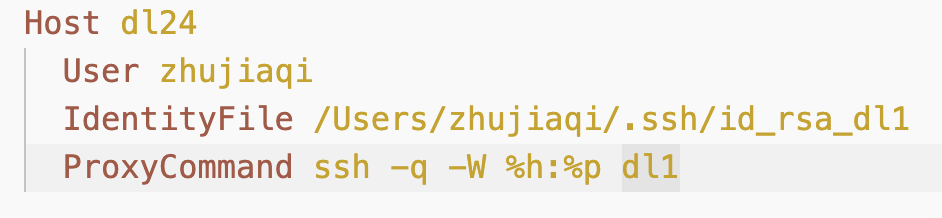

# 远程开发

## 连接远程服务器

- 公钥上传到dl1中
- 下载vscode相关插件
- 配置如下：



## 跨过跳板机

跳板机是dl1

- 首先在dl1上个人的`~/.ssh`中下载**私钥**到本地
- 然后如下配置文件



### 常见问题

#### 服务器下载vs code插件报错"can not verify certificate"

问题是wget无法验证微软的证书，解决方法是让wget以后都不验证证书，直接下载。

更改`/etc/wgetrc`文件，添加：

```
check_certificate = off
```

#### windows的ssh版本问题导致“过程试图写入的管道不存在”

解决方法是换用git自带的ssh。

