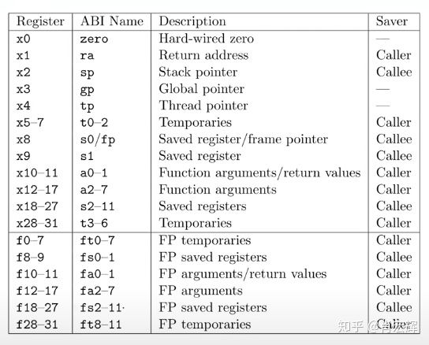
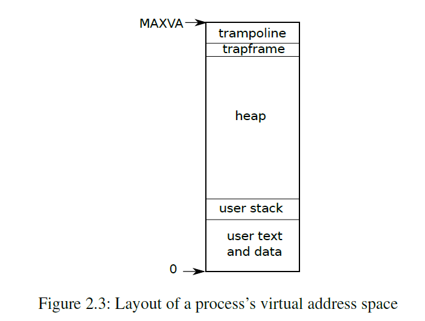

# XV6源码阅读

## 基础

`kernel/defs.h`声明了kernel的函数和数据结构

- 隔离的基本单位是process:

```C
// Per-process state
struct proc {
  struct spinlock lock;

  // p->lock must be held when using these:
  enum procstate state;        // Process state
  struct proc *parent;         // Parent process
  void *chan;                  // If non-zero, sleeping on chan
  int killed;                  // If non-zero, have been killed
  int xstate;                  // Exit status to be returned to parent's wait
  int pid;                     // Process ID

  // these are private to the process, so p->lock need not be held.
  uint64 kstack;               // Virtual address of kernel stack
  uint64 sz;                   // Size of process memory (bytes)
  pagetable_t pagetable;       // User page table
  struct trapframe *trapframe; // data page for trampoline.S
  struct context context;      // swtch() here to run process
  struct file *ofile[NOFILE];  // Open files
  struct inode *cwd;           // Current directory
  char name[16];               // Process name (debugging)

};
```
`struct proc(kernel/proc.h:86)`保存了每个进程的状态信息。

- risc-v的寄存器：



- xv6的虚拟地址空间：

指针是64位的，xv6的地址空间只用了38位。最大地址是0x3fffffffff, 即 MAXVA (`kernel/riscv.h:348`)。在地址的最顶端，xv6 reserves a page for a trampoline and a page mapping the process’s trapframe to switch to the kernel。



## xv6的启动

首先是在`kernel/entry.S`中，把xv6 kernel加载到物理地址的0x80000000处，然后新建一个栈。在`kernel/start.c`中定义了`stack0`，可以看到由于栈是向下增长的，所以栈指针sp存的值是`stack0 + (hartid * 4096)`。建好栈之后，就去执行`kernel/start.c`中的`start()`函数。`start()`函数主要改变了一些寄存器的值，从而把模式从machine mode设置为supervisor mode，把返回地址设置成main，在supervisor mode下忽略所的中断和异常，让时钟产生中断，然后返回到`kernel/main.c`下的`main()`中。`main()`函数会调用`kernel/proc.c`中的`userinit()`函数。这个函数会把`user/initcode.S`中的汇编代码拷贝到进程的虚拟内存中，然后`scheduler()`会进行进程的调度和执行。这样`user/initcode.S`中的代码就会被执行。这个代码会调用exec，并且在这里，exec会执行`user/init.c`中的`Init()`函数，至此，系统启动了。
```
# kernel/entry.S

_entry:
	# set up a stack for C.
        # stack0 is declared in start.c,
        # with a 4096-byte stack per CPU.
        # sp = stack0 + (hartid * 4096)
        la sp, stack0
        li a0, 1024*4
	csrr a1, mhartid
        addi a1, a1, 1
        mul a0, a0, a1
        add sp, sp, a0
	# jump to start() in start.c
        call start
```

``` C
// kernel/start.c

// entry.S jumps here in machine mode on stack0.
void
start()
{
  // set M Previous Privilege mode to Supervisor, for mret.
  unsigned long x = r_mstatus();
  x &= ~MSTATUS_MPP_MASK;
  x |= MSTATUS_MPP_S;
  w_mstatus(x);

  // set M Exception Program Counter to main, for mret.
  // requires gcc -mcmodel=medany
  w_mepc((uint64)main);// 把返回地址设置成main

  // disable paging for now.
  w_satp(0);

  // delegate all interrupts and exceptions to supervisor mode.
  w_medeleg(0xffff);
  w_mideleg(0xffff);
  w_sie(r_sie() | SIE_SEIE | SIE_STIE | SIE_SSIE);

  // ask for clock interrupts.
  timerinit();

  // keep each CPU's hartid in its tp register, for cpuid().
  int id = r_mhartid();
  w_tp(id);

  // switch to supervisor mode and jump to main().
  asm volatile("mret");//mret指令用于从machine mode返回到supervisor mode
}
```

``` C
// kernel/main.c

// start() jumps here in supervisor mode on all CPUs.
void
main()
{
  if(cpuid() == 0){
    consoleinit();
    printfinit();
    printf("\n");
    printf("xv6 kernel is booting\n");
    printf("\n");
    kinit();         // physical page allocator
    kvminit();       // create kernel page table
    kvminithart();   // turn on paging
    procinit();      // process table
    trapinit();      // trap vectors
    trapinithart();  // install kernel trap vector
    plicinit();      // set up interrupt controller
    plicinithart();  // ask PLIC for device interrupts
    binit();         // buffer cache
    iinit();         // inode cache
    fileinit();      // file table
    virtio_disk_init(); // emulated hard disk
    userinit();      // create first user process
    __sync_synchronize();
    started = 1;
  } else {
    while(started == 0)
      ;
    __sync_synchronize();
    printf("hart %d starting\n", cpuid());
    kvminithart();    // turn on paging
    trapinithart();   // install kernel trap vector
    plicinithart();   // ask PLIC for device interrupts
  }

  scheduler();        
}
```

``` C
// kernel/proc.c

// Set up first user process.
void
userinit(void)
{
  struct proc *p;

  p = allocproc();
  initproc = p;
  
  // allocate one user page and copy init's instructions
  // and data into it.
  // 这里会把initcode.S中要执行的代码拷贝到内存中
  uvminit(p->pagetable, initcode, sizeof(initcode));
  p->sz = PGSIZE;

  // prepare for the very first "return" from kernel to user.
  p->trapframe->epc = 0;      // user program counter
  p->trapframe->sp = PGSIZE;  // user stack pointer

  safestrcpy(p->name, "initcode", sizeof(p->name));
  p->cwd = namei("/");

  p->state = RUNNABLE;

  release(&p->lock);
}
```

``` 
# user/initcode.S

# Initial process that execs /init.
# This code runs in user space.

#include "syscall.h"

# exec(init, argv)
.globl start
start:
        la a0, init
        la a1, argv
        li a7, SYS_exec
        ecall

# for(;;) exit();
exit:
        li a7, SYS_exit
        ecall
        jal exit

# char init[] = "/init\0";
init:
  .string "/init\0"

# char *argv[] = { init, 0 };
.p2align 2
argv:
  .long init
  .long 0
```
``` C
// user/init.c

char *argv[] = { "sh", 0 };

int
main(void)
{
  int pid, wpid;

  if(open("console", O_RDWR) < 0){
    mknod("console", CONSOLE, 0);
    open("console", O_RDWR);
  }
  dup(0);  // stdout
  dup(0);  // stderr

  for(;;){
    printf("init: starting sh\n");
    pid = fork();
    if(pid < 0){
      printf("init: fork failed\n");
      exit(1);
    }
    if(pid == 0){
      exec("sh", argv);
      printf("init: exec sh failed\n");
      exit(1);
    }

    for(;;){
      // this call to wait() returns if the shell exits,
      // or if a parentless process exits.
      wpid = wait((int *) 0);
      if(wpid == pid){
        // the shell exited; restart it.
        break;
      } else if(wpid < 0){
        printf("init: wait returned an error\n");
        exit(1);
      } else {
        // it was a parentless process; do nothing.
      }
    }
  }
}
```
``` C
// kernel/proc.c

// Per-CPU process scheduler.
// Each CPU calls scheduler() after setting itself up.
// Scheduler never returns.  It loops, doing:
//  - choose a process to run.
//  - swtch to start running that process.
//  - eventually that process transfers control
//    via swtch back to the scheduler.
void
scheduler(void)
{
  struct proc *p;
  struct cpu *c = mycpu();
  
  c->proc = 0;
  for(;;){
    // Avoid deadlock by ensuring that devices can interrupt.
    intr_on();
    
    int found = 0;
    for(p = proc; p < &proc[NPROC]; p++) {
      acquire(&p->lock);
      if(p->state == RUNNABLE) {
        // Switch to chosen process.  It is the process's job
        // to release its lock and then reacquire it
        // before jumping back to us.
        p->state = RUNNING;
        c->proc = p;
        swtch(&c->context, &p->context);

        // Process is done running for now.
        // It should have changed its p->state before coming back.
        c->proc = 0;

        found = 1;
      }
      release(&p->lock);
    }
#if !defined (LAB_FS)
    if(found == 0) {
      intr_on();
      asm volatile("wfi");
    }
#else
    ;
#endif
  }
}
```
## traps and system call

cpu会从用户态切换到内核态执行特定代码的三种情况（统称为trap)：

- system call
- exception
- device interrupt

执行流程：Xv6 trap handling proceeds in four stages: hardware actions taken by the RISC-V CPU, an assembly “vector” that prepares the way for kernel C code, a C trap handler that decides what to do with the trap, and the system call or device-driver service routine.

三种模式：machine mode, supervisor mode, and user mode

- machine mode的指令拥有所有的权限，CPU starts in machine mode.Xv6在machine mode下执行一些指令，然后进入supervisor mode
- supervisor mode下可以执行privileged instructions
- an application can only execute user-mode instructions

### RISC-V trap machinery

#### control registers

xv6中有一组control registers，内核可以写这些寄存器从而告诉CPU该如何处理trap。同时内核也能读这些寄存器来了解发生了哪些trap。这些寄存器在`kernel/riscv.h`定义，下面是其中比较重要的：

- **stvec**：内核在这里写下trap处理程序的地址；RISC-V跳转到这里来处理trap。

- **sepc**：当trap发生时，RISC-V会将程序计数器(pc)保存在这里（因为**PC**会被**stvec**覆盖）。**sret**(从trap中返回)指令将**sepc**复制到pc中。内核可以写**sepc**来控制**sret**的返回到哪里。

- **scause**：RISC -V在这里放了一个数字，描述了trap的原因。

- **sscratch**：内核在这里放置了一个值，在trap处理程序开始时可以方便地使用。

- **sstatus**：**sstatus**中的**SIE**位控制设备中断是否被启用，如果内核 clear **SIE**，RISC-V将推迟设备中断，直到内核 set **SIE**。**sstatus**中的**SPP**位表示trap是来自user mode还是supervisor mode，并控制**sret**返回到那个mode。

上述寄存器是用于与在supervisor mode下处理trap，在user mode下不能读或写它们。对于machine mode下处理的trap，有一组等效的控制寄存器；xv6只在定时器中断的特殊情况下使用它们。

多核CPU上的每个CPU都有自己的一组control registers，这样保证在任何时候都可能有多个CPU在处理trap。

#### 流程

1. If the trap is a device interrupt, and the sstatus SIE bit is clear, don’t do any of the following.
2. Disable interrupts by clearing SIE.
3. Copy the pc to sepc.
4. Save the current mode (user or supervisor) in the SPP bit in sstatus.
5. Set scause to reflect the trap’s cause.
6. Set the mode to supervisor.
7. Copy stvec to the pc.
8. Start executing at the new pc.

### 从用户态trap

陷入trap: `uservec(kernel/trampoline.S)`，然后是`usertrap(kernel/trap.c)`

从trap中返回：`usertrapret(kernel/trap.c)`，然后是`userret(kernel/trampoline.S)`。

#### 陷入trap

因为RISC-V硬件在trap过程中不切换页表，所以用户页表必须包含**uservec**的映射，即**stvec**指向的trap处理程序地址。**uservec**必须切换**satp**，使其指向内核页表；为了在切换后继续执行指令，**uservec**必须被映射到内核页表与用户页表相同的地址。

Xv6用一个包含**uservec**的trampoline页来满足这些条件。Xv6在内核页表和每个用户页表中的同一个虚拟地址上映射了trampoline页。这个虚拟地址就是**TRAMPOLINE** （如我们在图2.3和图3.3中看到的）。**trampoline.S**中包含trampoline的内容，（执行用户代码时）**stvec**设置为**uservec**（kernel/trampoline.S）。

当**uservec**启动时，所有32个寄存器都包含被中断的代码所拥有的值。但是**uservec**需要能够修改一些寄存器，以便设置satp和生成保存寄存器的地址。RISC-V通过**sscratch**寄存器提供了帮助。**uservec**开始时的**csrrw**指令将**a0**和**sscratch**的内容互换。现在用户代码的**a0**被保存了；**uservec**有一个寄存器（**a0**）可以使用；**a0**包含了内核之前放在**sscratch**中的值。

**uservec**的下一个任务是保存用户寄存器。在进入用户空间之前，内核先设置**sscratch**指向该进程的**trapframe**，这个**trapframe**可以保存所有用户寄存器（kernel/proc.h:44）。因为**satp**仍然是指用户页表，所以**uservec**需要将**trapframe**映射到用户地址空间中。当创建每个进程时，xv6为进程的**trapframe**分配一页内存，并将它映射在用户虚拟地址**TRAPFRAME**，也就是**TRAMPOLINE**的下面。进程的**p->trapframe**也指向**trapframe**，不过是指向它的物理地址[[1\]](#_ftn1)，这样内核可以通过内核页表来使用它

因此，在交换**a0**和**sscratch**后，**a0**将指向当前进程的**trapframe**。**uservec** 将在**trapframe**保存全部的寄存器，包括从**sscratch**读取的**a0**。

trapframe包含指向当前进程的内核栈、当前CPU的**hartid**、**usertrap**的地址和内核页表的地址的指针，**uservec**将这些值设置到相应的寄存器中，并将**satp**切换到内核页表和刷新TLB，然后调用**usertrap**。

```
# kernel/trampoline.S

	#
        # code to switch between user and kernel space.
        #
        # this code is mapped at the same virtual address
        # (TRAMPOLINE) in user and kernel space so that
        # it continues to work when it switches page tables.
	#
	# kernel.ld causes this to be aligned
        # to a page boundary.
        #
	.section trampsec
.globl trampoline
trampoline:
.align 4
.globl uservec
uservec:    
	#
        # trap.c sets stvec to point here, so
        # traps from user space start here,
        # in supervisor mode, but with a
        # user page table.
        #
        # sscratch points to where the process's p->trapframe is
        # mapped into user space, at TRAPFRAME.
        #
        
	# swap a0 and sscratch
        # so that a0 is TRAPFRAME
        csrrw a0, sscratch, a0

        # save the user registers in TRAPFRAME
        sd ra, 40(a0)
        sd sp, 48(a0)
        sd gp, 56(a0)
        sd tp, 64(a0)
        sd t0, 72(a0)
        sd t1, 80(a0)
        sd t2, 88(a0)
        sd s0, 96(a0)
        sd s1, 104(a0)
        sd a1, 120(a0)
        sd a2, 128(a0)
        sd a3, 136(a0)
        sd a4, 144(a0)
        sd a5, 152(a0)
        sd a6, 160(a0)
        sd a7, 168(a0)
        sd s2, 176(a0)
        sd s3, 184(a0)
        sd s4, 192(a0)
        sd s5, 200(a0)
        sd s6, 208(a0)
        sd s7, 216(a0)
        sd s8, 224(a0)
        sd s9, 232(a0)
        sd s10, 240(a0)
        sd s11, 248(a0)
        sd t3, 256(a0)
        sd t4, 264(a0)
        sd t5, 272(a0)
        sd t6, 280(a0)

	# save the user a0 in p->trapframe->a0
        csrr t0, sscratch
        sd t0, 112(a0)

        # restore kernel stack pointer from p->trapframe->kernel_sp
        ld sp, 8(a0)

        # make tp hold the current hartid, from p->trapframe->kernel_hartid
        ld tp, 32(a0)

        # load the address of usertrap(), p->trapframe->kernel_trap
        ld t0, 16(a0)

        # restore kernel page table from p->trapframe->kernel_satp
        ld t1, 0(a0)
        csrw satp, t1
        sfence.vma zero, zero

        # a0 is no longer valid, since the kernel page
        # table does not specially map p->tf.

        # jump to usertrap(), which does not return
        jr t0

.globl userret
userret:
        # userret(TRAPFRAME, pagetable)
        # switch from kernel to user.
        # usertrapret() calls here.
        # a0: TRAPFRAME, in user page table.
        # a1: user page table, for satp.

        # switch to the user page table.
        csrw satp, a1
        sfence.vma zero, zero

        # put the saved user a0 in sscratch, so we
        # can swap it with our a0 (TRAPFRAME) in the last step.
        ld t0, 112(a0)
        csrw sscratch, t0

        # restore all but a0 from TRAPFRAME
        ld ra, 40(a0)
        ld sp, 48(a0)
        ld gp, 56(a0)
        ld tp, 64(a0)
        ld t0, 72(a0)
        ld t1, 80(a0)
        ld t2, 88(a0)
        ld s0, 96(a0)
        ld s1, 104(a0)
        ld a1, 120(a0)
        ld a2, 128(a0)
        ld a3, 136(a0)
        ld a4, 144(a0)
        ld a5, 152(a0)
        ld a6, 160(a0)
        ld a7, 168(a0)
        ld s2, 176(a0)
        ld s3, 184(a0)
        ld s4, 192(a0)
        ld s5, 200(a0)
        ld s6, 208(a0)
        ld s7, 216(a0)
        ld s8, 224(a0)
        ld s9, 232(a0)
        ld s10, 240(a0)
        ld s11, 248(a0)
        ld t3, 256(a0)
        ld t4, 264(a0)
        ld t5, 272(a0)
        ld t6, 280(a0)

	# restore user a0, and save TRAPFRAME in sscratch
        csrrw a0, sscratch, a0
        
        # return to user mode and user pc.
        # usertrapret() set up sstatus and sepc.
        sret

```

`usertrap`主要是确定trap的原因，处理它，然后调用`usertrapret`返回。

它首先改变**stvec**，这样在内核中发生的trap将由**kernelvec**处理。然后它把**sepc**（用户态会把用户的PC值写到sepc寄存器中）保存到`p->trapframe->epc`中，这也是因为**usertrap**中可能会出现进程切换，导致**sepc**被覆盖。

然后进行判断：

- 如果trap是system call，**syscall**会处理它
- 如果是device interrupt，**devintr**会处理
- 否则就是异常，内核会杀死故障进程。

最后调用`usertrapret`从trap中返回。

```c
// usertrap()
// kernel/trap.c
//
// handle an interrupt, exception, or system call from user space.
// called from trampoline.S
//
void
usertrap(void)
{
  int which_dev = 0;

  if((r_sstatus() & SSTATUS_SPP) != 0)
    panic("usertrap: not from user mode");

  // send interrupts and exceptions to kerneltrap(),
  // since we're now in the kernel.
  w_stvec((uint64)kernelvec);// 改变stvec

  struct proc *p = myproc();
  
  // save user program counter.
  p->trapframe->epc = r_sepc();// 保存用户PC
  
  if(r_scause() == 8){// 如果是system call
    // system call

    if(p->killed)
      exit(-1);

    // sepc points to the ecall instruction,
    // but we want to return to the next instruction.
    p->trapframe->epc += 4;

    // an interrupt will change sstatus &c registers,
    // so don't enable until done with those registers.
    intr_on();

    syscall();// 系统调用
  } else if((which_dev = devintr()) != 0){// 如果是device interrupt
    // ok
  } else {
    printf("usertrap(): unexpected scause %p pid=%d\n", r_scause(), p->pid);
    printf("            sepc=%p stval=%p\n", r_sepc(), r_stval());
    p->killed = 1;
  }

  if(p->killed)
    exit(-1);

  // give up the CPU if this is a timer interrupt.
  if(which_dev == 2){
    yield();
  }
    

  usertrapret();
}
```

#### 从trap中返回

`usertrapret`用于从trap中返回。首先要设置RISC-V控制寄存器，为以后用户空间trap做准备。这包括改变**stvec**来引用**uservec**，准备**uservec**所依赖的**trapframe**字段，并将**sepc**设置为先前保存的用户程序计数器。最后，**usertrapret**在用户页表和内核页表中映射的trampoline页上调用**userret**，因为**userret**中的汇编代码会切换页表。

**usertrapret**对**userret**的调用传递了参数**a0，a1， a0**指向TRAPFRAME，**a1**指向用户进程页表(kernel/trampoline.S)，**userret**将**satp**切换到进程的用户页表。回想一下，用户页表同时映射了trampoline页和**TRAPFRAME**，但没有映射内核的其他内容。同样，事实上，在用户页表和内核页表中，trampoline页被映射在相同的虚拟地址上，这也是允许**uservec**在改变**satp**后继续执行的原因。**userret**将**trapframe**中保存的用户**a0**复制到**sscratch**中，为以后与**TRAPFRAME**交换做准备。从这时开始，**userret**能使用的数据只有寄存器内容和**trapframe**的内容。接下来**userret**从**trapframe**中恢复保存的用户寄存器，对**a0**和**sscratch**做最后的交换，恢复用户a0并保存TRAPFRAME，为下一次trap做准备，并使用**sret**返回用户空间。

```c
// usertrapret
// kernel/trap.c

//
// return to user space
//
void
usertrapret(void)
{
  struct proc *p = myproc();

  // we're about to switch the destination of traps from
  // kerneltrap() to usertrap(), so turn off interrupts until
  // we're back in user space, where usertrap() is correct.
  intr_off();

  // send syscalls, interrupts, and exceptions to trampoline.S
  w_stvec(TRAMPOLINE + (uservec - trampoline));

  // set up trapframe values that uservec will need when
  // the process next re-enters the kernel.
  p->trapframe->kernel_satp = r_satp();         // kernel page table
  p->trapframe->kernel_sp = p->kstack + PGSIZE; // process's kernel stack
  p->trapframe->kernel_trap = (uint64)usertrap;
  p->trapframe->kernel_hartid = r_tp();         // hartid for cpuid()

  // set up the registers that trampoline.S's sret will use
  // to get to user space.
  
  // set S Previous Privilege mode to User.
  unsigned long x = r_sstatus();
  x &= ~SSTATUS_SPP; // clear SPP to 0 for user mode
  x |= SSTATUS_SPIE; // enable interrupts in user mode
  w_sstatus(x);

  // set S Exception Program Counter to the saved user pc.
  w_sepc(p->trapframe->epc);

  // tell trampoline.S the user page table to switch to.
  uint64 satp = MAKE_SATP(p->pagetable);

  // jump to trampoline.S at the top of memory, which 
  // switches to the user page table, restores user registers,
  // and switches to user mode with sret.
  uint64 fn = TRAMPOLINE + (userret - trampoline);
  ((void (*)(uint64,uint64))fn)(TRAPFRAME, satp);
}
```

#### 用户态调用system call

用户代码将**exec**的参数放在寄存器**a0**和**a1**中，并将系统调用号放在**a7**中。系统调用号与函数指针表**syscalls**数组(kernel/syscall.c)中的项匹配。**ecall**指令进入内核，执行**uservec**、**usertrap**，然后执行**syscall**，就像我们上面看到的那样。

`syscall()`从**trapframe**中的**a7**中得到系统调用号，并其作为索引来查找相应函数。例如：对于系统调用**exec**，a7将被设置为`SYS_exec`，这会让`syscall`调用**exec**的实现函数`sys_exec()`。

当系统调用函数返回时，syscall将其返回值记录在**p->trapframe->a0**中。用户空间的`exec()`将会返回该值，因为RISC-V上的C调用通常将返回值放在**a0**中。系统调用返回负数表示错误，0或正数表示成功。如果系统调用号无效，`syscall()`会打印错误并返回-1。

```c
// kernel/syscall.c

static uint64 (*syscalls[])(void) = {
[SYS_fork]    sys_fork,
[SYS_exit]    sys_exit,
[SYS_wait]    sys_wait,
[SYS_pipe]    sys_pipe,
[SYS_read]    sys_read,
[SYS_kill]    sys_kill,
[SYS_exec]    sys_exec,
[SYS_fstat]   sys_fstat,
[SYS_chdir]   sys_chdir,
[SYS_dup]     sys_dup,
[SYS_getpid]  sys_getpid,
[SYS_sbrk]    sys_sbrk,
[SYS_sleep]   sys_sleep,
[SYS_uptime]  sys_uptime,
[SYS_open]    sys_open,
[SYS_write]   sys_write,
[SYS_mknod]   sys_mknod,
[SYS_unlink]  sys_unlink,
[SYS_link]    sys_link,
[SYS_mkdir]   sys_mkdir,
[SYS_close]   sys_close,
};

void
syscall(void)
{
  int num;
  struct proc *p = myproc();

  num = p->trapframe->a7;
  if(num > 0 && num < NELEM(syscalls) && syscalls[num]) {
    p->trapframe->a0 = syscalls[num]();
  } else {
    printf("%d %s: unknown sys call %d\n",
            p->pid, p->name, num);
    p->trapframe->a0 = -1;
  }
}

```

### 从内核态trap

在从内核态trap时，xv6设置的寄存器方式与从用户态trap时不同。

当内核在CPU上执行时，内核将**stvec**(这个寄存器记录处理trap的函数的地址，从而让系统跳到这个地址来处理trap)指向**kernelvec**上的汇编代码（kernel/kernelvec.S）。由于xv6已经在内核中，**kernelvec**可以使用**satp**，将其设置为内核页表，以及引用有效内核的堆栈指针。**kernelvec**保存所有寄存器，以便中断的代码最后可以在没有中断的情况下恢复。

kernelvec将寄存器保存在中断内核线程的堆栈上。这样能保证：如果trap导致线程A切换到线程B，trap将返回到线程B的栈上。而这种情况下，kernelvec能保证线程A的寄存器安全地保留在其堆栈上。

```
# kernel/kernelvec.S

#
        # interrupts and exceptions while in supervisor
        # mode come here.
        #
        # push all registers, call kerneltrap(), restore, return.
        #
.globl kerneltrap
.globl kernelvec
.align 4
kernelvec:
        // make room to save registers.
        addi sp, sp, -256

        // save the registers.
        sd ra, 0(sp)
        sd sp, 8(sp)
        sd gp, 16(sp)
        sd tp, 24(sp)
        sd t0, 32(sp)
        sd t1, 40(sp)
        sd t2, 48(sp)
        sd s0, 56(sp)
        sd s1, 64(sp)
        sd a0, 72(sp)
        sd a1, 80(sp)
        sd a2, 88(sp)
        sd a3, 96(sp)
        sd a4, 104(sp)
        sd a5, 112(sp)
        sd a6, 120(sp)
        sd a7, 128(sp)
        sd s2, 136(sp)
        sd s3, 144(sp)
        sd s4, 152(sp)
        sd s5, 160(sp)
        sd s6, 168(sp)
        sd s7, 176(sp)
        sd s8, 184(sp)
        sd s9, 192(sp)
        sd s10, 200(sp)
        sd s11, 208(sp)
        sd t3, 216(sp)
        sd t4, 224(sp)
        sd t5, 232(sp)
        sd t6, 240(sp)

	// call the C trap handler in trap.c
        call kerneltrap

        // restore registers.
        ld ra, 0(sp)
        ld sp, 8(sp)
        ld gp, 16(sp)
        // not this, in case we moved CPUs: ld tp, 24(sp)
        ld t0, 32(sp)
        ld t1, 40(sp)
        ld t2, 48(sp)
        ld s0, 56(sp)
        ld s1, 64(sp)
        ld a0, 72(sp)
        ld a1, 80(sp)
        ld a2, 88(sp)
        ld a3, 96(sp)
        ld a4, 104(sp)
        ld a5, 112(sp)
        ld a6, 120(sp)
        ld a7, 128(sp)
        ld s2, 136(sp)
        ld s3, 144(sp)
        ld s4, 152(sp)
        ld s5, 160(sp)
        ld s6, 168(sp)
        ld s7, 176(sp)
        ld s8, 184(sp)
        ld s9, 192(sp)
        ld s10, 200(sp)
        ld s11, 208(sp)
        ld t3, 216(sp)
        ld t4, 224(sp)
        ld t5, 232(sp)
        ld t6, 240(sp)

        addi sp, sp, 256

        // return to whatever we were doing in the kernel.
        sret

        #
        # machine-mode timer interrupt.
        #
.globl timervec
.align 4
timervec:
        # start.c has set up the memory that mscratch points to:
        # scratch[0,8,16] : register save area.
        # scratch[24] : address of CLINT's MTIMECMP register.
        # scratch[32] : desired interval between interrupts.
        
        csrrw a0, mscratch, a0
        sd a1, 0(a0)
        sd a2, 8(a0)
        sd a3, 16(a0)

        # schedule the next timer interrupt
        # by adding interval to mtimecmp.
        ld a1, 24(a0) # CLINT_MTIMECMP(hart)
        ld a2, 32(a0) # interval
        ld a3, 0(a1)
        add a3, a3, a2
        sd a3, 0(a1)

        # raise a supervisor software interrupt.
	li a1, 2
        csrw sip, a1

        ld a3, 16(a0)
        ld a2, 8(a0)
        ld a1, 0(a0)
        csrrw a0, mscratch, a0

        mret

```

kernelvec在保存寄存器后跳转到`kerneltrap()`（kernel/trap.c）。

`kerneltrap()`会处理两种trap：

- device interrupt。用`devintr()`处理
- exception。发生在内核中的exception一定是致命错误，内核会调用panic并停止执行

如果由于计时器中断而调用了kerneltrap，并且进程的内核线程正在运行（而不是调度程序线程），kerneltrap调用会让出CPU，允许其他线程运行。

当`kerneltrap`的工作完成时，它需要返回到被中断的代码。由于`yield()`让出CPU可能破坏**sepc**(当trap发生时，RISC-V会将pc保存在这里)和在**sstatus**(用来记录设备中断是否被启用)中的值，所以kerneltrap在启动时保存**sepc**和**sstatus**的值，并在最后恢复他们。之后`kerneltrap`会返回到`kernelvec`（注意kernelvec这个汇编代码中`call kernveltrap`，实际上执行kerneltrap是汇编代码的一部分），`kernelvec`会从堆栈恢复保存的寄存器并执行sret，sret将sepc复制到pc，从而恢复中断的内核代码。

当CPU从用户空间进入内核时，Xv6将CPU的stvec设置为kernelvec；可以在usertrap（kernel/trap.c）中看到这一点。内核运行但stvec被设置为uservec时，这期间有一个时间窗口，在这个窗口期，禁用设备中断是至关重要的。幸运的是，RISC-V总是在开始使用trap时禁用中断，xv6在设置stvec之前不会再次启用它们。

```c
// kerneltrap
// kernel/trap.c

// interrupts and exceptions from kernel code go here via kernelvec,
// on whatever the current kernel stack is.
void 
kerneltrap()
{
  int which_dev = 0;
  uint64 sepc = r_sepc();
  uint64 sstatus = r_sstatus();
  uint64 scause = r_scause();
  
  if((sstatus & SSTATUS_SPP) == 0)
    panic("kerneltrap: not from supervisor mode");
  if(intr_get() != 0)
    panic("kerneltrap: interrupts enabled");

  if((which_dev = devintr()) == 0){// device interrupt
    printf("scause %p\n", scause);
    printf("sepc=%p stval=%p\n", r_sepc(), r_stval());
    panic("kerneltrap");
  }

  // give up the CPU if this is a timer interrupt.
  if(which_dev == 2 && myproc() != 0 && myproc()->state == RUNNING)
    yield();

  // the yield() may have caused some traps to occur,
  // so restore trap registers for use by kernelvec.S's sepc instruction.
  w_sepc(sepc);
  w_sstatus(sstatus);
}
```


## Schedule

`swtch()`函数(定义在`kernel/swtch.S`中)用来在kernel thread调度时存储和恢复信息。swtch doesn’t directly know about threads; it just saves and restores register sets, called contexts。每个context由`kernel/proc.h`中的`struct context`定义。

最重要的就是`swtch()`:
```
# Context switch
#
#   void swtch(struct context *old, struct context *new);
# 
# Save current registers in old. Load from new.	


.globl swtch
swtch:
        sd ra, 0(a0)
        sd sp, 8(a0)
        sd s0, 16(a0)
        sd s1, 24(a0)
        sd s2, 32(a0)
        sd s3, 40(a0)
        sd s4, 48(a0)
        sd s5, 56(a0)
        sd s6, 64(a0)
        sd s7, 72(a0)
        sd s8, 80(a0)
        sd s9, 88(a0)
        sd s10, 96(a0)
        sd s11, 104(a0)

        ld ra, 0(a1)
        ld sp, 8(a1)
        ld s0, 16(a1)
        ld s1, 24(a1)
        ld s2, 32(a1)
        ld s3, 40(a1)
        ld s4, 48(a1)
        ld s5, 56(a1)
        ld s6, 64(a1)
        ld s7, 72(a1)
        ld s8, 80(a1)
        ld s9, 88(a1)
        ld s10, 96(a1)
        ld s11, 104(a1)
        
        ret

	

```
``` C
// kernel/proc.h

// Saved registers for kernel context switches.
struct context {
  uint64 ra;
  uint64 sp;

  // callee-saved
  uint64 s0;
  uint64 s1;
  uint64 s2;
  uint64 s3;
  uint64 s4;
  uint64 s5;
  uint64 s6;
  uint64 s7;
  uint64 s8;
  uint64 s9;
  uint64 s10;
  uint64 s11;
};
```
`yield()`会调用`sched()`,`sched()`会调用`swtch()`来保存context, 然后切换到之前之前保存到`cpu->scheduler`中的scheduler context。（Yield in turn calls sched, which calls swtch to save the current context in p->context and switch to the scheduler context previously saved in cpu->scheduler）

**注意：执行完swtch之后，不是接着当前位置的下一行运行，而是另一处swtch的下一行运行**

`swtch`从新的上下文中恢复寄存器，新的上下文中保存着前一次`swtch`所保存的寄存器值。当`swtch`返回时，它返回到被恢复的ra寄存器所指向的指令，也就是新线程之前调用`swtch`的指令。此外，它还会返回新线程的堆栈。

实际上xv6中只有两处调用了`swtch`，一处是`shced()`函数，另一处是`scheduler()`函数。
``` C
// kernel/proc.c

// Give up the CPU for one scheduling round.
void
yield(void)
{
  struct proc *p = myproc();
  acquire(&p->lock);
  p->state = RUNNABLE;
  sched();
  release(&p->lock);
}

// Switch to scheduler.  Must hold only p->lock
// and have changed proc->state. Saves and restores
// intena because intena is a property of this
// kernel thread, not this CPU. It should
// be proc->intena and proc->noff, but that would
// break in the few places where a lock is held but
// there's no process.
void
sched(void)
{
  int intena;
  struct proc *p = myproc();

  if(!holding(&p->lock))
    panic("sched p->lock");
  if(mycpu()->noff != 1)
    panic("sched locks");
  if(p->state == RUNNING)
    panic("sched running");
  if(intr_get())
    panic("sched interruptible");

  intena = mycpu()->intena;
  swtch(&p->context, &mycpu()->context);
  mycpu()->intena = intena;
}
```
``` C
// kernel/proc.c

struct proc proc[NPROC];

// Per-CPU process scheduler.
// Each CPU calls scheduler() after setting itself up.
// Scheduler never returns.  It loops, doing:
//  - choose a process to run.
//  - swtch to start running that process.
//  - eventually that process transfers control
//    via swtch back to the scheduler.
void
scheduler(void)
{
  struct proc *p;
  struct cpu *c = mycpu();
  
  c->proc = 0;
  for(;;){
    // Avoid deadlock by ensuring that devices can interrupt.
    intr_on();
    
    int found = 0;
    for(p = proc; p < &proc[NPROC]; p++) {
      acquire(&p->lock);
      if(p->state == RUNNABLE) { 
        //把一个RUNNABLE的process变成RUNNING

        // Switch to chosen process.  It is the process's job
        // to release its lock and then reacquire it
        // before jumping back to us.
        p->state = RUNNING;
        c->proc = p;
        swtch(&c->context, &p->context);// 把当前cpu的context设置为p的context。这样p就能运行了

        // Process is done running for now.
        // It should have changed its p->state before coming back.
        c->proc = 0;

        found = 1;
      }
      release(&p->lock);
    }
#if !defined (LAB_FS)
    if(found == 0) {
      intr_on();
      asm volatile("wfi");
    }
#else
    ;
#endif
  }
}
```
`swtch` returns on the scheduler’s stack as though scheduler’s swtch had returned. The scheduler continues the for loop, finds a process to run, switches to it, and the cycle repeats.

`sched()`调用`swtch`后，会返回到`scheduler()`函数的`swtch`的下一跳语句处。然后遍历所有进程，找到一个runnable，再switch到该runnable进程，而这次switch完成后，则是从该进程context中ra指向的位置开始运行（不一定是sched中的switch，对于一个被fork产生的进程，他最初被调度时的ra被设置为forkret，所以他第一次被调度后，会去执行forkret函数）

``` C
// kernel/proc.c

// A fork child's very first scheduling by scheduler()
// will swtch to forkret.
void
forkret(void)
{
  static int first = 1;

  // Still holding p->lock from scheduler.
  release(&myproc()->lock);

  if (first) {
    // File system initialization must be run in the context of a
    // regular process (e.g., because it calls sleep), and thus cannot
    // be run from main().
    first = 0;
    fsinit(ROOTDEV);
  }

  usertrapret();
}
```