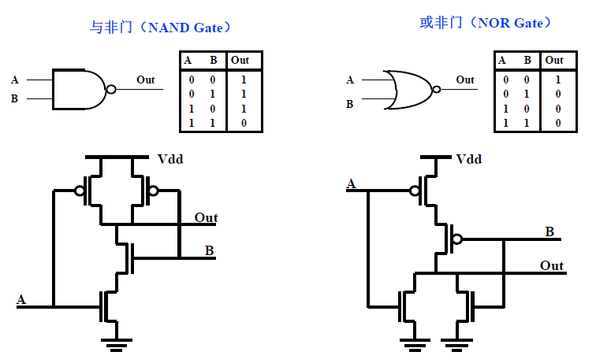
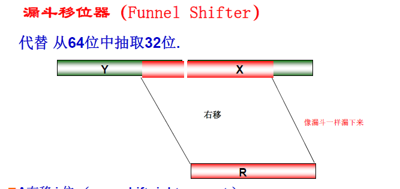
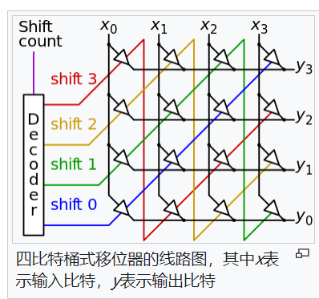
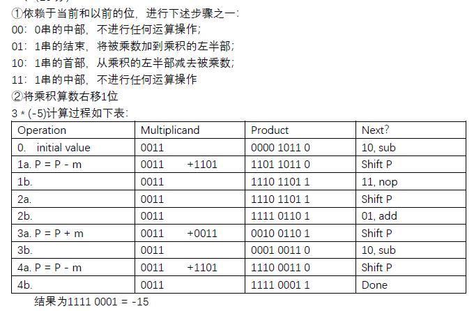

# 体系复习

## 简答题

1. 计算机体系和组成的关系和异同

计算机指令系统体系结构（Instruction set architecture ）是指程序员能看到的系统属性即概念结构和功能行为，通常是指用机器语言的程序员（包括汇编程序设计者）所看到的传统机器的属性，包括指令系统、数据类型、存储器寻址技术和 I/O 处理机制等。
计算机组成（organization ）是指如何实现计算机体系结构所体现的属性，是寄存器传输级（ RTL ）的逻辑实现。主要功能部件的实际能力和性能特性，部件之间的互联方式，部件之间的信息的流动，控制这些信息流动的逻辑和方法，为实现指令系统体系结构，功能部件协作、运行的情况。

2. 差分机的数学原理

差分机是利用牛顿提出的分步积分法原理计算多项式函数值的机械计算设备，可以用来计算多项式函数，精确三角函数和对数函数的精度等。
具体差分过程以平方为例：
0 的平方是 0，1 的平方是 1，2 的平方是 4 ，3 的平方是 9 。
据此，我们按照以下规则得到 4 的平方：计算已知平方之间的差：$1^2-0^2=0$ , $2^2 -1^2 =
3$, $3^2-2^2 = 5$ 。然后，我们计算这些结果的差： $3-1 = 2,5-3 = 2$ 。我们发现这些差都是2 ，假设这个规律是成立的，那么我们可以得出这样的结论 ：$(4^2-3^2)$ 和 $(3^2-2^2)$ 之间的差也是 2 。最终求得 , $4^2$ = 16 。更进一步，我们得到对于 N 次多项式，其 N 次数值差分为同一常数的差分原理。

3. 与非门/或非门

4. 没有变址寄存器前如何使用寄存器，如何做数组的迭代访问

使用Self modifying Code（第2讲ppt109页）。在每次循环中使用地址加载存储指令 ，通过累加器为下一次循环计算出地址 ，修改自身指令。

把存储指令加载到累加器中，利用累加器计算出循环的下一次对应的数组元素地址。修改自身指令，即：把原指令的地址部分修改成新的地址。在把新的指令存储到存储器中。

5. Dhrystone 合成基准程序的主要动机和机理是什么？用它评价机器性能

动机：真实程序数量多，规模大，直接用于评测，时间开销太大，因此人为构造规模小，但是能够反映真实工作负载的动态指令频度特征的基准程序。
机理：合成基准程序是取大量程序的指令和操作数出现频率的平均值，人工设计的程序。在操作类型和操作数类型这两个方面，合成基准程序试图保持与真实负载中的比例一致。
主要缺陷：人工设计的合成程序虽然试图在指令类型和操作数类型出现的频率上与真实负载保持比例一致，但是无法反映出真实负载的程序结构和指令之间的相互关系。

6. 浮点数的表示，非规格化数定义，为什么引入非规格化数？

规格化数：$(-1)^{s}*(1.M)*2^{E-127}$。1位的符号位S，8位的指数位E，23位的尾数位M。

非规格化数：当指数位的二进制全部为0 时，此时所表示的数为非规格化数，此时小数点左侧的隐含位为 0 ，而不是规格化数中的 1 。具体为$(-1)^{s}*(0.M)*2^{-126}$。1位的符号位S，8位的指数位E，23位的尾数位M。

无穷大：指数位全为1，尾数位全为0。有正负无穷大。

NaN：指数位全为1，尾数位非0。NaN具有出传播性。

引入非规格化数的原因：如果没有非规格化数，在单精度规格化数中，0到第一个规格化数之间 的距离为
$2^{-126}$ ，而最小和次最小规格化数之间的距离则减小到$2^{-(126+ M)}$, $(M=23)$, 比 $2^{-126}$小很多，因此通过非规格化数，使得 0 到第一个可表示的非零数之间的距离为$2^{-(126+ M)}$，提高了0附近的数值精
度。但是非规格化数的问题在于去除了前导的1, 通过降低精度来增加表示数值的范围。

浮点计算：移位对齐，计算，移位表示计算结果（如果结果需要规格化）。

浮点舍入：四舍六入五成双。

浮点的三个位：guard, rounding, sticky。

- guard：近似后的最低位
- rounding: guard的后一位
- sticky: rounding位后面的所有位的或运算的结果，视作一位

7. ENIAC是不是存储程序式计算机？

不是。ENIAC(Electronic Numerical Integrator and Calculator)是第一台通用电子计算机。它能实现条件跳转，并具有可编程能力。它不是存储程序式计算机，因为对于要处理的计算问题，它需要人来分析算术处理过程，并准备好布线表来进行布线。

存储程序的思想：即构成计算机程序的指令可同数据一样事先存放到存储器中，然后由计算机自己一条条取出执行。这种思想很自然地引出了转移指令和可对指令的地址部分进行修改的概念，从而使一段程序的指令可以自动地被有意义地多次执行。

第一台可操作的存储程序机器：Mark-I

第一台全面的、可操作的、存储程序计算机：EDSAC（Electronic Delay Storage Automatic Calculator）。其基于累加器的结构和其指令系统设计对以后一段时期的机器设计有着重要影响。

普林斯顿结构：计算机的指令和数据不加区别，放到一个存储器里。现在也认为，如果指令cache和数据cache不加区别放成一个联合cache，就是普林斯顿结构。

哈佛结构：计算机的指令和数据放到两个存储器/cache里。

8. SPEC用什么平均数，为什么？

使用了几何平均值。由于运行时间是评测机器性能的标准，因此定义$性能_{A}/性能_{B}=执行时间_{B}/执行时间_{A}$。SPEC中使用了规格化执行时间来评测机器性能。即：$参照机器的执行时间/被评测机器的时间$。

由于基准计算机可以任意选择，我们要保证基准计算机的选择不会影响性能的评定，需要在计算平均值时消除不同基准计算机选择的影响，因此要使用几何平均值。

使用几何均值可以确保以下两个重要特性。

(1) 这些比值的几何均值与几何均值之比相等。
(2) 几何均值之比等于性能比值的几何均值，这就意味着与基准计算机的选择无关。

举例：两个程序分别为程序1和程序2。两个计算机A,B。A的执行时间为1, 10，B的执行时间为10, 1。如果以A机器的时间为基准时间，和以B机器的时间为基准时间分别计算相对性能。发现取算术平均值是有问题的。

9. 零地址指令机器

在堆栈计算机中。计算指令的操作数要push到栈顶才能用于计算。因此要进行计算的两个操作数两个操作数必然来自于栈顶，计算结果放到栈顶。要取得计算结果就从栈顶pop出来。

栈顶的位置是可以动态维护的，因此堆栈计算机的计算指令不需要指明操作数地址，所以是零地址指令。

一地址指令：基于累加器的计算机中，一条计算指令的一个操作数已知在累加器中，计算结果放在累加器中，因此指令只需要给出另一个操作数的地址。所以是一地址指令。

10. 先行进位加法器的工作原理

先行进位是一种用来提高高阶进位速度的方法。其原理如下：

对于第$i$位，定义第$i$位是否有产生进位的能力：$g_{i}=A_{i}\& B_{i}$

第$i$位是否有传播进位的能力：$p_{i}=A_{i} | B_{i}$

一个位$i$能产生进位，取决于该位具有产生进位的能力($g_{i}=1$)，或者是其之前的某一位$j$具有产生进位的能力($g_{j}=1)$并且从j+1到i-1位都具有传播进位的能力($\forall k \in\{j+1,...,i-1\}, p_{k}=1$)。

因此，可以增加硬件来对这些情况进行判断，提高高阶进位的速度。在实际中，实现全先行进位加法器的成本过高，一般会连接一些 N位先行进位加法器，形成一个大加法器。

例如 : 连接 4个8位进位先行加法器，形成 1个 32 位局部先行进位加法器。

11. 漏斗移位器的工作原理

把一个32位的数的移位代替成从64位中抽取出32位。就像是漏斗一样漏下来。

例如：A右移i位的值，相当于Y中的低i位和X中的高(32-i)位拼成的一个数：

- 逻辑右移：令Y中存0，X中存A
- 算术右移：Y中存sign(A), X中存A
- 循环右移：Y和X均存A
- 左移：Y存A，X存0。取Y中的低32-i位和X中的高i位拼成的数。

真实情况该怎么移位：用硬件定制实现，依赖于技术工艺的解决方案。

桶式移位器：

12. 微程序机制

微程序控制的基本思想是把程序执行的概念用于控制器的设计，把机器指令执行的每个周期所需的所有控制信号对应于一条微指令的相关位域，每条机器指令对应于一段微指令构成的微程序。当执行机器指令时，从控制存储器中取出相应的微指令，便可以按照要求的次序产生相应的控制信号。控制存储器是用来存放整个指令系统的全部微程序，一般由 ROM构成。

13. 多周期处理器与流水线处理器中是如何避免寄存器堆与存储器中的WrEn与地址信号的竞争问题的？

多周期处理器：

- 在周期N结束时，确认地址(Adr)是稳定的
- 在之后的一个周期（周期N+1)发出Write Enable信号
- 在撤销Write Enable信号之前，地址信号不能改变

流水线处理器：

- 假设时钟是下降沿触发。将Write Enable信号和时钟进行逻辑与操作，作为控制存储器写使能的信号
- 这样使得在一个周期的前半段，信号为0，保证先让地址稳定。在这个周期的后半段，信号为1，实现写存储器的操作。

14. 超标量处理器与超长指令字的工作原理

超长指令字：这种处理器使用一条长指令字来实现多个操作的并行执行。通常一条长指令字多达上百位，有若干操作数，每条指令可以支持不同的几种运算。这种处理器完全依靠编译器发现指令之间的并行性，因此可以简化计算机的控制器的设计实现复杂度。
超标量处理器：超标量处理器依靠计算机的硬件，每周期同时取指译码多条指令，进行并行性检测后，可每周期可以发射多条指令到不同的执行部件。即使对于传统的串行程序，超标量处理器也可以动态挖掘程序中的指令并行性。

超级流水线：把流水线做成很多级（6级/8级），每个内部周期发送一条指令。试图通过增加流水线级数的方法来缩短机器周期，相同的时间内超级流水线执行了更多的机器指令。

15. 以物理地址访问的Cache，如何做到TLB访问与Cache访问的时间的重叠？

对于使用虚拟地址的处理器发出存储请求时，需要将虚拟地址转换为物理地址。在转换过程中， TLB 的工作是将虚拟页号转换为页帧号，但是转换中，地址中的页内偏移不会发生改变。如果访问 cache 的索引只需要使用地址中的页内地址，则可以不需要经过地址转换直接访问，即实现 cache 的访问和 TLB 访问同时进行。为了使得 cache 的索引只使用页内地址，可以增大页面大小或者提高 cache 的相联度。

16. RAID5/RAID4

RAID(Redundant Arrays of Independent Drives)Drives)，独立磁盘冗余阵列，一种把多块独立的硬盘（物理硬盘）按不同的方式组合起来形成一个硬盘组（逻辑硬盘），从而提供比单个硬盘更高的存储性能和提供数据备份技术。
RAID5是在 RAID 中的一种存储性能，数据安全和存储成本兼顾的存储解决方案。在RAID５和RAID4 一样，数据以块为单位分布到各个硬盘上，数据块可以看作是一个完整的数据集合，通过这种方式可以保证块的完整性。 RAID 5不对数据进行备份，而是把数据和与其相对应的奇偶校验信息存储到组成RAID5的各个磁盘上，并且奇偶校验信息和相对应的数据分别存储于不同的磁盘上。当 RAID5 的一个磁盘发生损坏后，不会影响数据的完整性，从而保证了数据安全。当损坏的磁盘被替换后， RAID 还会自动利用剩下奇偶校验信息去重建此磁盘上的数据，来保持 RAID5 的高可靠性。 RAID5 的缺点在于控制器较为复杂，并且相对于 RAID1 ，因硬盘故障而重新构建 RAID 体系更加复杂。

RAID1: 对每个盘的数据做一个镜像备份。其需要的容量大，成本高。

RAID2: 以汉明码（Hamming Code）的方式将数据进行编码后分割为独立的位元，并将数据分别写入硬盘中。因为在数据中加入了错误修正码（ECC，Error Correction Code），所以数据整体的容量会比原始数据大一些。

RAID3: 把数据按bit为单位进行划分，放到多个硬盘上。并存放数据的奇偶校验码到独立的校验盘上。RAID3的问题是丧失了硬盘的物理特征。因为硬盘是以扇区为单位读的，每个扇区本身就存在ECC码，来检测数据是否错误。那么如果一个扇区的部分数据错误，就能直接发现。用bit为单位划分数据，就无法利用硬盘这个性质了。它也会出现：如果写入的数据多，校验盘负载大的问题（和RAID4相同）。

RAID4：把数据以块为单位存储在多个硬盘上，并把奇偶校验码存放在独立的奇偶校验盘上。它与RAID5的区别是，RAID4的所有校验数据都存放在校验盘上。这会导致每写一次任意一个数据盘，都会写一次校验盘。校验盘被写入的次数比数据盘多，更容易坏。相比之下，RAID5没有单独的校验盘，而是把奇偶检验的数据随机放到某一个盘上，使得块数据和校验值在所有的盘上均匀分布，避免了大量写入某一个盘的情况。

17. booth乘法原理

任何一个1串都等于两个$(10…0)_{2}$的串的差。因此BOOTH乘法是将乘数分成多个1串的组合。其中的每个1串用看到第一个1时的减法和1结束时的加法代替。这样就省去了传统算法遇到每个1都要把被乘数加到临时结果中的操作。从而减少操作步骤。

18. -2018.125的浮点表示

符号位：1

指数位：10001001

尾数位：11111000100010000000000

11000100111111000100010000000000

2018.125=$2^{10}+2^9+2^8+2^7+2^6+2^5+2^1+2^{-3}$

=$2^{10}(1+2^{-1}+2^{-2}+2^{-3}+2^{-4}+2^{-5}+2^{-9}+2^{-13})$

19. 时钟扭斜对时钟周期和保持时间的影响

时钟周期 >= CLK-to-Q + 最长延迟路径 + setup + 时钟扭斜

CLK-to-Q + 最短延迟路径 - 时钟扭斜 > 保持时间

建立时间：在触发时钟边沿之前，输入必须保持稳定。

保持时间：在触发时钟边沿之后，输入必须保持稳定。

CLK-to-Q：在触发时钟边沿后，经历CLK-to-Q时间输出才发生变化。

- 分为内在的CLK-to-Q和负载相关的CLK-to-Q

20. 软件流水和循环展开

软件流水技术（Software pipeline loop）是通过对循环重新进行建构，使得每次迭代执行的指令是属于原循环不同迭代过程的指令。这样的话，如果循环的每次迭代之间是没有相关的，就能通过从不同迭代中抽取指令来获得更高的指令级并行性。

循环展开：是一种牺牲程序的尺寸来加快程序的执行速度的优化方法。通过把一个循环体的代码复制多次，将一个循环进行展开。例如将一个n*m次的循环，展开成m次的，每次进行n个操作的循环。

循环展开：从减少循环开销方面。可以减少分支预测错误次数，增加取消数据相关进一步利用并行执行提高速度的机会。

软件流水：减少循环执行时间

- **基本思想**：将有真相关的指令分隔到不同的循环周期内执行

- 使用软件调度的方法对循环进行重构，消除/降低每个loop内的相关。
- 代码空间较小。只需填充和排空流水线一次。而循环展开每次迭代就需要一次

（以上是个人理解，可能有错）

21. 写分配的写返回cache

cache的写入策略：命中时：写穿透（write through)，写返回(wirte back)。不命中时：写分配，写不分配。

- 写穿透：只写入cache。当出现cache失效，某个cache数据块被替换出cache时，才将cache块中的数据写回到存储器。
  - 对每个cache数据块，要增加一个脏位
  - 极大地减小存储器的带宽需求
  - 控制较复杂
- 写返回：数据同时写入cache和存储器。

- 写分配与写不分配：假设一个16位的数据要写到存储器中，它产生了cache失效。那么我们是否需要读取该块的其他数据并将其调入cache中：
  - 把存储器中的块调入cache，并在cache中修改：写分配
  - 不调入cache，只写主存：写不分配

一般而言：

- 写穿透+写不分配
- 写返回+写分配

## 设计题