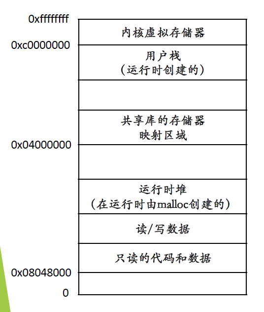
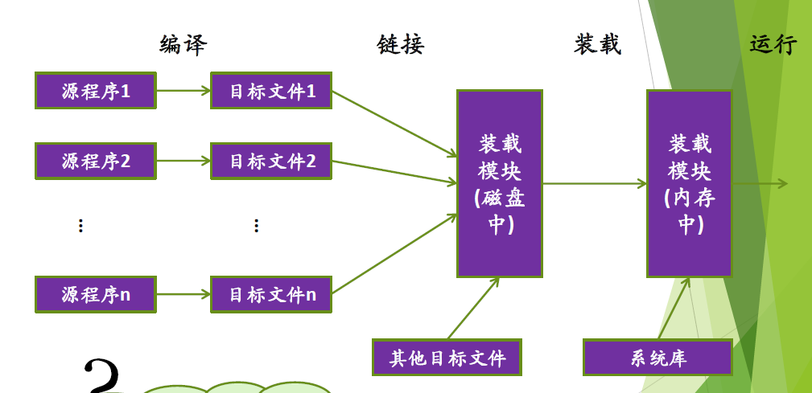
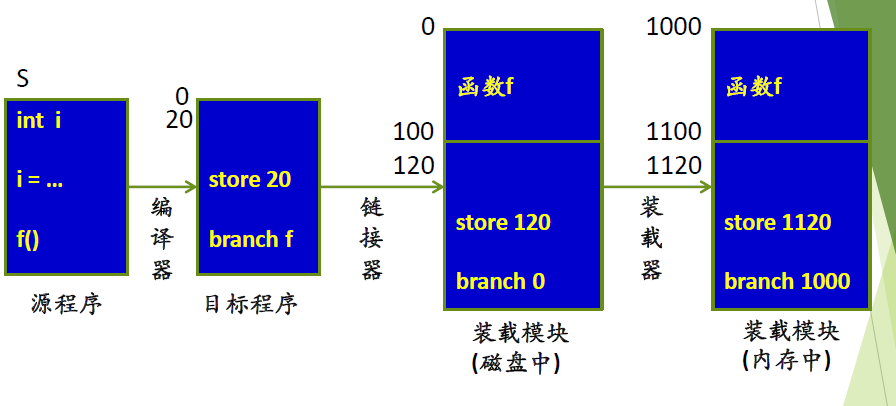
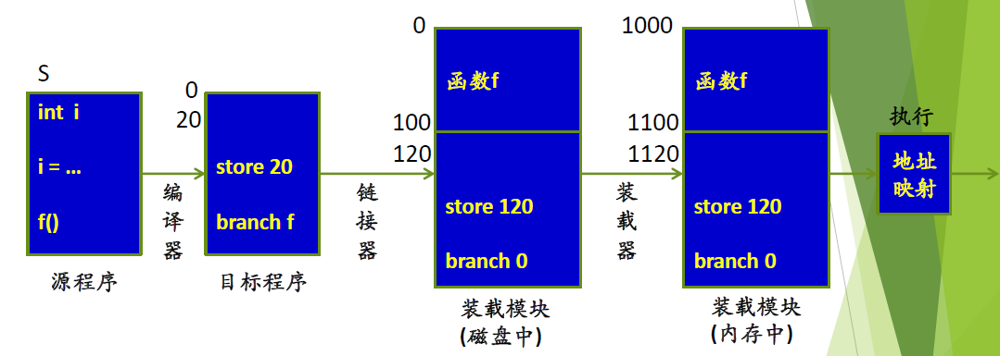
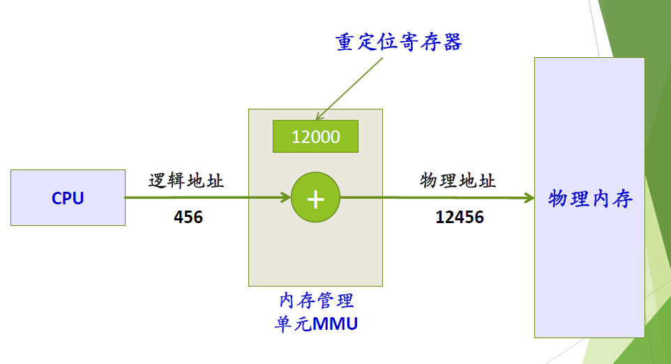
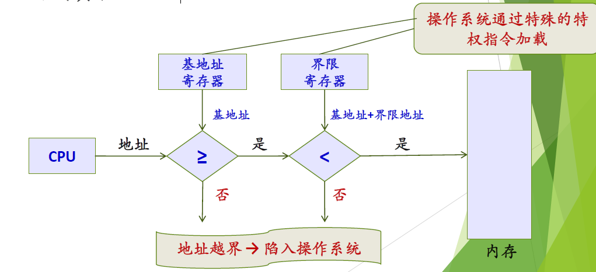
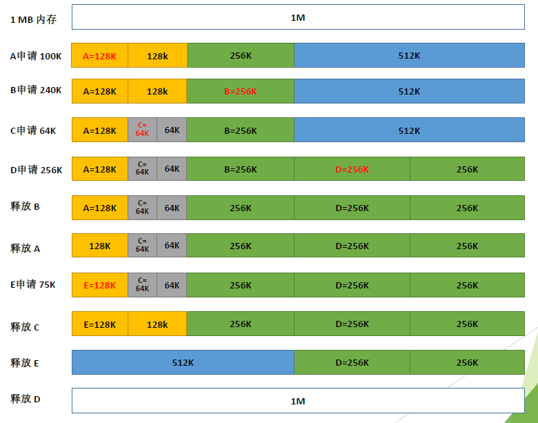
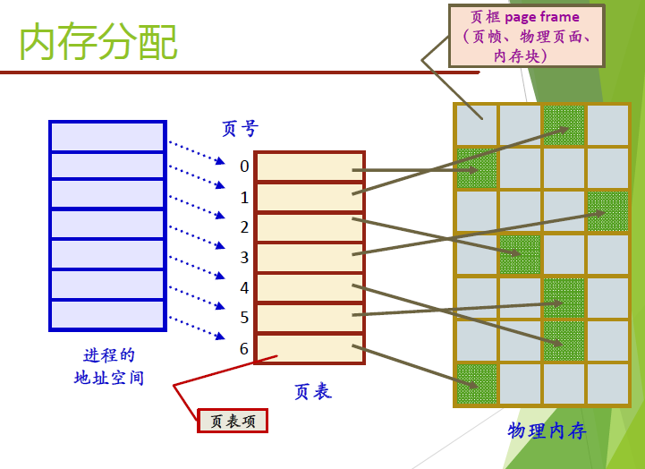
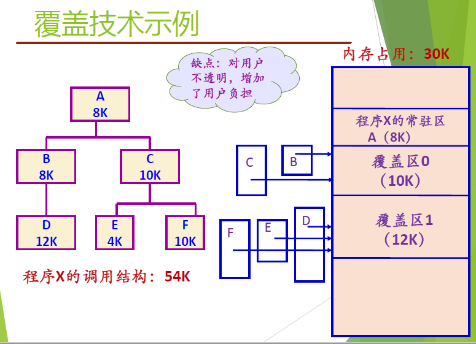

[TOC]

# 存储管理

## 基本概念

内存管理：

- 需要支持地址重定位
  - 程序运行前无法计算出物理地址
  - 程序中的地址不一定是最终的物理地址

- 需要支持地址保护
  - 进程间地址空间不能相互访问

程序执行前的准备过程：

### 地址重定位

- 逻辑地址（相对地址、虚拟地址）
  - 用户程序经过编译、汇编后形成目标代码，目标代码通常采用相对地址的形式， 其首地址为0，其余指令中的地址都相对于首地址而编址，不能用逻辑地址在内存中读取信息

- 物理地址（绝对地址，实地址）
  - 内存中存储单元的地址，可直接寻址

- 用户程序中的逻辑地址转换为运行时可由机器直接寻址的物理地址的过程

#### 静态地址重定位

- 当用户程序加载到内存时，一次性实现逻辑地址到物理地址的转换
- 一般可由软件完成

#### 动态地址重定位

- 在进程执行过程中进行地址变换
  - 即逐条指令执行时完成地址映射
  - 硬件支持：MMU

##### 内存管理单元：MMU

### 地址保护

- 确保每个进程有独立的地址空间
- 确定进程可访问的合法地址的范围，以确保进程只访问其合法地址

## 物理内存管理方案

### 空闲物理内存管理

数据结构：

- 位图：每一位表示一个分配单元的分配情况。0表示空闲，1表示占用
- 空闲区表、已分配区表：表中每一项记录了空闲区（或已分配区）的起始地址、长度、标志
- 空闲块链表

### 内存分配算法

- 首次适配：在空闲区表中找到第一个满足进程要求的空闲区
- 下次适配：从上次找到的空闲区处接着找
- 最佳适配：查找整个空闲区表，找到能够满足进程要求的最小空闲区
- 最差适配：总是分配满足进程要求的最大空闲区

### 回收问题

内存回收算法

- 当某一块归还后，前后空闲空间合并，修改内存空闲链表
- 四种情况
  - 上相邻、下相邻、上下都相邻、上下都不相邻

### 伙伴系统

- 将内存按照2的幂进行划分，组成若干个空闲块链表；查找该链表找到能满足进程需求的最佳匹配块
- 算法：
  - 首先将整个可用空间看做一个块$2^U$
  - 假设进程申请的空间大小为$s$, 如果满足$2^{U-1}<s\leq2^{U}$，则分配整个块。否则将块划分成两个大小相等的伙伴
  - 一直划分下去直到产生大于或等于$s$的最小块

## 内存管理基本方案

分区技术（单一用户、固定分区、可变分区）是不涉及虚拟内存的内存管理技术。

### 单一用户（连续区）

一段时间只有一个进程在内存

方案简单，但是内存利用率低

### 固定分区

- 把内存空间分割成若干区域，称为分区
- 每个分区的大小可以相同或不同
- 分区大小固定不变
- 每个分区装一个且只能装一个进程

### 可变分区

- 根据进程的需要，把内存空间分割出一个分区，分配给该进程

- 剩余部分成为新的空闲区
- 外碎片导致内存利用率下降
  - 解决：
    - 紧缩技术：在内存中移动程序（进程），保证每个进程仍然占用连续的内存空间，同时将所有小的空闲区合并为较大的空闲区

### 页式存储

- 把用户程序（进程）空间划分成大小相等的页(page)
- 内存空间按页大小划分成大小相等的区域，称为内存块（物理页面，页框，页帧 page frame)
- **进程中的页**正好可以存放到**内存中的页框**
- 内存分配原则：以页为单位进行分配，并按照进程需要的页数来分配；逻辑上相邻的页，物理上不一定相邻
- 典型的页面尺寸：4K或4M

#### 页表及地址转换

- 页表项：记录了逻辑页号和页框号的对应关系
- 每个进程一个页表，存放在内存中
- 地址转换（硬件支持）：
  - CPU取到逻辑地址，自动划分为页号和页内地址；用页号查页表，得到页框号，再与页内地址（页内偏移）拼接为物理地址

### 段式存储管理

- 用户程序地址空间：按程序自身的逻辑关系划分为若干个程序段，每个程序段都有一个段名
- 内存空间被动态的划分为若干个长度不相同的区域，称为物理段，每个物理段由起始地址和长度确定
- 内存分配规则：以段为单位进行分配， 每一个段在内存中占据连续空间，但各段之间可以不相邻

#### 段表及地址转换

- 段表
  - 记录了段号、段首地址和段长度之间的关系
  - 每个进程一个段表，存放在内存
- 物理内存管理：同可变分区

- 地址转换（硬件支持）：CPU取到逻辑地址，用段号查段表，得到段的起始地址，再与段内偏移地址计算出物理地址

### 段页式存储管理

- 用户程序划分：按段式划分（对用户来讲，按段的逻辑关系进行划分；对系统讲，按页划分每一段）
- 内存分配：以页为单位
- 内存划分：按页式存储管理方案

- 段表：记录了每一段的页表始址和页表长度
- 页表：记录了逻辑页号与内存块号的对应关系（每一段有一个，一个程序可能有多个页表）
- 空闲区管理：同页式管理
- 分配、回收：同页式管理

## 内存“扩充”

内存不足时如何管理？

- 内存紧凑
- 覆盖技术
- 交换技术
- 虚存技术

### 覆盖技术

问题：程序大小超过物理内存总和

- 程序执行过程中，程序的不同部分在内存中相互替代：
  - 按照其自身的逻辑结构将那些不会同时执行的程序段共享同一块内存区域
  - 要求程序各模块之间有明确的调用结构
- 程序员声明覆盖结构，操作系统完成自动覆盖
- 主要用在早期的操做系统

缺点：

- 增加编程困难
- 增加执行时间

### 交换技术

- 最早用于小型分时系统
- 内存空间紧张时，系统将内存中某些进程暂时移到外存，把外存中某些进程换进内存，占据前者所占用的区域（进程在内存与外存之间的动态调度）
- 交换区：一般系统会指定一块特殊的磁盘区域作为交换空间（swap space），包含连续的磁道，操作系统可以使用底层的磁盘读写操作对其高效访问
- 需要交换什么？
  - 堆，栈。用匿名文件交换。代码区、data不用放，因为在磁盘上有它们的备份。
- 交换时机
  - 和系统的实现有关
  - 只要不用就换出（很少再用 ）；内存空间不够或有不够的危险时换出
- 考虑进程的各种属性；不应换出处于等待 I/O 状态的进程
- 换出后又换入的进程不一定回到原处（采用动态重定位）

