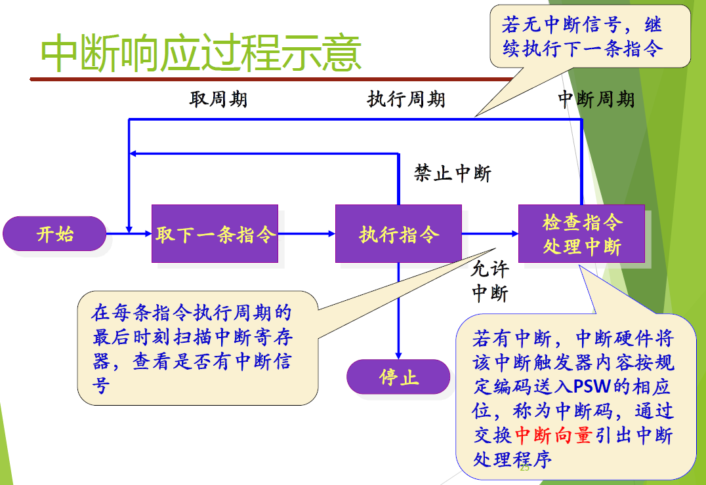
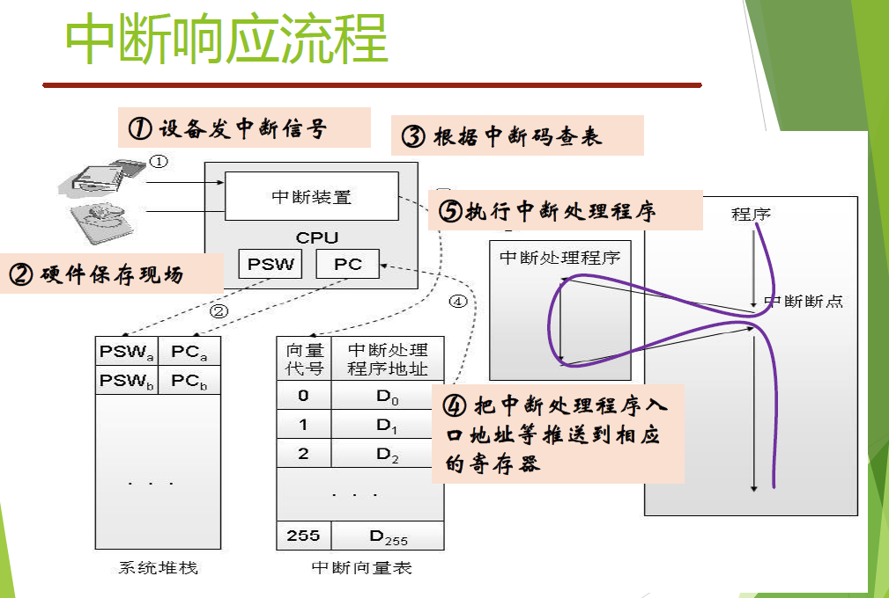
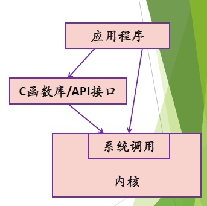
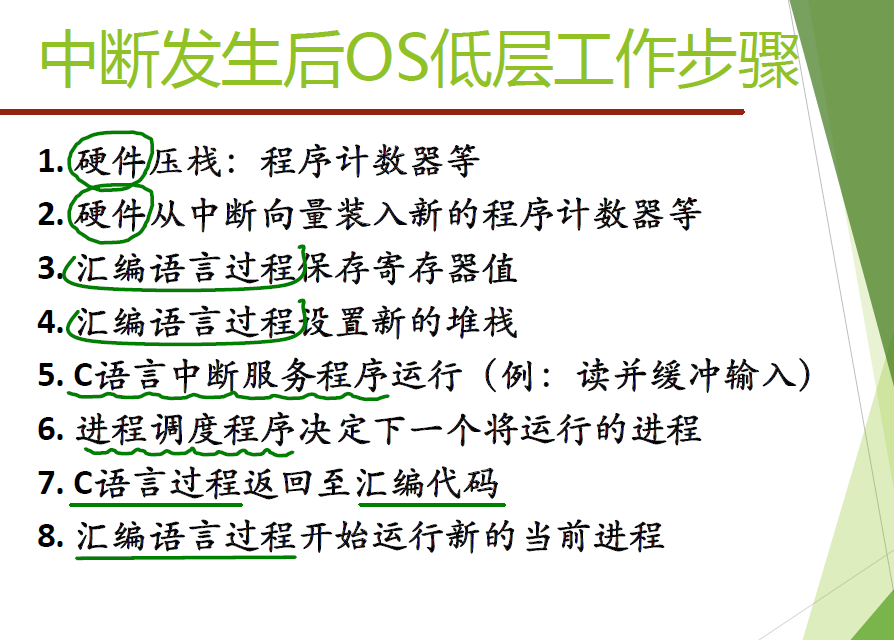
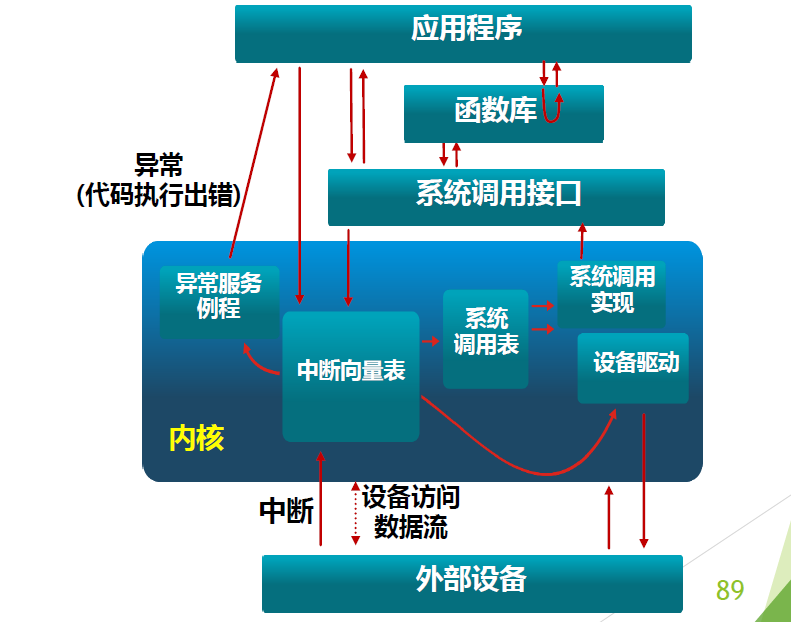

[TOC]

# 运行环境与运行机制

## 操作系统的运行环境

### 中央处理器CPU

- 由运算器、控制器、一系列的寄存器以及高速缓存构成
- 两类寄存器：
  - 用户可见寄存器：：高级语言编译器通过优化算法分配并使用之，以减少程序访问内存次数
    - 数据寄存器：又称通用寄存器，主要用于各种算术逻辑指令和访存指令
    - 地址寄存器：用于存储数据及指令的物理地址、线性地址或者有效地址，用于某种特定方式的寻址。如index register, segment register, stack register
    - 条件码寄存器：：保存 CPU 操作结果的各种标记位。如算术运算产生的溢出、符号等等
  - 控制和状态寄存器：用于控制处理器的操作。只能**在某种特权级别下访问、修改**
    - 程序计数器（PC: Program Counter）：记录将要取出的指令的地址
    - 指令寄存器（IR: Instruction Register）：包含最近取出的指令
    - 程序状态字（PSW: Program Status Word）：记录处理器的运行状态如条件码、模式、控制位等

#### 处理器的状态（模式mode)

- 现代处理器通常将CPU状态设计划分为两种、三种、四种
- 在PSW中专门设置一位，根据运行程序对资源和指令的使用权限而设置不同的CPU状态

#### 特权指令与非特权指令

操作系统需要两种CPU状态：

- 内核态：运行操作系统程序
- 用户态：运行用户程序

特权指令：只能由操作系统使用、用户程序不能使用的指令

- 例如：启动IO；内存清零；修改程序状态字；设置时钟；允许/禁止中断；停机

非特权指令：用户可以使用的指令

- 例如：控制转移；算术运算；访管指令；取数指令等

#### CPU状态之间的转换

用户态$\to$内核态：中断/异常/陷入

- 陷入指令（又称访管指令）：提供给用户程序的接口，用于调用操作系统的功能（服务
  - 例如：`int trap syscall sysenter sysexit ecall`

内核态$\to$用户态：设置程序状态字

### 中断机制

- 中断与异常的引入原因
  - 中断的引入：为了支持 CPU 和设备之间的并行操作
    - CPU启用设备进行输入/输出后，设备独立工作。然后设备工作完成后发出中断告诉CPU
  - 异常的引入：表示 CPU 执行指令时本身出现的问题

- 概念

  - CPU 对系统发生的某个事件作出的 一种反应

    - 暂停正在执行的程序
    - 保存现场
    - 自动转去执行相应事件的处理程序，处理完成后返回断点
    - 恢复现场
    - 继续执行被打断的程序

    

|      类别      |            原因             | 异步/同步 |       返回行为       |
| :------------: | :-------------------------: | :-------: | :------------------: |
| 中断 Interrupt | 来自 I/O 设备、其他硬件部件 |   异步    | 总是返回到下一条指令 |
|   陷入 Trap    |        有意识安排的         |   同步    |   返回到下一条指令   |
|   故障 Fault   |        可恢复的错误         |   同步    |    返回到当前指令    |
|   终止 Abort   |       不可恢复的错误        |   同步    |       不会返回       |

#### 工作原理

- 中断/异常机制工作原理
  - **软硬件配合**
  - 硬件：中断/异常响应
    - 捕获中断源发出的中断/异常请求，以一定方式响应将处理器控制权交给特定的处理程序
  - 软件：中断/异常处理程序
    - 识别中断/异常类型，并作出相应的处理

#### 中断响应

- 发现中断、接收中断的过程；由中断硬件部件完成

- 中断向量表：一个内存单元，存放中断处理程序入口地址和程序运行所需的处理机状态字
  - 硬件按中断号/异常类型的不同，把不同的中断通过中断向量表转移控制权给不同的中断处理程序

- 中断处理程序：设计操作系统时，为每一类中断 异常事件编好相应的处理程序，并设置好中断向量表

#### 多个中断

- 方法一：在中断处理过程中禁止其他的中断。如果此期间发生了中断，通常挂起该中断，只有当处理器允许中断时，再由处理器检测该中断。
  - 所有中断都严格按照顺序处理
  - 缺点：没有考虑相对优先级和时间限制的要求。
    - 例如：当通信线路的输入到达时，如果不及时处理可能会导致缓冲区溢出
- 方法二：为所有中断指定优先级，并允许高优先级的中断打断低优先级的中断处理程序的执行。

### 存储系统

- 重要方面：
  - 进程必须将其程序和数据放在内存中才能运行
  - 操作系统本身也要放在内存中运行
  - 多道程系统中，若干个程序和相关的数据要放入内存
- 容量，速度，成本的平衡
- 局部性原理：时间局部性；空间局部性
- 存储分块
- 高速缓存：Cache(SRAM)
  - 对操作系统不可见

### IO访问技术

- 程序控制方式
  - 由CPU提供IO相关指令来实现
    - 控制指令 : 用于激活外设，并告诉它做什么
    - 状态指令 : 用于测试I/O控制中的各种状态和条件
    - 数据传送指令 : 用于在设备和主存之间来回传送数据
  - I/O 处理单元处理请求并设置IO状态寄存器相关位
  - 不中断处理器，也不给处理器警告信息
  - CPU 定期**轮询** I/O 单元的状态，直到处理完毕
  - 主要问题：CPU必须关注I/O处理单元的状态，因而耗费大量时间轮询信息，降低了系统性能
- 中断驱动方式
  - 每个数据需要传输时中断 CPU
  - I/O 操作与指令并行
- 直接存储器存取（DMA）方式
  - DMA控制器: 系统总线中一个独立控制单元
  - DMA控制器自动控制成块数据在内存和IO单元间的传送
  - 当CPU需要读写一整块数据时给DMA控制单元发送一条命令
    - 包含：是否请求一次读或写，I/O 设备的编址，开始读或写的内存编址，需要传送的数据长度等信息
  - CPU 发送完命令后就可处理其他事情，DMA控制器将自动完成数据的传送。当传送过程完成后，DMA控制器给 CPU 发一个中断，CPU只在开始传送和传送结束时进行关注
  - CPU 和 DMA 传送不完全并行：因为会有总线竞争的情况发生
    - CPU 用总线时可能稍作等待
    - 不会引起中断
    - 不引起程序上下文的保存
  - 通常过程只有一个总线周期
  - 在 DMA 传送时， CPU 访问总线速度会变慢

### 时钟

- 绝对时钟；相对时钟
- 硬件时钟（用寄存器模拟）；软件时钟（用内存单元模拟）

## 操作系统运行机制

### 系统调用

系统调用：用户在编程时可以调用的操做系统功能，使CPU从用户态陷入内核态

- 系统调用机制的设计
  - 利用中断/异常机制
  - 选择一条特殊指令：陷入指令
  - 每个系统调用都事先给定一个编号
  - 系统调用表
- 如何实现参数传递
  - 陷入指令自带参数：指令的长度优先，只能携带有限个参数
  - **通用寄存器**：寄存器是操作系统和用户程序都能访问的，但是寄存器个数会限制传递参数的数量
  - 专用堆栈区

- 执行过程：
  - 中断/异常机制：硬件保护现场，查中断向量表把控制权转给系统调用总入口程序
  - 系统调用总入口程序：保存现场；将参数保存在内核堆栈；查系统调用表把控制权转移给相应的系统调用处理例程或内核函数
  - 执行系统调用例程
  - 恢复现场，返回用户程序

## 总结

