# 进程和线程模型

## 进程

### 基本概念

- 多道程序设计：允许多个程序**同时进入内存并运行**
- 并发环境：一段时间间隔内，单处理器上有两个或两个以上的程序同时处于开始运行但尚未结束的状态 ，并且次序不是事先确定的

进程：进程是具有独立功能的程序关于某个数据集合上的一次运行活动 ，是系统进行资源分配和调度的独立单位

- 程序的一次执行过程，是正在运行程序的抽象
- 将一个CPU变换成多个虚拟的CPU
- 系统资源以进程为单位分配，每个进程有独立的地址空间
- 操作系统将CPU调度给进程

### 进程模型

#### 进程的状态

三状态模型：

- 运行态：占有CPU，并在CPU上运行
- 就绪态：已经具备运行条件，但由于没有空闲CPU ，而暂时不能运行
- 等待态：因等待某一事件（如完成I/O）而暂时不能运行

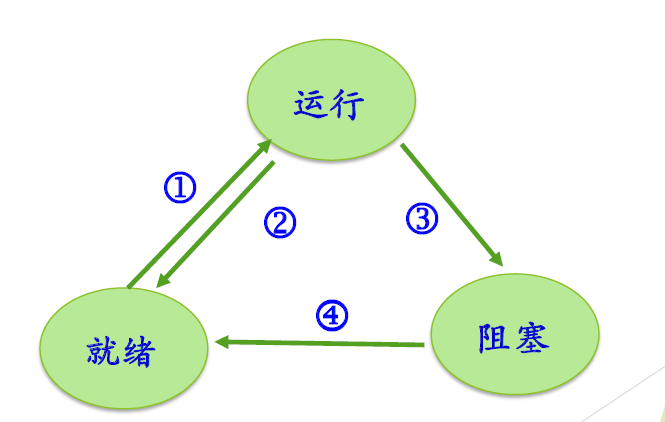

其他状态：

- 创建
  - 已完成创建一进程所必要的工作：PID, PCB
  - 但是尚未同意执行该进程：因为资源有限

- 终止：
  - 终止执行后，进程进入该状态
  - 可完成一些数据统计工作
  - 资源回收
- 挂起：
  - 把一个进程从内存转到磁盘。进程不占用内存空间，其进程映像交换到磁盘上
  - 用于调节负载

五状态进程模型：

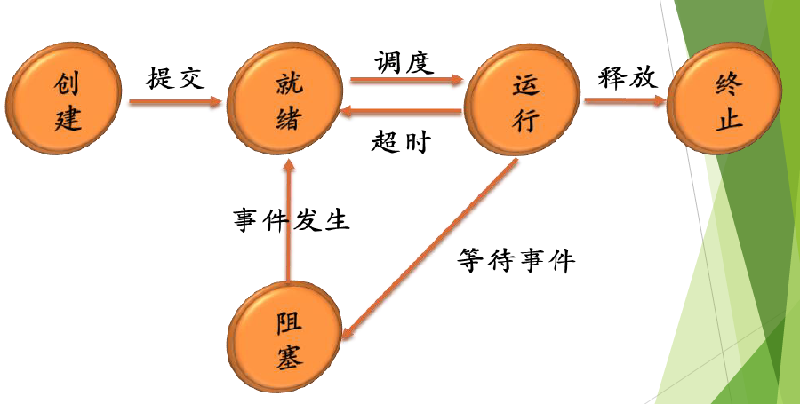

七状态进程模型：

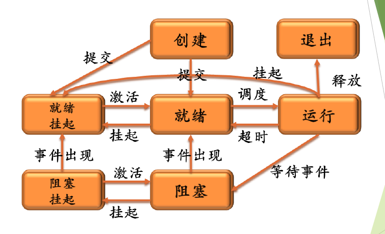

linux进程状态：

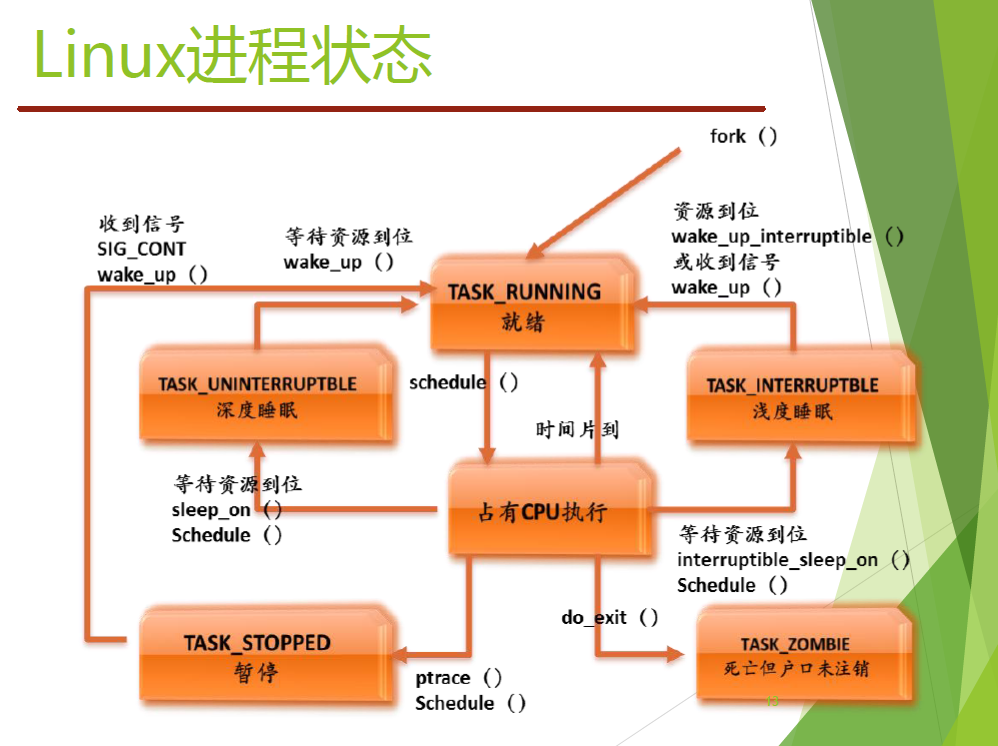

#### 进程控制块PCB

Process Control Block

- 操作系统中表示进程的数据结构
- 记录进程的各种属性，描述进程的动态变化过程
- 操作系统通过PCB来控制和管理进程
  - 进程与PCB一一对应
  - PCB是系统感知进程存在的唯一标志

PCB的内容：

- 进程描述信息
  - 进程标识符
  - 进程名
  - 用户标识符；进程组关系
- 进程控制信息
  - 当前状态
  - 优先级
  - 代码执行入口地址
  - 可执行文件名（磁盘地址）
  - 运行统计信息（执行时间、页面调度）
  - 进程间同步和通信；阻塞原因
  - 进程的队列指针
  - 进程的消息队列指针
- 所有用的资源和使用情况
  - 虚拟地址空间现状
  - 打开文件列表
- CPU现场信息
  - 寄存器值（通用、程序计数器 PC 、状态 PSW ，地址如栈指针）
  - 指向赋予该进程的段 页表的指针

#### 进程地址空间

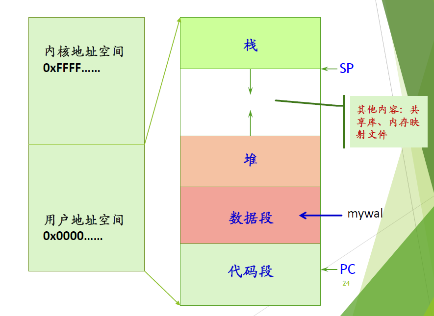

#### 上下文切换

- 进程运行时，其硬件状态保存在CPU上的寄存器中
- 进程不运行时，这些寄存器的值保存在PCB中
- 将CPU硬件状态从一个进程换到另一个进程的过程称为上下文切换

#### 进程表（队列）

- 操作系统为每一类进程建立一个或多个队列
- 队列元素为 PCB
- 伴随进程状态的改变，其 PCB 从一个队列进入另一个队列

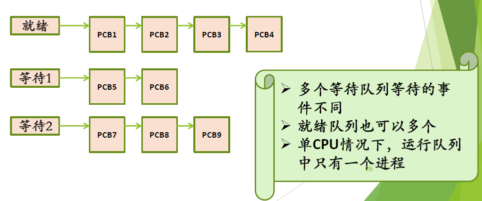

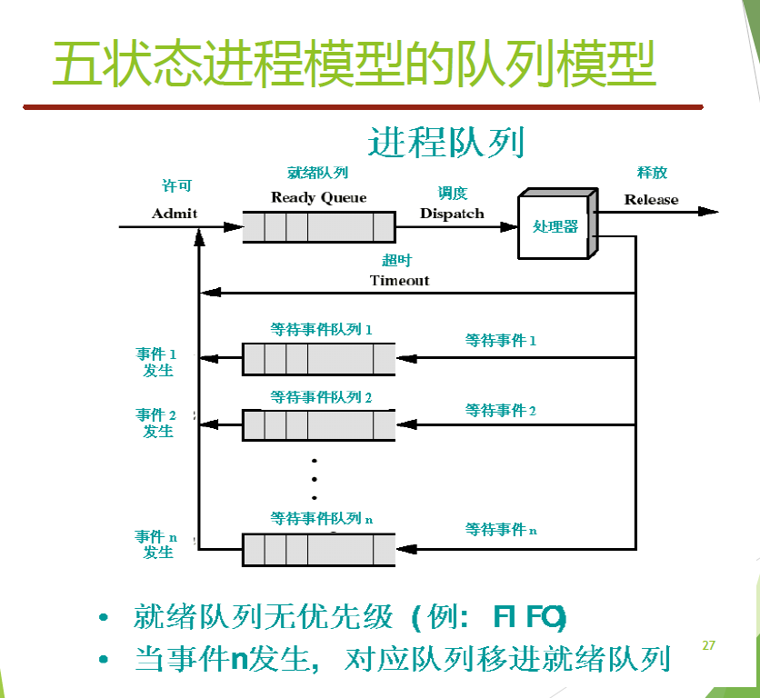

### 进程控制

进程控制操作完成进程各状态之间的转换，由具有特定功能的**原语**完成

- 原语：不可分割性或不可中断性
- 进程创建原语
- 进程撤销原语
- 阻塞原语
- 唤醒原语
- 挂起原语
- 激活（解挂）原语
- 改变进程优先级

#### 进程的创建

- 分配pid和PCB
- 分配地址空间
- 初始化PCB
- 设置相应的队列指针
- 创建或扩充其他数据结构

#### 进程的撤销

- 结束子进程或线程
- 收回进程所占有的资源：关闭文件，断开网络连接、回收分配的内存
- 撤销该进程的PCB

#### 进程的阻塞和唤醒

- 阻塞：在进程运行过程中期待某一事件发生，如等待键盘输入、等待磁盘数据传输完成、等待其它进程发送消息，当被等待的事件未发生时，由 进程自己执行阻塞原语 ，使自己由运行态变为阻塞态

## 线程模型

为什么需要线程？

- 应用的需要：
  - Web服务器
  - 打印机
- 开销的考虑
  - 创建和撤销线程花费的时间少
  - 两个线程切换花费的时间少
  - 线程之间相互通信无需调用内核（共享内存和文件）
- 性能的考虑
  - 多个线程，有的计算，有的IO
  - 多个处理器

### 基本概念

- 是资源的拥有者
  - 一个虚拟地址空间，一些占有的资源(文件/IO设备)
- 是调度单位
  - 一个执行轨迹，状态、优先级

将原来进程的两个 属性分别处理

- 线程：进程中的一个运行实体，是CPU的调度单位
- 进程是资源分配的单位，线程是调度的单位

### 线程的属性

线程：

- 有状态及状态切换
- 不运行时需要保存的上下文
  - 程序计数器等寄存器
- 有自己的栈和栈指针
- 共享所在进程的地址空间和其他资源

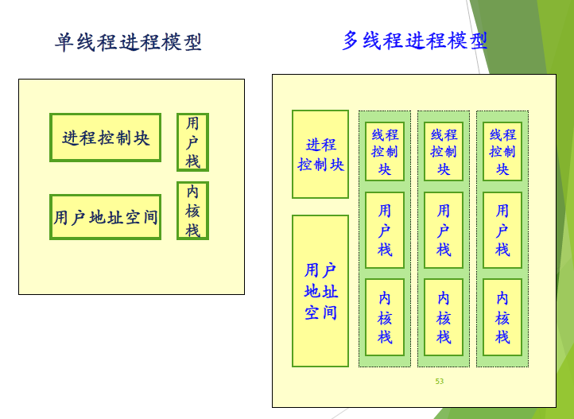

### 线程的实现

- 用户级线程：在用户空间实现
- 核心级线程：在内核中实现
- 混合两者的结合方法：在内核中实现，支持用户线程

#### 用户级线程

- 在用户空间建立线程库：提供一组管理线程的函数
- 运行时系统：完成线程的管理工作（操作、线程表）
- 内核管理的是进程，不知道线程的存在
- 线程切换不需要内核态特权

例如：POSIX Pthreads

优点：

- 线程切换块
- 调度算法是应用程序特定的
- 用户级线程可运行在任何操作系统上（只需要实现线程库）

缺点：

- 大多数系统调用是阻塞的。由于内核阻塞进程，故进程中的所有线程也被阻塞
  - 两种解决方案：
    - 修改系统调用为非阻塞的（只要系统调用就yield)
    - 重新实现对应系统调用的IO库函数
- 内核只将处理器分配给进程，**同一进程中的两个线程不能同时运行于两个处理器上**

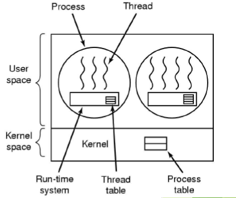

#### 核心级线程

- 内核管理所有线程管理，并向应用程序提供API接口
- 内核维护进程和线程的上下文
- 线程的切换需要内核支持
- 以线程为基础进行调度

例如：Windows

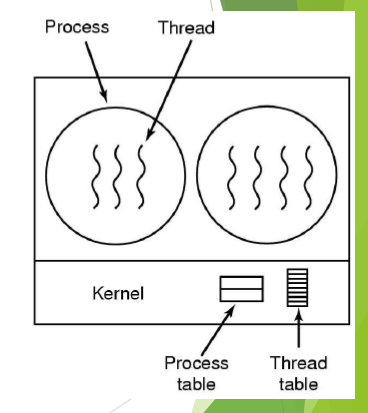

#### 混合模型

- 线程的创建在用户空间完成
- 线程的调度等在内核态完成
- 多个用户级线程多路复用多个内核级线程

例如：Solaris

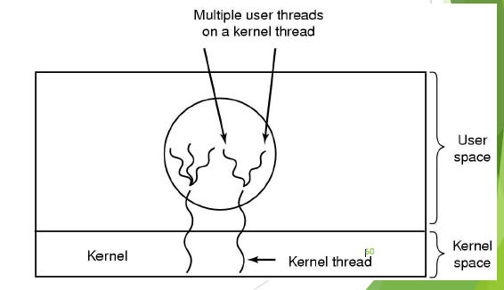

- Solaris 的多线程模型中包括四种实体：进程，内核线程，用户线程和轻量级进程(LWP)

- Solaris 内核是多线程的
  - 进程是资源分配和管理的单元
  - 内核级线程是内核的调度单元
  - 用户级线程是程序执行在用户态的抽象
  - LWP 把用户线程和内核线程绑定到一起

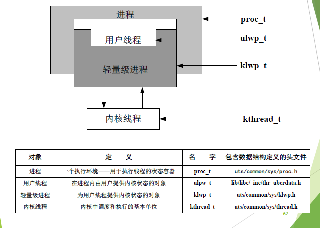

用户线程、内核线程、lwp三者之间的关系：

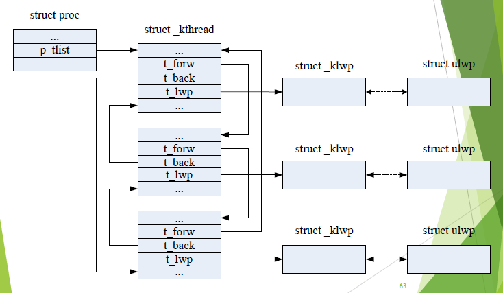

[(10 封私信 / 80 条消息) Linux下调用pthread库创建的线程是属于用户级线程还是内核级线程？求大神指教? - 知乎 (zhihu.com)](https://www.zhihu.com/question/35128513)