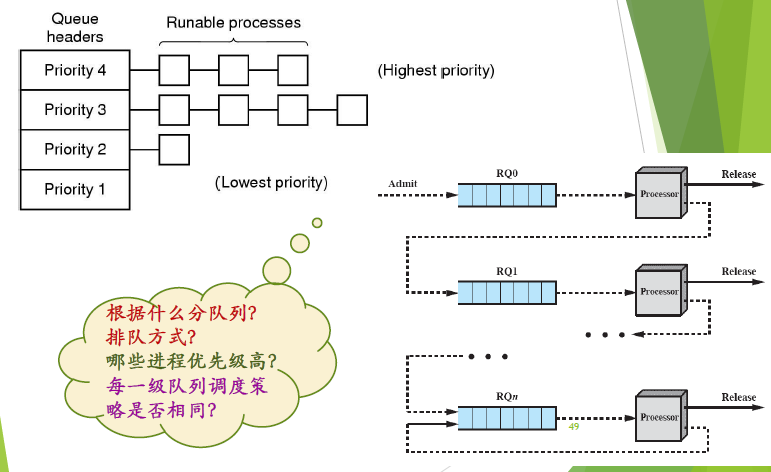

[TOC]

# 进程和线程调度

## 处理器调度

调度三个层次：

- 长程调度：创建新进程时，决定是否进入当前活跃进程集合

- 中程调度：进程在内外存之间的交换
  - 从存储资源管理的角度：把进程的部分或全部换出到外存，可为当前运行进程的执行提供所需内存空间，将当前进程所需部分换入到内存（ 交换技术）

- 短程调度：从处理机资源分配的角度，需要选择就绪进程或线程进入运行状态
  - 短程调度的时间尺度通常是毫秒级的
  - 由于短程调度算法的频繁使用，要求实现时做到高效

处理器调度：

- 控制、协调进程对CPU的竞争
- 即按一定的调度算法从就绪队列中选择一个进程 ，把CPU的使用权交给被选中的进程
- 如果没有就绪进程，系统会安排一个系统空闲进程或idle进程
- 调度程序：挑选就绪进程的内核函数
- 三个问题：调度算法；调度时机；调度过程

### CPU调度时机

在事件发生时：内核对中断/异常/系统调用处理后返回到用户态前最后时刻

典型的事件：

- 创建、 唤醒、退出等进程控制操作
- 进程等待I/O、I/O 中断
- 时钟中断，如：时间片用完、计时器到时
- 进程执行过程中出现abort异常

### 调度过程——进程切换

- 进程调度程序从**就绪队列**选择了要运行的进程：这个进程可以是刚刚被暂停执行的进程，也可能是另一个新的进程

- 进程切换：是指一个进程让出处理器，由另一个进程占用处理器的过程
  - **切换全页目录**以加载一个新的地址空间
  - **切换内核栈和硬件上下文**，其中硬件上下文包括了内核执行新进程需要的全部信息，如CPU相关寄存器
  - 保存原进程的状态，恢复新进程状态

切换的开销：

- 直接开销：内核完成切换所用的CPU的时间
  - 保存和恢复寄存器
  - 切换地址空间（比较昂贵）
- 间接开销：
  - 高速缓存（Cache)、缓冲区缓存(Buffer Cache)和TLB失效

### 调度算法的设计

不同操作系统的目标不同：

衡量指标：

- 公平性
- 吞吐量
- 周转时间：每个进程从提出请求到运行完成的时间
- 响应时间
- CPU利用率
- 等待时间

#### 进程优先级

静态优先级：创建时确定，运行时不变

动态优先级：运行时可以变

#### 进程就绪队列的组织

#### 抢占与非抢占

- 可抢占：当有比正在运行的进程优先级更高的进程就绪时，系统可强行剥夺正在运行进程的CPU，提供给具有更高优先级的进程使用

- 不可抢占：某一进程被调度运行后，除非由于它自身的原因不能运行 ，否则一直运行下去

#### IO密集型与CPU密集型进程

- IO密集型：频繁的进行I/O，通常会花费很多时间等待I/O操作的完成

- CPU密集型：需要大量的CPU时间进行计算
- 未来对IO密集型进程的调度处理的更重要

#### 时间片

- 一个时间段，分配给调度上CPU的进程，确定了允许该进程允许的时间长度
- 固定/可变

## 处理机调度算法

批处理系统中的调度算法：

- 先来先服务
- 短作业优先
- 最短剩余时间优先
- 最高响应比优先

交互式系统中采用的调度算法

- 轮转调度
- 优先级调度
- 多级队列与多级反馈队列
- 最短进程优先

交互式系统中采用的其他调度算法

- 公平共享调度
- 保证调度
- 彩票调度

### 先来先服务（FCFS)

- 按照进程就绪的先后顺序使用CPU
- 没有抢占
- 优点：公平、简单
- 缺点：
  - 长进程之后的短进程需要等很长时间
  - IO资源和CPU资源的利用率较低

### 短作业优先（SJF）调度算法

- 有最短完成时间的进程优先执行
- 非抢占
- 优点：最短的平均周转时间
- 缺点：
  - 不公平，饥饿
  - 需要预测未来

### 最短剩余时间（SRTN）优先

- SJF的抢占版本
- 当一个新就绪的进程比当前运行的进程具有更短的完成时间时，抢占当前进程 ，而选择新就绪的进程执行

### 最高响应比优先（HRRN）算法

- 计算每个进程的响应比R
- 总是选择响应比最高的进程
- 响应比R = 作业周转时间 / 作业处理时间 = 1 + (作业等待时间 / 作业处理时间)

### 时间片轮转调度算法

目标：为短任务改善平均响应时间

- 周期性任务切换
- 每个进程分配一个时间片
- 时钟中断$\to$轮换

合适的时间片：

- 太长	
  - 降级为先来先服务算法
  - 延长短进程的响应时间
- 太短：
  - 进程切换浪费CPU时间

优点：

- 公平
- 利于交互式计算，响应时间快

缺点：

- 进程切换导致较高的开销
- 对不同大小的进程有利，但是不利于相同大小的进程

### 虚拟轮转法

- 基于时间片轮转法进行改进，解决在CPU调度中对于I/O密集型进程的不友好
- 设置了一个辅助队列，对于I/O型进程执行完一个时间片之后，则进入辅助队列
- CPU调度时总是先检查辅助队列是否为空，如果不为空总是优先调度辅助队列里的进程，直到为空，才调度就绪队列的进程。
- 辅助队列里并不是存有所有类型的进程，而是只存入I/O型进程。
  

### 最高优先级调度算法

- 选择优先级最高的进程投入运行
  - 系统进程 高于 用户进程
  - 前台进程 高于 后台进程
  - 操作系统更偏好 IO型进程
- 优先级可以动态调整
- 就绪队列可以按照优先级组织
- 实现简单；不公平（饥饿）

#### 优先级反转问题

一个低优先级进程持有一个高优先级进程所需要的资源，使得高优先级进程等待低优先级进程运行

影响：

- 系统错误
- 高优先级停滞不前，导致系统性能降低

解决方案：

- 设置优先级上限
- 优先级继承
- 使用中断禁止

### 多级队列调度算法

- 多个就绪队列，第一级队列优先级最高
- 给不同就绪队列中的进程分配长度不同的时间片，第一级最小；随着优先级降低而增大
- 当第一级就绪队列为空时，在第二级调度，以此类推
- 各级队列按照**时间片轮转方式**进行调度
- 当一个新创建进程就绪后，进入第一级就绪队列
- 进程用完时间片而放弃CPU，进入下一级就绪队列
- 由于阻塞而放弃CPU的进程进入相应的等待队列，一旦等待的事件发生，该进程回到原来一级就绪队列（非抢占）

如果允许抢占：当有一个优先级更高的进程就绪时，可以抢占 CPU被抢占的进程回到原来一级就绪队列末尾

