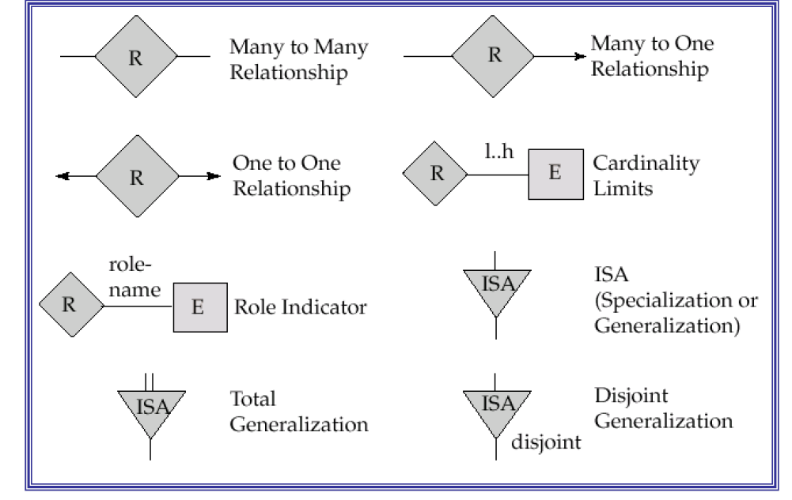

# ER模型

[TOC]

## 1 概念

世界由一组称为实体的对象和这些对象之间的联系构成

实体：客观存在并可相互区分的事物

属性：实体所具有的某一特性。一个实体可以由若干属性来刻画

域：属性的取值范围

实体型：实体名+属性名集合

实体集：同型实体的集合

联系：实体之间的相互关联

- 联系也可以有属性

联系的元：参与联系的实体集的个数。二元联系、三元联系......

实体的码：

- 超码：能唯一标识实体的属性或属性组
  - 超码的超集也是超码
- 候选码：其任意真子集都不能成为超码的最小超码
- 主码：从所有候选码中选定一个用来区别同一实体集中的不同实体

其他码：

- 替代码：除去主码之外的候选码
- 代理码：人工码，只起唯一标识作用的序列号
- 自然码：一个与行中属性有逻辑联系的候选码，它是实体的“真正的”属性
- 智能码：经过编码的标识符。e.g. 身份证

## 2 E-R图基础

### 2.1 基本概念

#### 2.1.1 参与

E全部参与R：实体集E中的每个实体都参与到联系集R中的至少一个联系

E部分参与R：实体集E中只有部分实体参与到联系集R的联系中

#### 2.1.2 存在依赖

x存在依赖于y：实体x的存在依赖于实体y的存在

- y是支配实体
- x是从属实体

#### 2.1.3 角色

角色：实体在联系中的作用称为实体的角色

对于一元联系，为区别各实体参与联系的方式，需要显式指明其角色

### 2.2 属性的类型

简单属性：不可再分的属性

符合属性：可以划分为更小的属性

单值属性：每一个特定的实体在该属性上的取值唯一

多值属性：某个特定实体在该属性上有多于一个的取值。e.g. 学生和所选课程

派生属性：可以从其他相关的属性或实体派生出来的属性值

- 数据库中派生属性一般只存其定义或依赖关系

NULL属性：

- “无意义”：当实体在某个属性上没有值时
- “值未知”：值存在，但目前不知道
- 主码的取值不能设置为NULL

### 2.3 联系的基数

#### 2.3.1 联系种类的E-R图表示

箭头指向单方实体集：

多方实体的箭头指向联系集：

数字标注：

#### 2.3.2 二元联系的种类

一对一：

一对多：

多对多：

#### 2.3.3 一个实体集内的递归联系

注意：多元联系中最多允许出现一个箭头。否则会出现歧义。

## 3 E-R图扩展

### 3.1 弱实体

#### 3.1.1 定义

弱实体集：一个实体集的所有属性都不足以形成主码

标识性联系(identifying relationship)：弱实体集与其拥有者之间的联系。弱实体集与强实体集之间是一对多的联系

弱实体集必然存在依赖于强实体集；但是存在依赖并不总会导致一个弱实体集，从属实体集可以有自己的主码

分辨符（Discriminator)：弱实体集中用于区别依赖于某个特定强实体集的属性集合，也称作部分码（partial key)

弱实体集的主码 = 强实体集的主码 + 弱实体集的分辨符

#### 3.1.2 画法

弱实体集以双边框的矩形表示

弱实体集的分辨符用下划虚线标明

标识性联系以双边框的菱形表示

从联系集用双线（全部参与）连接弱实体集，用箭头（一对多联系）指向强实体集。

#### 3.1.3 何时引入

作为层次结构的一部分

实体集的一些多值、复合属性可以抽取出来作为弱实体集

如果弱实体集不但参与和强实体集之间的标识性联系，而且参与和其它实体集的联系，或者弱实体集本身含有很多属性，则将其表述为弱实体集

### 3.2 特化与概化

#### 3.2.1 特化

实体集中某些子集具有区别于该实体集内其它实体的特性，可以根据这些差异特性对实体集进行分组，这一分组的过程称作特化。

#### 3.2.2 概化

各个实体集根据共有的性质，合成一个较高层的实体集。概化是一个高层实体集与若干个低层实体集之间的包含关系。

概化与特化对比：

- 概化与特化是互逆的，在E-R图中的表示方法相同
- 特化强调同一实体集内不同实体之间的差异
- 概化强调不同实体集之间的相似性
- 反映了数据库设计的不同方法

属性继承：高层实体集的属性被低层实体集自动继承；低层实体集特有的性质仅适用于某个特定的低层实体集。

- 两种继承结构：
  - 层次结构：实体集作为低层实体集只能参与到一个 ISA 联系中
  - 格结构（Lattice）：低层实体集可以参与到多个 ISA 联系中。例如下图：

成员身份：同一个概化中，一个高层实体是否可以属于多个不同低层实体集

- 两种成员身份：
  - 不相交的：一个实体至多属于一个低层实体集
  - 有重叠的：同一实体可同时属于同一概化的多个低层实体集

全部性约束：确定高层实体集中的一个实体是否必须属于至少一个低层实体集

- 两种全部性约束：
  - 全部的：每个高层实体必须属于一个低层实体集
  - 部分的：允许一些高层实体不属于任何低层实体集

### 3.3 聚集

- 如何表达联系之间的联系
- 某些联系之间存在重叠

实例：职工参加项目，并在此过程中可能使用机器

## 4 ER模型设计

ER模型设计中的选择问题

- 实体 / 属性
- 实体 / 联系
- 二元 / 多元
- 聚集 / 三元

### 4.1 实体 / 属性

- 实体有多方面性质，属性没有
- 属性通常是**原子性**的

### 4.2 实体 / 联系

- 实体与联系：静态与动态
- 联系的属性一般是动态的，否则可以抽象成一个（弱）实体

### 4.3 二元 / 多元

- 多元到二元的瓠瓜式通用转换方式
  - 新构建一个**标识实体集** $E$，构造三个新联系集 $R_A$，$R_B$，$R_C$，对每个 $(a_i,b_i,c_i)\in R$，在$E$ 中创建一个$e_i$，然后在$R_A, R_B, R_C$中分别加入联系 $(e_i,a_i),(e_i,b_i),(e_i,c_i)$
  - 但是这样子没有实际意义，单纯是一个标识

- 能否用实体之间的二元联系替换三元联系

是一个有损分解，出现了不存在于原表的元素$(4,2,3)$

### 4.4 聚集 / 三元

实例：一个项目由多个部门资助，一个部门资助多个项目，每个资助协议由一个或多个雇员监督

- 三元联系
  - 不明确，如果资助和监督有自己的属性则不能明确表示属性是属于资助的还是监督的。例如：资助有起始时间，监督有截止时间

- 聚集

## 5 E-R模型向关系模式的转换

- ER 模型：概念数据模型
- 关系模式：结构数据模型

实体 $\to$ 关系

属性 $\to$ 关系的属性

### 5.1 复合属性

- 将每个组合属性作为复合属性所在实体的属性
  - 复合属性拆解为原子属性
- 复合属性定义为视图，或由应用定义

### 5.2 多值属性

- 多值属性 $\to$ 新的关系 + 所在实体的码
- 单独放在一个表里，避免出现冗余

### 5.3 一对多联系

将单方参与实体的吗作为多方参与实体的属性

### 5.4 多对多联系

将联系定义为新的关系，属性为参与双方的码

### 5.5 一对一联系

- 若联系双方均部分参与，则将联系定义为一个新的关系，属性为参与双方的码

- 若联系一方全部参与，则将联系另一方的码作为全部参与一方的属性

### 5.6 弱实体

- 弱实体集所对应的关系的码由**弱实体集本身的分辩符**再加上**所依赖的强实体集的码**
- 弱实体集一个表，同时加上其所依赖的强实体的一个码

例如：

拆出了3张表。

### 5.7 概化与特化

- 高层实体集和低层实体集分别转为表，低层实体集所对应的关系包括高层实体集的码
  - 低层实体集记录自己独有的属性，以及高层实体集的一个码
  - 性能上不利的地方：如果需要查询低层实体的某些属性信息时（这些属性属于高层实体集时），需要和高层实体的表做一个连接操作

- 如果概括是不相交并且是全部的，则可以不为高层实体集建立关系，低层实体集所对应的关系包括上层实体集的的所有属性
  - 高层实体刚好可以**不重不漏**的划分为低层实体
  - 获取所有高层实体的信息只需要两个表求并即可（求并很快）

### 5.8 聚集

实体集A与B及其联系R被抽象成实体集C，C与另一实体集D构成联系S，则S的码由C和D的码构成

## 6 关系模式向ER的转换

例子：

- 已知有如下关系模式：R1(**a1**,a2,a3)，R2(**a3**,a4)，R3(**a5**,a6)，R4(**a3**,**a5**,a7)
- 其中加粗的属性标识为所在关系模式的主码，试画出合适的 ER 图，使得可以将该 ER 图转换为上述关系模式

关键：识别关系之间的重合属性

## 7 符号汇总

**UML**

