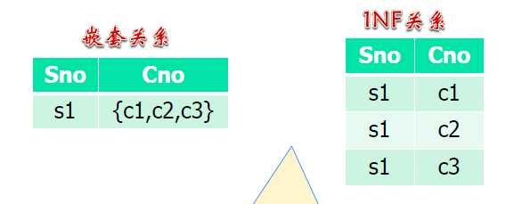
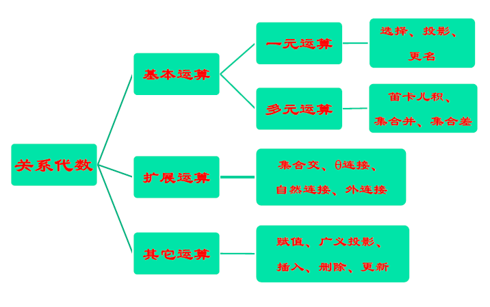

[TOC]

# 关系模型

## 1 基本概念

- 域：具有相同数据类型的一组值的集合：如整数集合、字符串集合等

- 一组域$D_{1},D_{2},...,D_{n}$的笛卡尔积为: $D_{1}\times D_{2}\times ...\times D_{n}=\{(d_{1},d_{2},...d_{n})|d_{i} \in D_{i},i=1,2,...,n \}$

- 笛卡尔积的元素$(d_{1},d_{2},...d_{n})$称作n元组(tuple)。元组的每一个值$d_{i}$称为分量

- 若$D_{i}$的基数为$m_{i}$，则笛卡尔积的基数为$\Pi_{i=1}^{n}m_{i}$

- 笛卡尔积$D_{1}\times D_{2}\times ...\times D_{n}$的子集称作在域$D_{1},D_{2},...,D_{n}$上的关系用$R(D_{1},D_{2},...,D_{n})$表示。其中$R$是关系的名字，$n$是关系的度或目

- 关系：关系是笛卡尔积中有意义的子集

  - 有意义：子集得有名字
  - 名称不一样，反应的现实中的关系也不一样

- 关系的性质

  - 列是**同质**的，是**同一类型的数据**，即每一列中的分量来自同一域
  - 不同的列可以来自同一域，每列必须有不同的属性名
    - 一元联系
  - 行列的顺序无关紧要
  - 任意两个元组不能完全相同（集合内不能有相同的两个元素）
    - 实际的数据库的表允许重复行的存在
  - **每一分量必须是不可再分的数据**，称其为作满足第一范式（1NF）的关系

  

  - 从查询的角度，深入分析嵌套关系的利弊
    - 如果查询某个学生选修的课程哪些
      - 嵌套关系性能更高，直接通过学号索引就行
      - 1NF 关系需要先对学号过滤，再取出来课程
    - 如果查询选修的某个课程的学生有哪些
      - 嵌套关系没办法直接表达（无法使用声明式查询，需要编程进行路径式查询）
      - 1NF 各种属性的查询没有区别

## 2 关系模型三要素

### 2.1 数据结构

#### 2.1.1 单一的数据结构

- 单一的数据结构：

  关系

  - 实体集、联系都表示成关系

- 单一的数据结构好处是什么

  - 实现数据库的时候，只需要实现一种数据结构

#### 2.1.2 码

候选码（Candidate Key）

- 关系中的一个属性组，其值能唯一标识一个元组
- 若从属性组中去掉任何一个属性，它就不具有这一性质了，这样的属性组称作候选码

- **任何一个候选码**中的属性称作**主属性**

主码（PK: Primary Key）

- 进行数据库设计时，从一个关系的多个**候选码**中**选定一个**作为主码

外码（FK: Foreign Key）

- 关系 R 中的一个属性组，它不是 R 的码，但它与另一个关系 S 的码相对应，称这个属性组为 R 的外码
- 反映实体之间的联系

#### 2.1.3 关系模式与关系

关系模式

- 关系的描述，记作$R(A_{1},A_{2},...,A_{n})$，包括：
  - **关系名**、**关系中的属性名**
  - 属性向域的**映象**，通常说明为属性的类型、长度等
  - 属性间的数据依赖关系
    - 比如在特定的时间和教室只能安排一门课
- **关系模式**是**型**，是**稳定**的

关系

- 某一时刻对应某个关系模式的内容（元组的集合）
- **关系**是**某一时刻的值**，是**随时间不断变化**的

#### 2.1.4 关系数据库的构成

- 关系数据库的型
  - 是**关系模式**的集合，即数据库描述
  - 称作数据库的**内涵**（Intension）
- 关系数据库的值
  - 是**某一时刻关系**的集合
  - 称作数据库的外延（Extension）

### 2.2 数据操作

#### 2.2.1 关系操作

- 关系操作是**集合操作**
- 操作的对象及结果都是集合
- 是一次一集合（Set-at-a-time）的方式
  - 非关系型的数据操作方式是**一次一记录** （Record-at-a-time）

#### 2.2.2 关系数据语言的特点

- 一体化
  - 对象单一，都是关系，因此操作符也单一
- 非过程化
  - 用户只需提出 “做什么”，无须说明 “怎么做”
  - 存取路径的选择和操作过程由系统自动完成
- 面向集合的存取方式
  - 操作对象是一个或多个关系，结果是一个新的关系（一次一关系）

#### 2.2.3 抽象的关系模型查询语言

- 关系代数（主流）
- 关系演算
  - 元组关系演算
  - 域关系演算

##### 2.2.3.1 关系演算

- 用**谓词**来表达查询，只需描述所需信息的特性
- 元组关系演算
  - 谓词变元的**基本对象**是**元组变量**
  - $\{t|t \in R \and \exist u \in R (t[A]=u[B] \and t[B]=u[A]\}$
- 域关系演算
  - 谓词变元的**基本对象**是**域变量**
  - $\{<a,b>|<a,b> \in R \and <b,a> \in R\}$

##### 2.2.3.2 关系代数

- 用**对关系的运算**来表达查询
- 需要指明所用操作
- 相比关系演算，关系代数是过程性操作语言
  - 这里的过程性指的是需要人为地把关系序列定义出来
    - 和之前的过程性查询不是一个概念
  - 而关系演算只是通过一系列谓词来描述

##### 2.2.3.3 具体系统中的关系操作语言

- SQL
  - 介于关系代数和关系演算之间
  - 由 IBM 公司在研制 System R 时提出
- QUEL
  - 基于 Codd 提出的**元组关系演算**语言 ALPHA
  - 在 INGRES 上实现
- QBE
  - 基于**域关系**演算
  - 由 IBM 公司研制

### 2.3 完整性约束

- **实体完整性**、**参照完整性**、**用户定义完整性**

#### 2.3.1 实体完整性

- 关系的主码中的属性值不能为空值
- 意义：关系对应到现实世界中的实体集，元组对应到实体，**实体是相互可区分的**，通过主码来唯一标识，若主码为空，则出现不可标识的实体，这是不容许的
- 三值逻辑

#### 2.3.2 参照完整性

- 相对于外码而言的
- 如果关系$R_{2}$的外码$F_{k}$与关系$R_{1}$的主码$P_{k}$相对应，则$R_{2}$中每个元组的$F_{k}$值或者等于$R_{1}$中某个元组的$P_{k}$值，或者空值
  - 空值是允许的，可以认为是未分配、不知道
- 如果关系$R_{2}$的某个元组$t_{2}$参照了关系$R_{1}$的某个元组$t_{1}$，则$t_{1}$必须存在，也即必须与客观存在的实体发生联系

#### 2.3.3 用户定义的完整性

- 用户针对具体应用环境定义的完整性约束条件
  - e.g. sno要求是8位整数，首位是0或1
- 数据库应该支持这些功能，否则对应用程序言而言，就需要它自己去判断

#### 2.3.4 比较

- 实体完整性和参照完整性由系统自动支持
- 系统提供定义和检验用户定义的完整性的机制

## 3 关系代数

### 3.1 关系代数基本运算

#### 3.1.1 选择运算

- 在关系中选择满足给定条件的元组：$\sigma_{F}(R)=\{t|t \in R, F(t)=true\}$

- F 是选择的条件，$\forall t \in R, F(t)$要么为真，要么为假

- F 由**逻辑运算符**连接**算术表达式**而成

- 逻辑运算符：$\and, \or,\neg$

- 算术表达式：$X$  $\theta$  $Y$

  - $X,Y$是属性名、常量、或简单函数
  - $\theta$是比较算符
    - $\theta \in \{>,\geq,<,\leq,=,\neq\}$

- 例子：找年龄不小于 20 的男学生

  (1) $\sigma_{age \geq 20 \and sex='M'}(S)$

  (2) $\sigma_{age \geq 20} (\sigma_{sex='M'}(S))$

  (3) $\sigma_{sex='M'} (\sigma_{age \geq 20}(S))$

  - (1)表达上等效
  - 实际查询中谁更高效？取决于数据库的设计
    - 如果索引中含有 age，则(3)可能最高效
    - 一般不会是(2)，性别这种二值属性不适于建索引

#### 3.1.2 投影运算

### 3.2 关系代数扩展运算

### 3.3 关系代数查询实例

### 3.4 关系代数更新运算