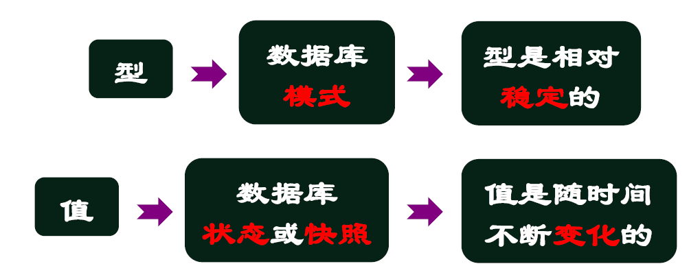
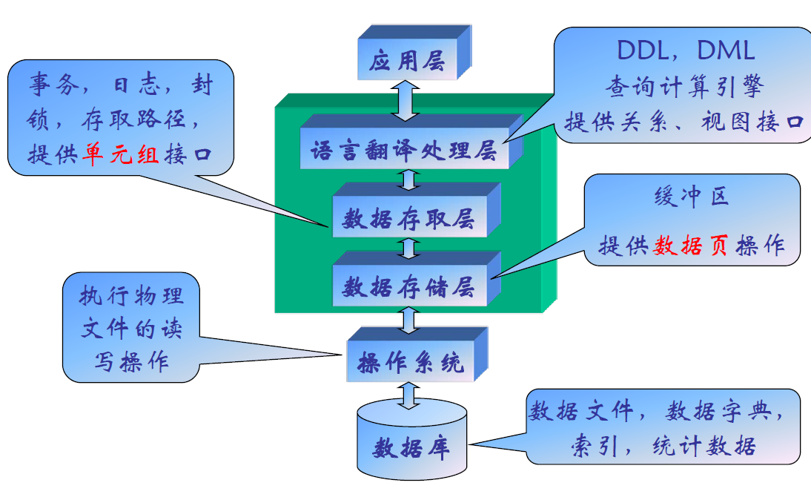

[TOC]

# 数据库系统简介

## 1 简介

### 1.1 数据

数据：对现实世界中客观事物的符号表示

计算机中数据：能输入计算机，并能为其处理的符号序列

数据项：是数据记录中最小的、不可分的有名数据单位

数据元素：由若干个数据项组成

数据是信息的符号表示，或称载体；信息是数据的内涵，是数据的语义解释

### 1.2 数据结构

数据结构：按照逻辑关系组织起来的一批数据，按一定的存储方法把它存储在计算机中，并在这些数据上定义了一个运算的集合

- 逻辑结构：数据之间存在的逻辑关系
  - 表、树、图
- 物理结构：数据在计算机内的存储方式
  - 顺序方式、链接方式

### 1.3 数据类型

具有相同数据结构的数据属同一类，同一类数据的全体称为一个数据类型。

数据类型说明了数据在数据分类中的归属，用以限定该数据的变化范围。

### 1.4 数据独立性

当数据结构发生变化时，通过系统提供的映象（转换）功能，使应用程序不必改变

- **物理独立性**：当数据**存储结构**发生变化时，使应用程序不必改变
- **逻辑独立性**：当数据**逻辑结构**发生变化时，使应用程序不必改变

### 1.5 数据管理

**数据管理**：对数据的分类、组织、编码、存储、检索和维护

- 包括数据定义、数据操作、数据约束等
  - 数据定义
    - 逻辑结构、物理结构等
  - 数据操作
    - 查询、更新等
  - 数据约束
    - 对客观事物的合理反映、数据一致性等
- 数据独立性的实现视角：将数据管理从应用程序中剥离出来

## 2 数据管理的发展历程

- 各阶段的技术及应用背景
  - 计算机应用范围
  - 外存储设备
  - 数据管理软件
- 各个阶段的差别体现
  - 谁管理数据
  - 数据面向谁
  - 数据与应用的独立性

### 2.1 人工管理阶段

- 计算机主要用于科学计算
  - 数据量小、结构简单，如高阶方程、曲线拟和等
- 外存为顺序存取设备
  - 磁带、卡片、纸带
- 磁带的特点
  - 优点：廉价地存放大容量数据
  - 缺点：顺序访问；1%所需，100%访问
- 没有操作系统，没有数据管理软件
  - 用户用**机器指令编码**，**通过纸带机输入程序和数据**，程序运行完毕后，由用户取走纸带和运算结果，再让下一用户上机操作
- 特点：
  - 用户完全负责数据管理工作
    - 数据的组织、存储结构、存取方法、输入输出等
  - 数据完全面向特定的应用程序
    - 每个用户使用自己的数据，数据不保存，用完就撤走
  - 数据与程序没有独立性
    - 存取数据的子程序随着存储结构的改变而改变

### 2.2 文件系统阶段

- 计算机不但用于科学计算，还用于管理
- 外存有了磁盘、磁鼓等直接存取设备
  - 无须顺序存取
  - 由地址直接访问所需记录
- 产生了操作系统
  - 管理和控制计算机软硬件资源的计算机程序
- 文件系统的功能
  - 文件存储空间的管理
  - 目录管理
  - 文件读写管理
  - 文件保护
  - 向用户提供操作接口
- **文件系统解放了用户对外存的访问**
- 文件系统提供了一定的物理独立性
- 文件系统的数据定义独立性
  - 数据与程序紧密结合
    - 数据的逻辑结构改变则必须修改应用程序
  - 数据分散管理
    - 许多文件，许多数据格式
  - 数据的语义信息只能由程序来解释
    - 数据的组织方式以及按何种含义进行处理，只有全权管理它的程序知道
  - 数据共享困难
    - 一个应用若想共享另一个应用生成的数据，必须同另一个应用沟通，了解数据的语义与组织方式
- 文件系统的数据完整性独立性
  - 由于数据存在很多**副本**，给数据的修改与维护带来了困难，容易造成数据的不一致性
  - **数据完整性难于维护**
- 文件系统的数据操作独立性
  - 记录之间无联系
  - 用户自己编程实现
  - 对每个查询都重新编码
- 困难的本质
  - 文件系统眼中的数据：**字符流**
  - 面对一串字符流，要从中找到目标对象，你需要对其解析、遍历、匹配等
- 基于文件系统的查询
  - 分别组织几个文件，存储各类对象的记录
  - ad hoc query
- 基于文件系统维护数据完整性
  - insert，delete
  - 很复杂，需要修改大量文件
  - 容易出错

### 2.3 数据库系统阶段

- 外存有了大容量磁盘，光盘
- 数据管理需求旺盛
  - 数据量大，关系复杂，共享性要求强（多种应用、不同语言共享数据）
- 软件相对于硬件：从 Feature 到 future
  - 软件价格上升，硬件价格下降，编制和维护软件及应用程序成本相对增加，其中维护的成本更高，力求降低
- 数据不是依赖于处理过程的附属品，而是现实世界中**独立存在的对象**

#### 2.3.1 特点

- 有了数据库管理系统
- 面向全组织，面向现实世界
- 独立性较强
- 由 DBMS 统一存取，维护数据语义及结构
  - (DBMS：DataBase Management System) 数据库管理系统
- 面向全组织的数据结构
  - 支持**全企业的应用**而不是某一个应用
  - **数据反映了客观事物间的本质联系**，而不是着眼于面向某个应用，是有结构的数据；而文件系统只是记录的内部有结构，一个文件的记录是个线性序列，记录之间无联系
  - 数据库系统眼中的数据：**结构化数据**
- 数据的冗余度小，易扩充
  - 冗余度小
    - 数据面向整个系统，而不是面向某一应用，数据集中管理，数据共享
  - 集中管理
    - 节省存储空间，减少存取时间，避免数据之间的不相容性和不一致性
  - 易扩充性
    - 每个应用选用数据库的一个子集，只要重新选取不同子集或者加上一小部分数据，就可以满足新的应用要求
- 数据库的高数据独立性
  - 把数据库定义和描述从应用程序中分离出去
  - 数据描述是分级的（全局逻辑、局部逻辑、存储）
  - 数据存取由系统管理，用户不必考虑存取路径等细节，从而简化了应用程序(SQL)
- 统一的数据控制功能
  - 安全性控制（Security）
    - 保护数据以防止不合法的使用所造成的数据泄露和破坏
    - 措施：用户标识与鉴定，存取控制
  - 完整性控制（Integrity）
    - 数据的正确性、有效性、相容性
    - 措施：完整性约束条件定义和检查
  - 并发控制（Concurrency）
    - 对多用户并发操作加以控制，防止其互相干扰而得到错误的结果并使数据库完整性遭到破坏
    - 措施：封锁
  - 恢复控制（Recovery）
    - 将数据库从故障中恢复到某个一致状态
    - 措施：冗余

## 3 数据模型

数据模型：是数据库系统中用于提供信息表示和操作手段的形式框架

### 3.1 分类

#### 3.1.1 概念数据模型

- 按**用户的观点**来对数据和信息建模
- 用于组织信息世界的概念，表现从现实世界中抽象出来的事物以及它们之间的联系
- 这类模型**强调其语义表达能力**，概念简单、清晰，易于用户理解
- 概念数据模型是**现实世界到信息世界的抽象**，是用户与数据库设计人员之间进行交流的语言
- 例子
  - **E/R 模型**：实体、联系、属性
  - **ODL**：属性、关联、类

#### 3.1.2 结构数据模型

- 从计算机实现的观点来对数据建模
  - 是信息世界中的概念和联系在计算机世界中的表示方法
- 有严格形式化定义，以便于在计算机上实现
  - 层次模型、网状模型、关系模型、面向对象模型
- 结构数据模型的三要素：**数据结构、数据操作、数据约束条件**
  - 数据结构：描述系统的静态特性，即组成数据库的对象类型
    - **数据本身**：类型、内容、性质。如关系模型中的域、属性，关系等
    - 数据之间的**联系**。如关系模型中的外码
    - 一般按数据结构的类型来命名数据模型
  - 数据操作：描述系统的动态特性
    - 一般有检索、更新（插入、删除、修改）操作
    - 数据模型要定义操作含义、操作符号、操作规则，以及实现操作的语言
  - 数据约束条件：完整性规则的集合
    - 规定数据库状态及状态变化所应满足的条件
    - 保证数据的正确、有效、相容

##### 3.1.2.1 层次模型

- 用**树**结构表示实体之间联系
- 树由**结点和连线**组成
  - 结点：实体型
  - 连线：两实体型间的一对多联系
- 树的特性
  - 每棵树有且仅有一个结点无父结点，称为树的根
  - 树中的其它结点都有且仅有一个父结点
- 层次模型的特点
  - **结构简单，易于实现**
  - 支持的联系种类太少
    - 只支持**二元**一对多联系
    - 只允许实体集间的**一种**联系，不支持实体集间的多种联系
  - 数据操纵不方便
    - 子结点的存取只能通过父结点来进行
    - 插入、删除复杂，父结点的删除导致子结点的删除，丢失必要的信息
- 代表产品：IBM 的 **IMS 数据库**，**1969** 年研制成功
- IMS 的数据存储
  - **邻接法**：自顶向下、自左向右排列（**层次遍历**）
  - **层次序列法**：自顶向下、自左向右链接（**中序遍历**）
  - **子女-兄弟指引元法**：指向最大的子女，指向最近的兄弟（左子右兄）

##### 3.1.2.2 网状模型

- 是一个满足下列条件的有向图
  - 可以有一个以上的结点无父结点
  - 至少有一个结点有多于一个的父结点（排除树）
- 节点代表实体型，有向边（从箭尾到箭头）表示两实体型间的一对多联系
- 存储结构
  - 通过**指针**表达联系
- 特点
  - 表达的联系种类丰富
  - 性能良好，存取效率高
  - 结构复杂，语言复杂
- 典型代表：IDMS，IMAGE

##### 3.1.2.3 关系模型

用二维表来表示实体及其相互联系。

- 特点
  - **简单**：表的概念直观、单一，用户易理解
  - **非过程化的数据请求**：数据请求可以不指明路径
  - **数据独立性高**：用户只需提出”做什么”，无须说明 “怎么做”
  - **坚实的理论基础**：（曾经的）效率低

##### 3.1.2.4 面向对象模型

- 嵌套表：用嵌套表表示复杂实体（我的类型我定义）
  - **平面表**：把嵌套表展开

## 4 数据库模式

### 4.1 元数据

- 元数据（meta-data)：描述数据的数据
  - 描述数据的含义和性质，以便更好地理解、管理和使用数据的数据，信息检索的入口
    - 数据：毛泽东，特里尔
    - 元数据：标题、作者

### 4.2 数据库模式

- 模式：数据的抽象，数据的描述
  - 模式：数据管理的基石
- 数据字典：存取和管理数据的依据
  - 对于数据模型中的数据对象或者项目的描述的集合

### 4.3 数据库模式的分级设计

- Why
  - 提高数据的**物理独立性**和**逻辑独立性**
  - 将数据库的用户观点（用户看到的数据库）与数据库的物理方面（实际存储的数据库）区分开来

#### 4.3.1 三级模式

- 由 CODASYL 美国数据系统语言协商会提出
- 三级模式：**外模式**、**模式**、**存储模式**
- 三级模式之间有**两级映象**

- 外模式（Sub-Schema）
  - 用户的**数据视图**
  - 数据的**局部逻辑结构**，**模式的子集**
- 模式（Schema）
  - 所有用户的**公共数据视图**
  - 数据库中全体数据的**全局逻辑结构**和**特性的描述**
- 内模式（Storage Schema）
  - **存储模式**，数据的**物理结构**及**存储方式**
  - 位置、压缩、分区、合并、索引

#### 4.3.2 三级模式之间的两极模式映像

- 外模式 / 模式映象
  - 定义某个外模式和模式之间的对应关系
  - 映象**定义通常包含在各外模式**中
  - 当模式改变时，修改外模式 / 模式映象，使外模式保持不变，从而应用程序可以保持不变，称为数据的**逻辑独立性**
- 模式 / 内模式映象
  - 定义数据逻辑结构与存储结构之间的对应关系
  - 存储结构改变时，修改模式 / 内模式映象，使模式保持不变，从而应用程序可以保持不变，称为数据的**物理独立性**

### 4.4 总结

分层思想：复杂系统的简明剖析，不同视角下的同一世界

映射接口：兼容标准与多样性的弹性设计，避免局部风险扩散到整个系统

实例：

- 即插即用硬件设备
- OSI七层网络模型
- SOA：技术与业务分离

## 5 数据库系统的构成

### 5.1 概念

数据库：数据的集合。由DBMS统一管理，多用户共享

数据库管理系统DBMS：系统软件，对数据库进行统一管理和控制

数据库系统：带有数据库的整个计算机系统，包括硬件、软件、数据、人员

### 5.2 DBMS层次结构

### 5.3 DBMS的数据定义功能

- DDL 语言
  - Data Description Language
  - 描述外模式、模式、内模式（源模式）
- 模式翻译程序
  - 把源模式翻译成目标模式，存入数据字典中
  - 源模式 $\to$（模式翻译程序）$\to$ 目标模式（保存在数据字典中）

### 5.4 DBMS的数据存取功能

- DML 语言
  - Data manipulation Language
  - 对数据库进行检索、插入、修改、删除
- DML 类型
  - **宿主型**：DML不独立使用，嵌入到高级语言（主语言）程序中使用
  - **自含型**：独立使用，交互式命令方式
- DML 语句执行方式
  - 宿主型：**预编译和增强编译**
  - 自含型：**解释执行**

### 5.5 DBMS的数据控制功能

- 数据库运行管理
  - 并发控制、存取控制、完整性约束条件检查和执行，日志组织和管理，事务管理和自动恢复
- 数据组织存储和管理
  - 用户数据、索引、数据字典的组织、存储和管理，包括文件结构、存取方式、数据之间联系的实现
- 数据库建立和维护功能
  - 数据的装入、转换、卸出
  - 数据库的转储、恢复、性能监视和分析

### 5.6 数据库系统的用户

- 最终用户
  - 通过应用系统的用户接口（菜单等）使用数据库
- 应用程序员
  - 通过应用系统的用户接口（菜单等）使用数据库
- 系统分析员
  - 负责应用系统的需求分析和规范定义，确定系统软硬件配置，参与数据库模式设计
- 数据库管理员 DBA
  - 负责数据库的全面管理和控制

## 6 DBA 的职责

- 建库
  - 确定模式、外模式、存储结构、存取策略
  - 负责数据的整理和装入
- 用库
  - 定义完整性约束条件
  - 规定数据的保密级别、用户权限
  - 监督和控制数据库的运行情况
  - 制定后援和恢复策略，负责故障恢复
- 改进
  - 监督分析系统的性能（空间利用率，处理效率）
  - 数据库重组织，物理上重组织，以提高性能
  - 数据库重构造，设计上较大改动，模式和内模式修改

## 7 数据库研究方向

### 7.1 新的数据模型

- 面向对象数据库
- 对象-关系数据库
- XML数据库
- 图数据库
- 序列数据库
- 数组数据库
- 矩阵数据库

### 7.2 新的体系结构

- 分布式数据库
  - 网络+数据库，对等(P2P)数据库，集群
- 并行数据库
  - 数据划分、操作并行
- NoSQL 数据库
  - 互联网应用：海量、快速、多样
  - CAP、存储模型、分区、容错、map/reduce
- 数据流管理系统
  - 实时监视：传感网络、股市行情、交通状况…

### 7.3 新的硬件平台

- 主存数据库
- 闪存数据库
- 嵌入数据库
- GPU，FPGA，多核处理器

### 7.4 新的数据库应用

- 商业智能
  - 从事务型操作转向分析型操作
  - 决策支持：数据仓库、数据挖掘、OLAP
- 信息集成
  - “turn the Web into database”
  - 各式信息门户、知识图谱
- 社会测量
  - 社会媒体，社会网络，推荐系统

### 7.5 移动数据库

- 分布式数据库的扩展
- 传感网络、物联网
- 手机、汽车、PDA...
- 信息访问的即时性和就地性
- 移动：数据库+无线网络（偶尔断连）

### 7.6 主动数据库

- **被动服务**：**命令驱动**
- **主动服务**：**事件驱动**
- 实时监控系统：异常情况主动处理 ...
- 信息推送系统：RSS 新闻聚合服务
- 大规模触发器、复杂事件处理

### 7.7 演绎数据库

- 人工智能 + 数据库
- 专家系统
- 事实＋推理规则
- 规则计算：递归查询

### 7.8 时态数据库

- **快照数据库**：只记录实体的**当前信息**
- 管理被处理事件的历史性信息
- 管理数据库系统中元事件的时态信息
- 数据仓库的前驱？

### 7.9 模糊数据库

- 处理模糊对象：高矮胖瘦、好恶优劣…
- 模糊数学
- 模糊隶属函数
- 模糊专家系统，模拟计算 ......

### 7.10 实时数据库

- 对数据的 “定时” 存取和对 “短暂有效” 数据的存取
- 工厂生产过程控制、证券交易、雷达跟踪 ...
- 给数据和事务安装定时装置
- 基于优先级调度事务的执行

### 7.11 概率数据库

- 关键之一：概率查询的合理定义
- 关键之二：对 Possible world 的高效搜索算法

### 7.12 领域数据库

- 生物数据库
  - 序列、图、高维数据…
- 空间数据库
  - 几何数据、空间查询
- 多媒体数据库
- 天文数据库：虚拟天文台
- CAD数据库
  - 面向对象数据库

## 8 DBMS运行过程

- Step1：用户向 DBMS **发出**调用数据库数据的**命令**
- Step2：DBMS 对命令进行**语法检查、语义检查、存取权限检查**，**决定是否执行该命令**
- Step3：DBMS 执行**查询优化**，把命令转换为一串单记录的存取操作序列
- Step4：**执行存取操作序列**（反复执行以下各步，直至结束）
- Step5：DBMS 首先在**缓冲区**内查找记录，若找到转10，否则转6
- Step6：DBMS 查看存储模式，决定从**哪个文件存取哪个物理记录**
- Step7：DBMS 根据 6 的结果，**向操作系统发出读取记录的命令**
- Step8：**操作系统**执行**读取数据**的命令
- Step9：**操作系统**将**数据**从**数据库存储区**送到**系统缓冲区**
- Step10：DBMS 根据**用户命令**和**数据字典**的内容**导出用户所要读取的数据格式**
- Step11：DBMS 将数据记录从**系统缓冲区传送到用户工作区**
- Step12：DBMS将执行状态信息**返回给用户**

## 9 补充内容

- 多维数组的应用场景
  - 联机分析处理、多维分析
    - 通过关系数据库的多表连接实现，效率比较低
    - 多维数组，数组定位快，但是比较稀疏
  - 多维数组体现了局部性
    - 存储时空数据
    - 通常出现在科研领域：遥感数据、图像数据等
- 搜索引擎查询和数据库查询的区别
  - 数据库查询：局部化查询

