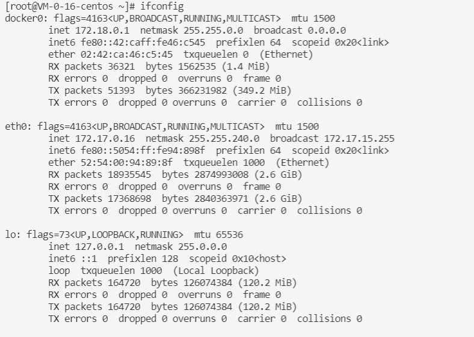
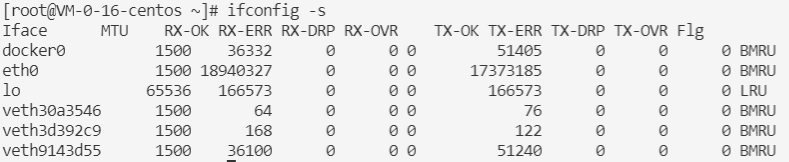
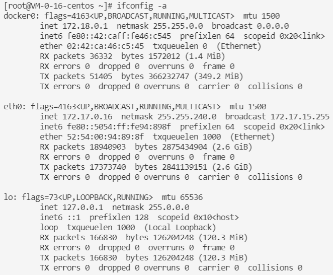
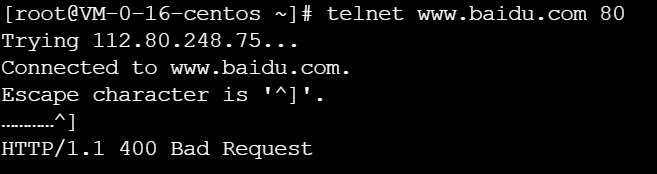
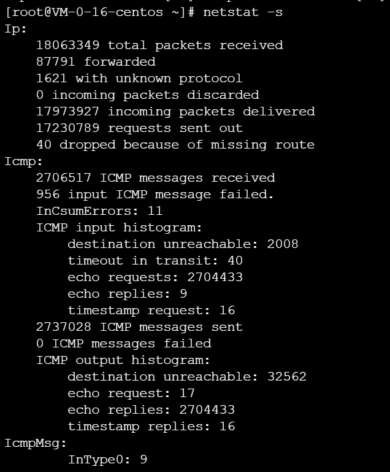
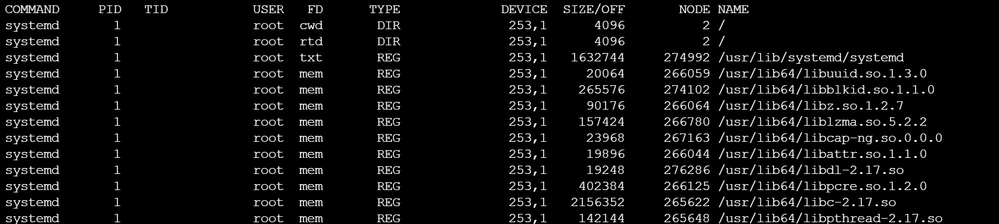
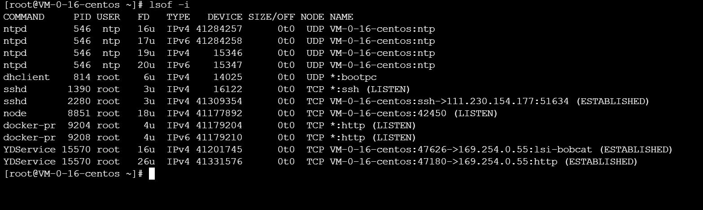

# 网络通信故障排查工具

以CentOs 7为例

```shell
yum install net-tools
```

## ifconfig

### 查看信息

用`ifconfig`命令能显示当前激活的网卡及其信息：



- `UP`：已启用；`BROADCAST`: 支持广播；`RUNNING`：在工作中；`MULTICAST`: 支持多播；`LOOPBACK`: 本地环回
- `mtu 1500`: 最大传输单元1500字节
- `inet`: ipv4地址；`netmask`：子网掩码；`broadcast`：广播地址
- `inet6 fe80::5054:ff:fe94:898f  prefixlen 64  scopeid 0x20<link>`：ipv6地址
- `ether 52:54:00:94:89:8f  txqueuelen 1000  (Ethernet)`：
  - 以太网的MAC地址
  - `txqueuelen` : 网卡设置的传送队列长度
- `RX`: 接收；`TX`: 发送
  - `errors`: 产生错误的数据包数；
  - `dropped`: 被丢弃的数据包数; 
  - `overruns`: 由于速度过快而丢失的数据包数
  - `frame`: 发生frame错误而丢失的数据包数
  - `carrier`：发送时，发生carrier错误而丢失的数据包数
  - `collisions`: 冲突信息包的数目

使用`ifconfig -s`查看精简信息：



默认情况下`ifconfig`命令只显示已经激活的网卡信息。可以使用`ifconfig -a`显示所有网卡信息：



### 激活/禁用网卡

```shell
ifconfig 网卡名 up
ifconfig 网卡名 down
#例如：
ifconfig lo up
ifconfig lo down
```

### 将ip地址绑定/解绑在某个网卡

```sh
ifconfig 网卡名 add IP地址
ifconfig 网卡名 del IP地址
```

一个网卡可以绑定多个ip地址

## ping

```shell
ping IP地址
ping 域名
```

ping命令是通过发送ICMP数据包来实现的

有的内网会禁用ping

## telnet

```shell
yum install telnet
```

如果一个服务程序对外开启了监听服务，那么可以用telnet连接上：

```shell
telnet IP地址 端口号
telnet 域名 端口号
# 如果不写端口号，默认是23端口
# 例如
telnet www.baidu.com 80
```



可以使用telnet检测一个监听服务是否存在。

## netstat

用于检查网络的连接状态，`netstat`常用选项如下：

- `-a`: 显示所有选项。不使用此选项时，`netstat`默认不显示LISTEN相关选项
- `-t`: 仅显示tcp相关选项
- `-u`: 仅显示udp相关选项
- `-n`: 不显示别名，将能显示数字的全部转换为数字。例如把localhost显示为`127.0.0.1`
- `-l`: 仅显示处于监听状态的服务
- `-p`: 显示建立相关链接的程序名
- `-r`: 显示路由信息，路由表
- `-e`: 显示扩展信息，如`uid`等
- `-s`: 按照各个协议进行统计
- `-c`: 每隔一个固定时间执行netstat命令

例如: `netstat -at`


例如：`netstat -s`



## lsof

`lsof`命令：列出已经打开的文件描述符

```shell
yum install lsof
```

lsof会输出很多很多的信息，我们要用`grep`过滤想要查看的信息。



```shell
lsof -p pid #过滤指定的进程
```

使用lsof只能查看当前用户有权限查看的进程fd信息，对于没权限的会显示`Permission denied`

```shell
# 最左侧的程序名最多显示15个字符
lsof +c 15
```

```shell
# 只显示和socket有关的fd
lsof -i
# 不显示别名，将能显示数字的全部转换为数字
lsof -i -n
```

